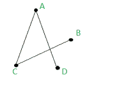
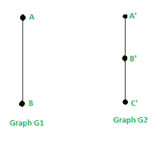
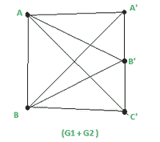
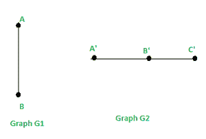
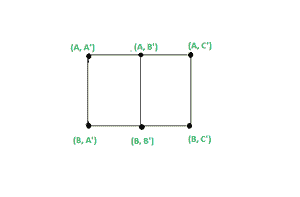
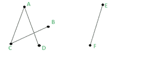

# 加法&两个图的乘积图的秩和零性

> 原文:[https://www . geeksforgeeks . org/图的加法积-图的秩和无效性/](https://www.geeksforgeeks.org/addition-product-of-2-graphs-rank-and-nullity-of-a-graph/)

**简介:**
图 G 由顶点&边组成。边是连接图中任意两个节点的直线或圆弧，这些节点也称为顶点。

一个简单的图形 G = (V，E)包括:

*   有限顶点集
*   e:边集

示例–
在下图中，图形 G 由以下部分组成:
V = { A，B，C，D}
E = { {A，C}，{C，B}，{ A，D}}



**两个图的相加:**
如果我们有两个图，g<sub>1</sub>t38】g<sub>2</sub>使得它们的顶点交集为零(v(g<sub>1</sub>)∪v(g<sub>2</sub>)=∅， 那么和:
G <sub>1</sub> + G <sub>2</sub> 定义为顶点集 V(G <sub>1</sub> +G <sub>2</sub> )为 V(G <sub>1</sub> ) + V(G <sub>2</sub> 的图，边集由这些边组成，这些边就是 G <sub>2</sub> &中的 inG<sub>1</sub>T39】
例:G <sub>1</sub> & G <sub>2</sub> 所示的 2 个图形相加为:

 

这里:v(g〔t1〕1〔t1〕v(g〔T2〕2〔T3〕)=√g

G <sub>1</sub> 中已经包含的边为，E(G <sub>1</sub> ) : {{A，B}}顶点为:V(G <sub>1</sub> ) = {A，B }
G<sub>2</sub>中已经包含的边为，E(G <sub>2</sub> ) : {{A，B'}，{B，C ' } }顶点为:V(G <sub>2</sub> ) = {A '， G <sub>1</sub> + G <sub>2</sub> 将有
(i)个顶点作为:V(G<sub>1</sub>+G<sub>2</sub>)= V(G1)+V(G<sub>2</sub>)= { A，B. A '，B '， C'}
(ii)和 E(G<sub>1</sub>+G<sub>2</sub>)= E(G<sub>1</sub>)+E(G<sub>2</sub>)+G<sub>1</sub>的每个顶点与 G <sub>2</sub> =
{ {A，B}，{A '，B'}，{B '，C'}，{A，A '

**2 个图的乘积:**
我们把 2 个图的乘积 G1*G2 定义为(G <sub>1</sub> *G <sub>2</sub> )(V， e)这样:
(i)顶点:V(G<sub>1</sub>* G<sub>2</sub>)= V(G<sub>1</sub>)&V(G<sub>2</sub>)= V(G<sub>1</sub>)* V(G<sub>2</sub>)和
的笛卡尔乘积(ii)边:考虑图 G <sub>1 的顶点集中的任意 2 个顶点 V(G<sub>1</sub>)&V(G<sub>2</sub>)的笛卡尔积，说 A & V(注:A & V 是一对 2 元素的顶点)这样:A = (a1，a2) & V = (v1，v2)，然后{A， V}是图形 G <sub>1</sub> *G <sub>2</sub> 中的一条边，如果满足以下条件之一–
(I)a1 = v1(该对中的第一个元素相同)，a2 与 v2 相邻
(ii) a2 = v2(该对中的第二个元素相同)，a1 与 v1 相邻</sub>

举例:考虑 2 个图形，G <sub>1</sub> & G <sub>2</sub> 这样:
V(G <sub>1</sub> ) = {A，B}
E(G <sub>1</sub> ) = { {A，B} }
V(G <sub>2</sub> ) = {A，B，C'}
E(G <sub>2</sub> ) ={ {A，B'}，{B



那么图 G <sub>1</sub> *G <sub>2</sub> 将有:
(i)顶点:V(G<sub><sup>1</sup></sub>* G<sub>2</sub>)= V(G<sub>1</sub>)&V(G<sub>2</sub>)= V(G<sub>1</sub>)* V(G<sub>2</sub>)= {(A，A ') C') }
(二)边:我们需要检查 G <sub>1</sub> * G <sub>2</sub> 中的每一对顶点是否能形成边。 我们知道，如果我们在(G <sub>1</sub> * G <sub>2</sub> 中有 2 个顶点 A & V，使得:A = (a1，a2) & V = (v1，v2)，那么{A，V}就是图 G <sub>1</sub> *G <sub>2</sub> 中的一条边，如果满足以下条件之一–
(I)a1 = v1(对的第一个元素相同)并且 a2 与 v2【相邻



图表产品 G <sub>1</sub> * G <sub>2</sub>

我们发现:
1。{ (A，A ')，(A，B') }是边，因为在 G <sub>2</sub>
2 中，对的第一个元素相同(A = A)，A '与 B '相邻。{ (A，C ')，(A，B') }是边，因为在 G <sub>2</sub>
3 中，对的第一个元素相同(A = A)，C '与 B '相邻。{ (B，A ')，(B，B') }是边，因为在 G <sub>2</sub>
4 中，对的第一个元素相同(B = B)，A '与 B '相邻。{ (B，C ')，(B，B') }是边，因为在 G <sub>2</sub>
5 中，对的第一个元素相同(A = A)，C '与 B '相邻。{ (A，A ')，(B，A') }是边，因为对的第二个元素相同(A' = A ')，A 在 G <sub>1</sub>
6 中与 B 相邻。{ (A，B ')，(B，B') }是边，因为对的第二个元素相同(B' = B ')，A 在 G <sub>1</sub>
7 中与 B 相邻。{ (A，C ')，(B，C') }是一条边，因为该对中的第二个元素相同(C' = C ')，A 与 G 中的 B 相邻 <sub>1</sub>

所以 E(G<sub>1</sub>* G<sub>2</sub>)= { (A，A ')、(A，B') }、{ (A，C ')、(A，B') }、{ (B，A ')、(B，B') }、{ (B，C ')、(B，B') }、{ (A，A ')、(B，A') }、{ (A，B ')、(B，B') }、{(A，C ')、(B，C') } }

这样我们就可以求出任意 2 个图的加法和乘积。

**图的秩&无效:**
让 G(V，E)是一个有 n 个顶点& m 条边和 K 个分量的图。
即:|G(V)| = n & |G(E)| = m 我们定义秩 P(G) &无效度μ(G)如下:

```
If G Is not connected : 
P(G) = Rank of G = n - k
μ(G) = Nullity of G = m - n + k

If G Is connected : 
P(G) = Rank of G = n - 1
μ(G) = Nullity of G = m - n + 1
```

示例 1:下图是连接的:


图表 G

| G(V)| = n = 4 &
| G(E)| = m = 3
P(G)= G 的秩= n–1 = 4-1 = 3
μ(G)= G 的零性= m–n+1 = 3–4+1 = 0

示例 2:下图未连接:



| G(V)| = n = 6 &
| G(E)| = m = 4&
组件数量= k = 2
P(G)= G 的秩= n–k = 6–2 = 4
μ(G)= G 的无效性= m–n+k = 4–6+2 = 0