# 实数系公理

> 原文:[https://www.geeksforgeeks.org/axioms-of-real-number-system/](https://www.geeksforgeeks.org/axioms-of-real-number-system/)

在这篇文章中，我们将了解一些关于**实分析**的非常基本的思想，即实数系统结构的研究。我们将讨论被认为由实数集满足的三个公理

这三个公理是:

1.  领域公理
2.  顺序公理
3.  完备性公理

**域公理**:集合表示为域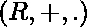，其中和分别是加法和乘法的二元运算。它由 4 个加法和乘法公理和一个分配律组成。

**(i)** 加法公理:

*   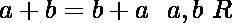
*   
*   r 包含元素 0，因此
*   每个对应一个元素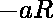，这样

**(二)**乘法公理:

*   
*   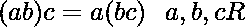
*   包含一个元素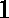，使得和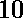
*   如果存在一个元素，这样

**(三)**分配规律:

*   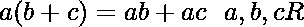

**序公理**:我们定义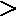(大于)为序关系，满足以下公理–

*   三分法——对于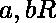来说，只有一个表达式是正确的:
*   传递性–对于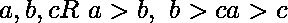
*   加法的单调性质–用于
*   乘法的单调性质–用于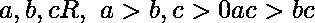

我们称为线性序，为**线性序场**。

在定义完备性公理之前，我们先来看看有界性的概念。在这里，我们将在陈述完备性公理之前定义几个术语。

**集合**:任何非空子集，比如，在中被称为**集合**。例如，集合是一个集合。类似地，集合 B = {1，2，4，8}也是一个集合，因为但是，集合 A = {x，y，z}和空集合不是集合。

**上限**:如果是，则的子集被称为**在**之上。这个数字叫做的一个**上限**。比如负实数的集合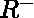是上界的，是上界的。同样，负整数的集合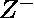在上界，为上界。但是，正实数的集合在上面是没有边界的。

**下界**:如果这样的这个数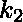叫做 s 的**下界**，那么的子集就称之为有界于下，比如集合有界于下，就是下界。同样的，集合是下界，是上界。但是，设定并不局限于此。

**最小上界**:考虑一个集合的上界，任何小于的实数都不是的上界，那么我们说就是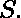的**最小上界(lub)** 或者**上界(sup)**

**最大下界**:考虑一个集合的下界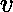，任何大于的实数都不是的下界，那么我们说就是的**最大下界(glb)或者下确界(inf)**

<u>例</u>:让![S = [0,1]  ](img/7fecb338007a8387399f3f0651111d46.png "Rendered by QuickLaTeX.com")。对于 S，我们看到 1 是上界，任何小于 1 的数都不是 S 的上界，因此，1 是 S 的上确界。此外，0 是下界，任何大于 0 的数都不是下界，因此，0 是 S 的下确界

**有界性**:如果一个集合 S 既是上有界的又是下有界的，那么它就是有界的。也就是说，它必须既有上限又有下限。例如，任何有限集合都是有界的，空集合也是有界的。但是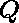和的集合是没有界限的。

**注**:一个集合不需要有一个最大成员和一个最小成员分别在上面有界或在下面有界。

现在完成了所需的定义，我们声明**完备性公理(也称为最小上限公理)**。

**“上面有界的每个非空实数集都有一个上确界。”**

集合 R 满足**场公理**、**序公理**和**完备性公理**。因此实数集合被称为**完全有序域。**

同样，有理数集合不满足完备性公理。因此，不是一个完整的字段。

完备性公理是实数系的一个非常基本和重要的性质，作为各种微积分定理、极大极小概念、中值定理等的证明。依靠实数的完备性。