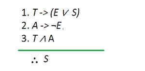
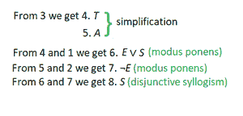

# 离散数学–命题逻辑的应用

> 原文:[https://www . geesforgeks . org/离散数学-命题逻辑的应用/](https://www.geeksforgeeks.org/discrete-mathematics-applications-of-propositional-logic/)

一个**命题**是一个断言、陈述或陈述句，可以是真或假，但不能两者都是。比如那句“拉姆去上学了。”可能是真的，也可能是假的，但两种情况都发生是不可能的。所以我们可以说，这句话“拉姆上过学。”是一个命题。但是，“N 大于 100”这个句子并不是一个命题，因为除非给出 N 的值，否则我们不能陈述它是真还是假。命题的几个例子是“12–10 = 3”，“图书馆是开放的。”等等。

处理命题的数理逻辑领域被称为 [*【命题逻辑】*](https://www.geeksforgeeks.org/proposition-logic/) 或*命题演算*。也称为*句子逻辑*或*句子演算*。它研究命题作为一个整体时的逻辑值，以及用逻辑连接词(如逻辑 and、逻辑 OR 等)连接时的逻辑关系。).

### 命题逻辑的重要性

命题逻辑在计算机科学和人们的日常生活中起着重要的作用。学习和使用命题逻辑的主要好处是，它可以防止我们做出不一致的推论和不谨慎的决定。它将推理和思考能力融入日常生活。

### 命题逻辑的应用

在计算机科学领域，命题逻辑有着广泛的应用，因此非常重要。它用于系统规格、电路设计、逻辑难题等。除此之外，它还可以用于将英语句子翻译成数学陈述，反之亦然。让我们详细了解一下这种广泛的应用。

#### 1)将英语句子翻译成逻辑语句

像任何其他人类语言一样，英语句子可能是模糊的。这种模糊性可能会导致不知情的决策和其他致命错误。为了消除这种歧义，我们可以借助命题逻辑将这些英语句子翻译成逻辑表达式。请注意，有时这可能包括根据句子的预期含义做出一些假设。

**例:**给定一句话“*如果你有 20 美元或 10 美元以及折扣券，你可以购买这本书。*“现在，这有点复杂，需要马上理解。所以我们把它翻译成一个逻辑表达式，这样就容易理解了。让 *a* 、 *b* 、 *c、*和 *d* 代表句子“*你可以购买这本书。*”、“*你有 20 块。*”、“*你有 10 块钱。*、*你有折扣券。*“分别。那么给定的句子就可以翻译成*(b∩(c∧d)->a*，简单的意思就是“如果你有 20 美元或者 10 美元，外加一张打折券，那么你就可以购买这本书了。”

#### 2)系统规格

当开发/制造一个系统(软件或硬件)时，开发者/制造商必须满足某些需求和规范，这些需求和规范通常用英语表述。但是由于英语句子可能会有歧义，开发人员/工程师将这些系统规范翻译成逻辑表达式，以严格而明确地陈述规范。

**例:**让 *a、b、c、*和 *d* 代表句子“*电脑在局域网内。*”、“*电脑有有效的登录 id。*”、“*电脑在管理员的使用下。*、“*电脑可以上网。”*所以复句，“*如果电脑在局域网内或者不在局域网内但是有有效的登录 id 或者是在管理员的使用下，那么电脑是可以访问互联网的。*”可以表示为(*a∩(a∧b)∨c)—>d .*

#### 3)逻辑难题

用推理和逻辑解决的谜题叫做逻辑谜题。它们可以用于大脑锻炼、娱乐目的以及测试一个人的推理能力。解决这样的难题通常很棘手，但可以使用命题逻辑轻松完成。一些著名的逻辑谜题有**泥泞儿童谜题**斯缪尔扬关于骑士和流民的谜题*等。*

***示例:***

**问题陈述:*有一个岛，岛上有两种居民，总是说真话的骑士，和他们的对立面，总是撒谎的流民。你遇到两个人 A 和 B，如果 A 说“B 是无赖”，B 说“我们俩是同一类型的人”，确定 A 和 B 是什么？*

**解*:让 *p* 和 *q* 分别是 *A* 是骑士和 *B* 是骑士的说法，那么 *p* 和 *q* 分别是 *A* 是流民和 *B* 是流民的说法。假设 *A* 是骑士，即 *p* 为真。所以 *A* 说的是实话，也就是说 *q* 是真的。现在由于 *B* 是一个无赖，不管它说什么都是谎言，即 *(p ∧ q) ∨ ( p ∧ q)* 是假的，这只是意味着如果他们中的任何一个是无赖，那么另一个是骑士，反之亦然。根据假设，这种说法是正确的。所以我们可以断定 *A* 是骑士 *B* 是流民。*

#### *4)布尔搜索*

*命题逻辑的另一个重要应用是[布尔](https://www.geeksforgeeks.org/properties-of-boolean-algebra/)搜索。这些搜索使用命题逻辑的技术。逻辑连接词广泛用于搜索大量信息，如网页索引。在布尔搜索中，连接“与”用于查找包含这两个术语的记录，连接“或”用于查找包含一个或两个术语的记录，连接“非”也写为“与非”，在我们需要排除特定搜索术语时使用。*

***示例:**一些网络搜索引擎支持使用布尔技术的网页搜索。例如，如果我们想寻找关于在西阿尔卑斯山徒步旅行的网页，那么我们可以寻找匹配西*和*阿尔卑斯山*和*徒步旅行的网页。如果我们想要关于在阿尔卑斯山徒步旅行的网页，但不是在西阿尔卑斯山，那么我们可以搜索与记录徒步旅行*和*阿尔卑斯山*而不是*(西*和*阿尔卑斯山)相匹配的网页。*

#### *5)逻辑/计算机电路*

*逻辑门或电路是实现布尔函数的电子设备，即它对输入的一位或多位进行逻辑运算，并给出一位作为输出。它们是任何数字系统的基本构件。输入和输出之间的关系是基于某种命题逻辑。*

***例:**逻辑门被命名为与门、或门、非门等。基于逻辑连接词 AND、OR、NOT 等的名称。这些门的给定输入位的输出真值与逻辑连接词返回的值相同。*

#### *6)推理和决策*

*命题逻辑广泛应用于制定[推理规则](https://www.geeksforgeeks.org/mathematical-logic-rules-inference/)和决策。这些推理规则可以用来建立论点。当给出几个前提时，很难判断给定的参数是否有效。因此，我们使用这些推理规则来验证一个论点并做出决定。*

***例:**我们可以利用推理规则证明下列前提建立了一个有效的论点。*

**如果今天是星期二，我有一个英语或者理科的考试。如果我的英语教授缺席，那么我就没有英语考试。今天是星期二，我的英语教授缺席。因此，我有一个科学考试。*”*

> *汤:今天是星期二*
> 
> *我有一个英语考试*
> 
> *我有一个科学考试*
> 
> *我的英语教授缺席了*

*

**作为逻辑符号的前提*** *

**推理规则*** 

*因此，所陈述的论点是有效的。*

#### *7)人工智能-模糊逻辑*

*人工智能算法利用[模糊逻辑](https://www.geeksforgeeks.org/fuzzy-logic-introduction/)。在模糊逻辑中，没有绝对真值和绝对假值的逻辑。但是在模糊逻辑中，也存在一个中间值，它部分为真，部分为假。*

***例如:**真值 0.6 可以赋给语句“Fred 很开心”，因为 Fred 比大部分时间稍微开心一点，而真值 0.5 可以赋给语句“Percy 很开心”，因为 Percy 有一半的时间是开心的。*