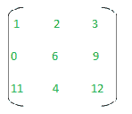
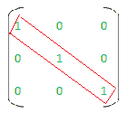
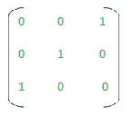
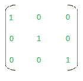
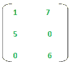
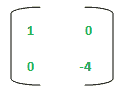
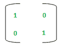
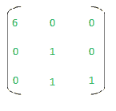
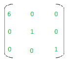

# 初等矩阵|离散数学

> 原文:[https://www . geesforgeks . org/初等-矩阵-离散-数学/](https://www.geeksforgeeks.org/elementary-matrices-discrete-mathematics/)

**先决条件:** [矩阵知识&身份矩阵](https://www.geeksforgeeks.org/matrix-introduction/)

**简介:**
矩阵是按行和列排列的数字的集合。矩阵的元素必须用括号括起来。
**示例–**
3 * 3 矩阵是指 3 行& 3 列共 9 个元素的矩阵。(3*3 = 9)

3*3 矩阵

**恒等式矩阵:**
恒等式矩阵是一个正方形矩阵，其中主对角线的所有成员都是 1，其他所有元素都是 0。

**基本矩阵:**
基本矩阵是可以通过对其仅执行以下操作之一而从单位矩阵创建的矩阵–

*   R1–交换了两行。
*   R2–将一行的元素乘以非零实数。
*   R3–将另一行对应元素的任意倍数添加到一行的元素中。

R1、R2 和 R3 是行操作，当应用于任何矩阵时，称为基本行操作。

*   C1–交换了 2 列。
*   C2–将一列的元素乘以非零实数。
*   C3-将另一列的相应元素的任意倍数添加到一列的元素中。

C1、C2 和 C3 是列运算，当应用于任何矩阵时，称为初等列运算。
我们知道，恒等式矩阵总是正方形的，所以初等矩阵总是正方形的，因为它是从恒等式矩阵得到的。

**示例–**
给定的矩阵 M 是初等的:

矩阵 M

**解释–**
我们知道，3 * 3 : I 3 的身份矩阵给出为–

一 3

通过应用 C1-交换 I 3 中的列 1 和列 3，我们可以得到矩阵 M，所以 M 是一个初等矩阵。

**基本矩阵的性质:**

*   初等矩阵的非奇异性是显而易见的。此外，初等矩阵的逆也是初等矩阵。
*   如果一个方阵 A 可以表示为初等矩阵的乘积，那么它是可逆的。
*   如果 A 是 n*n 矩阵，A 可以写成初等矩阵的乘积。
*   初等矩阵总是方阵。
*   如果基本矩阵 E 是通过对 I m 执行特定的行运算得到的，A 是 m*n 矩阵，则乘积 EA 是通过对 A 执行相同的行运算得到的矩阵。

**1。给定矩阵 M，求它是否初等。**

矩阵 M

**解:**
由于矩阵不是方阵，所以不能是初等矩阵。

**2。给定矩阵 M，求它是否初等。**

矩阵 M

**解:**
2 * 2 大小的身份矩阵如下图:

矩阵一 2

如果我们将 I2 的第二行乘以-3，我们将得到 M 作为结果。所以，M 是一个初等矩阵。

**3。给定矩阵 M，求它是否初等。**

矩阵 M

**解:**
大小为 3 * 3 的恒等式矩阵如下–

矩阵一 3

如果我们在 I 3 上划“执行操作”:R1 = R1 * 6，我们会得到–

但是现在这个结果矩阵不等于 M.
所以，我们不能以这样的方式执行任何单个行/列操作，即我们从 I3 得到给定的矩阵 M。
所以 M 不是初等矩阵。