# 工程数学–偏导数

> 原文:[https://www . geesforgeks . org/engineering-数学系-偏导数/](https://www.geeksforgeeks.org/engineering-mathematics-partial-derivatives/)

A [功能](https://www.geeksforgeeks.org/types-of-functions-class-12-maths/)就像一台机器，接受一些输入，给出一个输出。*例如*，y = f(x)是‘x’中的一个函数。这里，我们说“x”是自变量，“y”是因变量，因为“y”的值取决于“x”。

**函数的一些例子有:**

1.  f(x) = x 2 + 3 是代数函数。
2.  e x 为指数函数。
3.  sin(x)，cos(x)，tan(x)，…等。都是三角函数。

现在，所有这些函数都是单个变量的函数，即只有一个自变量。

要理解偏导数的概念，首先要看二元函数是什么意思。
考虑一个 z = f(x，y)形式的函数，其中‘x’和‘y’是自变量，‘z’是因变量。这个函数叫做双变量函数。类似地，也可以定义几个变量(即有 2 个以上独立变量)的函数。

**多变量函数或多变量函数的一些例子有:**

1.f(x，y) = x 2 +y

2.f(x，y，z) = x-3y+4z

让我们通过图形来形象化这个概念。首先我们考虑单变量函数 f(x) = x 2 。

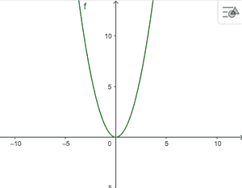

f(x) = x^2 图

与单变量函数不同，我们不能将多变量函数可视化为二维图形。为此，我们将其绘制在三维平面上。例如，考虑 f(x，y) = x 2 +y 2 的图形

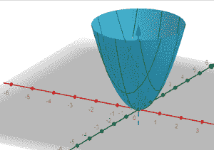

f(x，y) = x^2 + y^2 的曲线图

对于几个变量的函数，我们定义[极限](https://www.geeksforgeeks.org/formal-definition-of-limits/)如下:

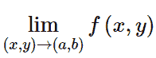

这意味着，当‘x’接近‘a’和‘y’接近‘b’时，求 f(x)的极限。

类似地，连续性和[可微性](https://www.geeksforgeeks.org/differentiability-of-a-function-class-12-maths/)的[定义可以从单变量函数的定义扩展而来。](https://www.geeksforgeeks.org/mathematics-limits-continuity-differentiability/)

回想一下，单变量 y=f(x)函数的导数定义为:f’(x)= `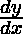

对于两个变量的函数 z = f(x，y)，我们将导数定义为: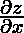

这意味着通过保持“y”不变来计算函数“z”相对于“x”的导数。同样，我们可以通过保持‘x’不变来计算‘z’相对于‘y’的导数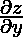

### **偏导数的几何解释**

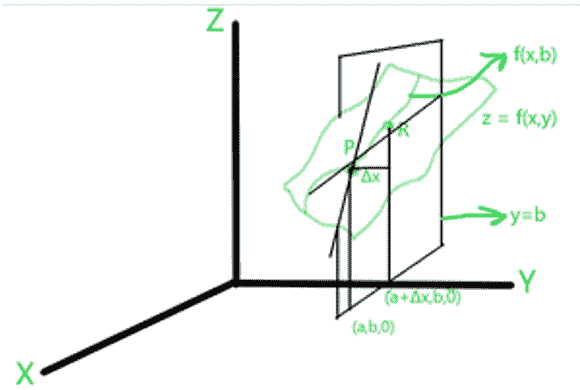

众所周知，对于单变量函数，导数的计算是通过曲线的切线的斜率。同样，我们可以理解多变量函数偏导数的几何解释。

考虑一个两个变量的函数，在三维平面上 z = f(x，y)，让平面 y=b 通过曲线 f(x，y)。

现在，我们画另一条曲线 f(x，b)，它位于垂直于平面 y=b 的 z 上。考虑这条曲线上的两个任意点 P，R，并画出穿过这些点的割线。

该割线的斜率使用如下第一原则计算:

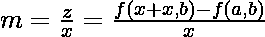

当这两个点彼此靠近时，差值δx 接近 0，我们以极限的形式计算出来:

该极限是“z”相对于“x”的偏导数，将“y”视为常数，即

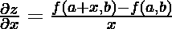

### 计算给定函数的偏导数。

计算给定函数偏导数的步骤:

1.  考虑 z = f(x，y)。
2.  通过将“y”视为常数，计算相对于“x”即的偏导数，并对函数相对于“x”进行微分。
3.  通过将“x”视为常数，计算相对于“y”即的偏导数，并对相对于“y”的函数进行微分。

*例* : 

这里，对于给定的函数，我们计算两个偏导数如下:

**情况 1** :通过将“y”视为常数，即来区分“x”

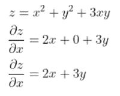

通过处理“y”常量来区分“z”和“x”

**情况 2** :通过将“x”视为常数，即来区分“y”

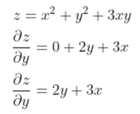

通过处理“x”常量来区分“z”和“y”

### 二阶偏导数

与计算单变量函数的二阶导数类似，我们也可以计算多变量函数的二阶导数。

例如，我们考虑相同的函数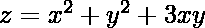。

**案例 1** :我们再次区分和【x】

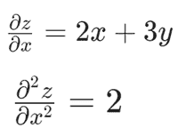

**案例 2** :我们再次区分和‘y’

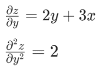

**案例 3** :我们再次区分与“y”

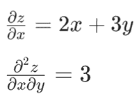

**案例 4** :我们再次区分和【x】

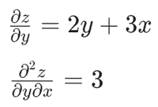