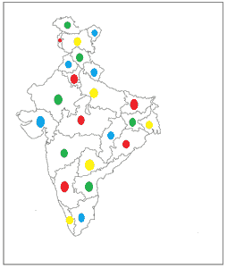
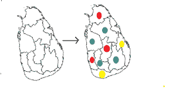
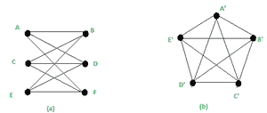

# 离散数学中的四色定理和库拉托夫斯基定理

> 原文:[https://www . geeksforgeeks . org/四色定理和-kuratowski-离散数学中的定理/](https://www.geeksforgeeks.org/four-color-theorem-and-kuratowskis-theorem-in-discrete-mathematics/)

**平面图形:**
如果一个图形可以在平面上画而不相交，则称之为平面。
简单图的着色是给图的每个顶点分配颜色，这样就不会给两个相邻的顶点分配相同的颜色。

**双部图:**
双部图，也称为双图，是一组被分割成两个不同集合的图顶点，同一集合中没有相邻的图顶点。二部图是以 k=2 为特定实例的 k 部图。

**色数:**
绘制图形 G 所需的最小颜色数称为 G 的色数&用–**μ(G)**表示

**相邻区域:**
给地图的区域分配颜色，使得相邻区域具有不同的颜色。
如果存在使用“n”种颜色的 M 的着色，则地图“M”是 n-可着色的。

**四色定理:**
1852 年，英国著名数学家、逻辑学家奥古斯都·德·摩根的学生弗朗西斯·格思里提出了四色问题。他用符合特定要求的地图来定义这个问题，例如没有任何洞，并且连接每个区域(例如国家或州)，使得没有区域存在于两个或多个不连续的部分中。
格思里断言，使用这种地图，给地图上色所需的颜色不超过四种，这样相邻的两个部分就不会是相同的颜色。
如果地图 M 的区域被着色，使得相邻区域不同，则不需要超过 4 种颜色。
每个平面图都是 4-可着色的(顶点着色)，但是当一个三角形是一个图或子图时，我们只需要 3 种颜色。

多年来，数学家们一直试图按照六色定理或五色定理的思路提出一个复杂的证明(四色定理)，而使用蛮力方法似乎就像黑客入侵了这个过程。
每个平面图形可以用四种不同的方式着色。
图中有顶点和边。我们希望相邻的顶点/区域具有不同的颜色。

**如何上色？**
取任意一张地图，将其划分为一组相连的区域:R <sub>1</sub> ，R<sub>2</sub>……R<sub>n</sub>边界连续。
必须有某种方式来分配集合{R，G，B，Y}中的每个区域 R <sub>i</sub> - >，使得如果两个区域 R <sub>i</sub> 和 R <sub>j</sub> 是“接触的”(即它们之间共享一些非零长度的边界)，它们必须接收不同的颜色。
**示例–**
1..四色地图如下所示:



平面地图

在这里，正如你所看到的，每个接触到另一个区域的区域都有不同于接触到的区域的颜色&我们总共需要最多四种颜色来给这张地图上色——红色、绿色、蓝色和黄色。

**2。未着色地图 G 到彩色地图的转换如下所示–**


地图 G

在这里，您可以看到每个接触到另一个区域的区域都有不同于接触到的区域的颜色&我们总共需要最多四种颜色来给这张地图上色——红色、绿色、蓝色和黄色。

**3。**未着色地图 H 到彩色地图的转换如下所示–



地图 H

在这里，您还可以看到，每个接触到另一个区域的区域都有不同于接触到的区域的颜色&我们总共需要最多四种颜色来给这张地图上色——红色、绿色、蓝色和黄色。

**库拉托夫斯基定理:**
库拉托夫斯基在 1930 年建立了建立平面性充要条件的定理。该定理指出–

```
*"If G is non planar if and only if G contains a sub-graph that is a subdivision*
 *of either K<sub>3,3 or K5."</sub>*
```

为了证明这个定理，我们将通过一些定义，并确保 K3，3 和 K5 都是非平面的。来看看 K <sub>3，3</sub> 。

**命题 1–**K<sub>3，3</sub> 不是平面的。
**证明:**
现在，我们用矛盾来证明。
相反，说 K <sub>3，3</sub> 是平面的。然后是 K 的平面嵌入 <sub>3，3</sub> 满足:
然后，通过欧拉公式:*v e+f = 2*，其中 v =顶点总数，e =边数，f =面总数。



(a) K <sub>3，3</sub> 图(b) K <sub>5</sub> 图

在图(a)中，双向图:v= 6，e= 9。

由于 K <sub>3，3</sub> 是二分的，里面没有 3-圈(里面可以有奇数圈)。
因此，嵌入的每个面必须由至少 4 条从 K <sub>3，3 开始的边界定。</sub>
此外，每个边在面的边界中被计数两次。
所以必须有:f≤2 * e/4
f≤e/2
f≤4.5。
现在把这个数据放到欧拉公式里:我们得到:2 = v e+f
2≤6 9+4.5
2≤1.5，显然是假的。
所以，我们可以说 K <sub>3，3</sub> 是非平面图。

**命题 2–**K5 不是平面的。
**证明:**
每个平面图都必须遵循:e≤3v-6(欧拉公式的推论)
对于上图中的图(b)，e = 10，v = 5。
LHS:e = 10
RHS:3 * v–6 = 15–6 = 9
10≤9，不成立。
所以，我们可以说 K <sub>5</sub> 是非平面图。

**例:**
**1。证明:平面图的子图都是平面的。**
**证明:**
设 G 为图& P 为其子图。
存在 G 的平面嵌入，如果 G 是平面的。在 G 的平面嵌入中，我们可以定位 G 的每个子图 P 的顶点和边。
这是如何创建 P 的平面嵌入的。

**2。非平面图的细分都是非平面的。**
**证明:**
假设对于 G，其细分的一个平面嵌入 P 存在。
当我们移除边细分中形成的顶点并重建原始边(不影响路径的形状和位置)时，我们获取 G 的平面嵌入并找到 G 平面。
结果，如果 G 是非平面的，那么 G 的每一个细分(P)也是非平面的。