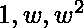
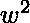
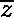

# 群同构和自同构

> 原文:[https://www . geesforgeks . org/group-同构-和-自同构/](https://www.geeksforgeeks.org/group-isomorphisms-and-automorphisms/)

**先决条件–**[集团](https://www.geeksforgeeks.org/groups-discrete-mathematics/)

**同构:**
对于两个组( *G* ，+)和( *G'* ，*)一个映射 *f* : *G* → G '称为同构如果

*   *f* 是*一对一*
*   *f i* s *到*
*   *f i* s *同态即 f*(a+b)*= f(*a)**f*(b)∀a，b ∈ G。

简而言之，双射同态是同构的。

**同构群:**
如果存在从群(G，+)到(G '，*)的同构。那么一个群(g，+)被称为同构于一个群(g '，*)
它被写成 g≅g’。

**示例–**

1.f(x)=对数(x)对于群(R + ，*)和(R，+)是群同构。
T3】解释–

*   f(x)=f(y) => log(x)=log(y) => x=y，所以 f 是一比一。
*   f(R + )=R，所以 f 是 on。
*   f(x * y)= log(x * y)= log(x)+log(y)= f(x)+f(y)，所以 f 是同态。

2.f(x)=组(Z，+)到(aZ，+)的 ax，其中 a 是任何非零数字
**解释–**

*   f(x)=f(y) => ax=ay => x=y，所以 f 是一比一。
*   f(Z)=aZ，所以 f 是 on。
*   f(x + y) =ax + ay= f(x) + f(y)，所以 f 是同态。

3.具有乘法运算的单位立方根群{  }中的函数 f 与具有结果类 mod(3)加法运算的群 resedual 类 mod(3) {{0}、{1}、{2}}同构，使得 f(1)={0}、f(  )={1}和 f(  )={2}。

**解释–**

*   很明显，f 是 on 和 1-1。
*   同样是 f(1 *)= f()= { 1 } = { 0 }+3{ 1 } = f(1)* f()。
    f(*)= f(1)= { 0 } = { 1 }+3{ 2 } = f()* f()。
    和 f(* 1)= f()= { 2 } = { 2 }+3{ 0 } = f()* f(1)。所以 f 是同态。
    这一切都证明了 f 对于两个被指群是同构的。

4.f(x)=e x 对于组(R，+)和(R+，*)，其中 R+是一组正实数，x 是一个整数。

5.群({0，1，2，3}，+ 4 )和({2，3，4，1}，+ 5 )同构。

**注:**

1.  如果存在同态 f，则形成群(G)，*(H，+)。那么 f 也是同构的当且仅当 Ker(f)={e}。这里 e 是(G，*)的恒等式。
    同样，Ker(f) =同胚 f 的核:(G，*) → (H，+)是 G 中所有元素的集合，使得 H 中所有这些元素的像是(H，+)的恒等式元素 e’。
2.  如果两个群同构，那么两个都是阿贝尔群，或者两个都不是。记住，如果一个群是可交换的，它就是阿贝尔群。
3.  一组同构群构成一个等价类，它们具有相同的结构，并被称为抽象相同。

**自同构:**
对于一个群(G，+)，一个映射 *f* : G → G 叫做自同构如果

*   *f* 是*一比一。*
*   *f 同态*即*f*(a+b)=*f*(a)+*f*(b)∀a，b ∈ G。

**示例–**

1.对于任何群(g，+)的恒等式映射 I g : G → G，使得 I g (g)=g，∀g ∈ G 是自同构。
**解释-**

*   好像我(a)=我(b) => a=b 所以我是一加一。
*   由于 I(a+b) =a+b =I(a)+I(b)，所以 I 也是同态的。

2.f(x)=-x 为组(Z，+)。
**解释-**

*   好像 f(a)=f(b) => -a=-b => a=b 所以 f 是一比一。
*   就好像 f(a+b)=-(a+b)=-(a)+(-b)= f(a)+f(b)，那么 f 也是同态的。

3.f(x)=axa -1 对于一组(g，+) ∀a ∈ G.
**解释–**

*   因为 f(n)= f(m)= > ana-1= ama-1=>n = m，所以 f 是一比一。
*   由于 f(n+m)= a(n+m)a-1= ana-1+ama-1= f(n)+f(m)，所以 f 也是同态。

4.f(z)= 为有加法运算的复数组。
记住 f 是复数形式，如果 z=a+ib，那么 f(z)=  =  =a-ib。

5.f(x)=1/x 是群(G，*)的自同构，如果它是阿贝尔的。

**注:**

1.  一个群的所有自同构(函数)的集合，函数的组合作为二元运算形成一个群。
2.  简单地说，如果定义域和定义域相等，同构也称为自同构。
3.  如果 f 是群(G，+)的自同构，那么(G，+)就是阿贝尔群。
4.  我们在例子中看到的恒等式映射，是一个群上的自同构，叫做平凡自同构和其他非平凡自同构。
5.  自同构可以分为[内](https://en.wikipedia.org/wiki/Inner_automorphism)和[外](https://en.wikipedia.org/wiki/Outer_automorphism_group)自同构。