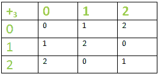
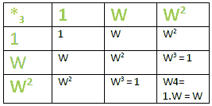

# 同态&群的同构

> 原文:[https://www . geeksforgeeks . org/同态-群的同构/](https://www.geeksforgeeks.org/homomorphism-isomorphism-of-group/)

**简介:**
我们可以说“o”是集合 G 上的二进制运算如果:G 是非空集合& G * G = { (a，b) : a，b∈ G }和 o:G * G–>G .这里，aob 表示函数/运算 o 下的有序对(a，b)的图像.
**例–**“+”被称为 G(任意非空集合)上的二进制运算如果&只有:a∀ a，b ∈G 和 a+b 每次相加得出相同的结果。
**实例**–‘+’是自然数‘N’集合上的二进制运算，因为 a+b∈N；∀ a，b ∈N 和 a+b a+b 每次相加得出相同的结果。

**二进制运算法则:**
在一个二进制运算 o 中，这样:o:G * G–>G 上的集合 G 是:
**1。可交换–**

```
 *aob = boa ; ∀ a,b ∈G*
```

示例:“+”是对自然数“N”集合的二进制运算。取任意 2 个随机的自然数，比如 6 & 70，那么这里 a = 6 & b = 70，
a+b = 6 + 70 = 76 = 70 + 6 = b + a
所有在自然数下的数都是如此。

**2。联想–**

```
*ao(boc) = (aob)oc ; ∀ a,b,c ∈G*
```

示例:“+”是对自然数“N”集合的二进制运算。取任意 3 个随机的自然数，比如 2，3 & 7，那么这里 a = 2 & b = 3，c = 7，
LHS:a+(b+ c)= 2+(3+7)= 2+10 = 12
RHS:(a+b)+c =(2+3)+7 = 5+7 = 12
所有在自然数下的数都是如此。

**3。左侧分配–**

```
*ao(b*c) = (aob) * (aoc) ; ∀ a,b,c ∈G*
```

**4。权利分配–**

```
 (*b*c) oa = (boa) * (coa)  ; ∀ a,b,c ∈G*
```

**5。左侧取消–**

```
 *aob =aoc* => *b = c  ; ∀ a,b,c ∈G*
```

**6。取消权限–**

```
 *boa = coa * => *b = c ; ∀ a,b,c ∈G*
```

**代数结构:**
配备 1/多二进制运算的非空集合 G 称为代数结构。
例:a. (N，+)和 b. (R，+，。)，其中 N 是一组自然数& R 是一组实数。给你。(点)指定乘法运算。

**GROUP :**
一种代数结构(G，o ),其中 G 是非空集合&“o”是在 G 上定义的二进制运算，如果二进制运算“o”满足以下性质，则称为 GROUP–

1.**关闭**–

```
*a ∈ G ,b ∈ G * => *aob ∈ G ;  ∀ a,b ∈ G*
```

2.**关联性–**

```
 *(aob)oc = ao(boc) ; ∀ a,b,c ∈ G.*
```

3.**身份元素**–
在 G 中存在 e，使得*AOE = eoa = a*；∀ a ∈ G(例如–此外，恒等式为 0)

4.**每个元素 a ∈ G 的逆**–
的存在；存在一个倒数(a <sup>-1</sup> )这样:∈ G 这样–*AOA<sup>-1</sup>= a<sup>-1</sup>OA = e*

**群的同态:**
设(G，o)&(G’，o’)为 2 群，从群(G，o)到群(G’，o’)的映射“f”称为同态，如果–

```
*f(aob) = f(a) o' f(b) ∀ a,b ∈ G*
```

这里的要点是:映射 f:G–> G '既不是一对一映射，也不是到映射，即 f '不需要是双射的。

**例–**
If(R，+)是运算“+”&(R -{0}，*)下的一组全实数是运算“*(乘法)&下的另一组非零实数 f 是从(R，+)到(R-{ 0 }，*)的映射，定义为:f(a)= 2<sup>a</sup>；∀ a ∈ R
那么 f 就是同态，就像–f(a+b)= 2<sup>a+b</sup>= 2<sup>a</sup>* 2<sup>b</sup>= f(a)。f(b)。
因此满足同态规则&因此 f 是同态。

***同态成–*** **一映射‘f’，即同态&也成。**

*****同态到*****–**
一个映射‘f’，也就是同态&也到了。**

****群的同构:**
设(G，o)&(G’，o’)是 2 个群，从群(G，o)到群(G’，o’)的映射“f”被称为同构，如果–**

```
*1\. f(aob) = f(a) o' f(b) ∀ a,b ∈ G*
*2\. f is a one- one mapping*
*3\. f is an onto mapping.*
```

**如果‘f’是同构映射，(G，o)将同构于群(G’，o’)&我们写道:**

```
G ≅ G'
```

****注:**一个映射 f: X - > Y 叫做:**

1.  **一–一–如果 x<sub>1</sub>x2，则 f(x <sub>1</sub> ) ≠ f(x <sub>2</sub> 或如果 f(x<sub>1</sub>)= f(x<sub>2</sub>)=>x<sub>1</sub>= x<sub>2。</sub>其中 x <sub>1</sub> ，x <sub>2</sub> ∈ X**
2.  **到–如果集合 Y 中的每个元素都是集合 x 中至少一个元素的 f 图像**
3.  **双射-如果它是一个&到。**

****同构群的例子**–
如果 G 是 3 个立方根单位的乘法群，即(G，o) = ( {1，w，w <sup>2</sup> }，*)，其中 w<sup>3</sup>= 1&G’是模 3 的整数的加法群–(G’，o’)=({ 1，2，3)，+ <sub>3</sub> )。然后:g≅g’，我们说 g 和 g 是同构的。**

****

****

*   **两个表的结构和顺序相同。映射“f”定义为:
    f:G->G ’,使得 f(1) = 0，f(w) = 1 & f(w <sup>2</sup> ) = 2。**
*   **同态性质:f(aob) = f(a) o' f(b) ∀ a，b ∈ G .让我们取 a = w & b = 1
    lhs:f(a * b)= f(w * 1)= f(w)= 1。
    RHS:f(a)+<sub>3</sub>f(b)= f(w)+<sub>3</sub>f(1)= 1+0 = 1
    =>LHS = RHS**
*   **这个映射 f 是一对一的，因此也是同态的。**