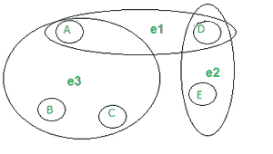
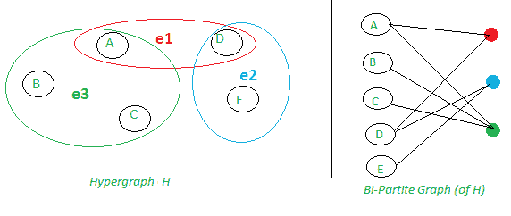
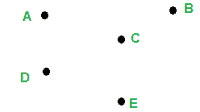
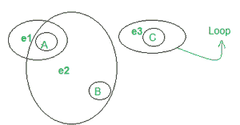
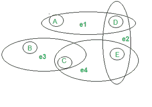

# 超图&其表示|离散数学

> 原文:[https://www . geeksforgeeks . org/hypergraph-its-表象-离散-数学/](https://www.geeksforgeeks.org/hypergraph-its-representation-discrete-mathematics/)

**简介:**
超图是超凸(广义边)可以连接到顶点/节点的子集而不是两个顶点/节点的图。
超图的边(也称为超边)是任意的非空顶点集。一个 k 超图有所有这样的恰好连接 k 个顶点的超格；因此，普通图是 2-超图(因为一条边连接 2 个顶点)。

**超图表示:**
无向超图 H 定义为一对 H = (V，E)，其中 V 是一组称为节点或顶点的项，E 是 V 的一组非空子集，称为超格或边(在无向超图中)。
这里，E 是 P(X)的子集，其中 P(X)是 X 的幂集。
每个超边可以表示为包含其成员的封闭曲线，以创建超图。
示例–



超图 H

H(V) = { A、B、C、D、E}
H(E) = {e1、e2、e3 } = { {A、D}、{D、E}、{ A、B、C} }

**阶&超图的大小:**
超图的阶=顶点集的大小，
超图的大小=边集的大小。

```
Order(H) = |H(V)|
Size(H)= |H(E)|
```

上面的超图有–
阶(H) = |H(V)| = 5
大小(H)= |H(E)| = 3

**超图到双部图:**
因为用双部图来表示超图总是可能的(尽管不总是方便的)，所以超图很少被使用。二部图中的顶点集可分为 P 和 Q 两个子集，每条边将 P 中的一个顶点连接到 Q 中的一个顶点。
我们简单地将 H 的顶点表示为 Q 中的顶点，将 H 的超边表示为 P 中的顶点，并且每当 s 是 H 中的超边 t 的成员时插入一条边(P，Q)



超图有两种描述方式。左边的五个顶点由三个超格连接。在右侧，相同的五个顶点通过普通边连接到表示超凸的新顶点(三个)。

**超图的属性:**
超图可以有许多不同的属性，包括–

*   **空超图**–
    空超图中没有边。如你所见，下图没有边，只有 5 个顶点，命名为:甲乙丙丁戊



空超图

*   **d–正则**–
    每个顶点都有一个 d 度，这意味着它包含在精确的 d 超格中。
    例:下图，超图是 2 正则的，因为所有的顶点(A，B & C)都有相同的度:2


2-正则超图

*   **2-可着色**–
    它的顶点可以分为 P 和 Q 两类，这样每个基数至少为 2 的超边至少有一个来自每个类的顶点。
*   **Non-Simple**–
    有环(单个顶点的超格)或重复边(两个或多个顶点集合相同的边)
    **例–**
    在下图中，我们可以看到 2 个环:e1 & e2e，所以是一个非 Simple 超图。



非简单超图

*   **简单–**
    这个设计没有循环或者重复的边。
*   **k 均匀**–
    每个超边界都是由正好 k 个顶点组成的。
    **示例–**
    在下面的 hypegraph 中，我们可以看到每个超边(e1，e2，e3，e4)由 2 个顶点组成，因此它是一个 2-均匀超图。



2-一致超图

*   **k-partition**–
    每个超边界恰好包含每种类型的一个顶点，这些顶点被分成 k 个部分。
    **例如–**
    在下面的超图中，假设顶点被分成 3 个部分:m (A，D)，(B，E) & (D，F)。请注意，每个超边只包含每个分区的一个顶点。


三部超图