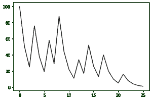
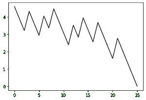
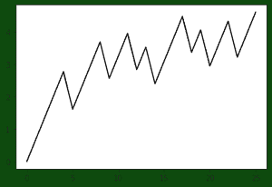
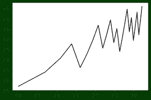

# 柯拉茨猜想的重要性

> 原文:[https://www . geeksforgeeks . org/the-concortz-prevention 的重要性/](https://www.geeksforgeeks.org/importance-of-the-collatz-conjecture/)

**引言:**
柯拉茨猜想是数学中一个难以捉摸的问题，它是关于自然数在通过基于奇数或偶数的特定函数时的单一性，具体来说，就是开始于无论初始数是多少，数列最终都会达到数 1。自 20 世纪初德国数学家洛塔尔·柯拉茨被认为是问题的起源以来，柯拉茨猜想一直是数学界的一个国际流行问题。

**对“该猜想”的描述:**
该猜想表述为–
取任意自然数 n，如果 n 为偶数，则除以 2 得到 n/2，如果 n 为奇数，则乘以 3 再加 1 得到 3n+1。无限期地重复这个过程。猜想是不管你从什么数字开始，你最终总会达到 1。

因此，对于自然数 n，我们可以定义以下函数–

> t(n)= n/2n≥0(mod 2)
> =(3 * n)+1n≥1(mod 2)

**一些研究:**
函数在连续迭代中的进展，而 n > 1 可以很容易地借助图形进行研究和可视化。为此，我们有相应的 python 代码来模拟一些运行并创建一个绘图。

## 蟒蛇 3

```
from matplotlib import pyplot as plt
n = int(input())
x = []
x.append(n)
while(n > 1):
    if(n % 2 == 0):
        n = n//2
        x.append(n)
        print(n)
    else:
        n = (3*n) + 1
        x.append(n)
        print(n)
plt.plot(x, '-ok')
plt.show()
```



上图是起始值 100。您可以用自己的一些初始值来尝试模拟代码。如你所见，上图相当混乱。除了最终收敛到 1 之外，没有其他明显的模式，因为值可能会很快变得很大。100 需要 25 步才能收敛，但其他人可能需要更多或更少。

让我们尝试一些更多的图表，通过在半对数网格中绘图，其中 y 轴是对数的，x 轴保持线性。该方法的 python 代码是:

## 蟒蛇 3

```
from matplotlib import pyplot as plt
import numpy as np

y = []
n = 100
y.append(n)
while(n > 1):
  if (n % 2 == 0):
    n = n//2
  else:
    n = (3*n) + 1
  y.append(n)
x = range(0,len(y))
plt.plot(x,np.log(y))
plt.show()
```

上述代码的图表如下:



现在，我们可以在另一种绘图方法中反转 y 轴，研究从 1 开始的增长，并创建如下图:



现在，为了找到一些关于我们的输入数收敛到 1 需要多少步的“模式”，让我们将上述绘图方法的 x 轴更改为对数刻度。的 python 代码如下所示:

## 蟒蛇 3

```
from matplotlib import pyplot as plt
import numpy as np

y = []
n = 100
y.append(n)
while(n > 1):
  if (n % 2 == 0):
    n = n//2
  else:
    n = (3*n) + 1
  y.append(n)
x = range(0,len(y))
plt.plot(np.log(x),np.log(y[::-1]))
plt.show()
```

上述代码的图表如下所示，其中 y 轴是 log 中的 collatz 值，x 轴是反向步进顺序。



现在用上面的作图方法，我们可以试着画出一堆不同的这样的系列来研究和比较每个系列的成长。