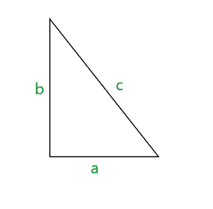
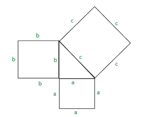
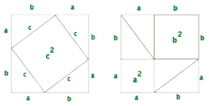

# 勾股定理背后的直觉

> 原文:[https://www . geeksforgeeks . org/直觉-背后-勾股定理/](https://www.geeksforgeeks.org/intuition-behind-pythagoras-theorem/)

毕达哥拉斯定理指出，在直角三角形中，“a”是三角形的底边，“b”是三角形的高度，“c”是三角形的斜边，那么 a2+b2= c2

以下是这方面的说明–

**示例–**

**1。如果直角三角形的底边是 3，高度是 4，那么它的斜边长度是多少？**
**解–**给定，a=3，b=4，c=？
利用勾股定理，
a2+b2= c2T13】32+42= c2T20】√(9+16)= c
c = 5

**2。如果直角三角形的斜边是 13，高度是 5，那么它的底边长度是多少？**
**解–**
给定，a=？，b=5，c=13
利用勾股定理，
a2+b2= c2T14】a2+52= 132T21】a =√(169-25)
a = 12

**毕达哥拉斯定理背后的直觉:**
让我们用图形来证明这个定理。
按照以下方式绘制对应于三角形每条边的正方形–

如果我们仔细看这个图，我们可以将勾股定理重新定义如下-
2 个正方形的面积等于第 3 个正方形。
ie- a 2 是第一个广场
b 2 是第二个广场
c 2 是第三个广场的面积

因此，a2+b2= c2
毕达哥拉斯定理的另一个证明可以通过重新排列三角形形成 2 个正方形来展示，如下所示

如果我们比较两个正方形，可以发现两个正方形都有 a+b 边长，因此面积相同。
在每个正方形中，使用了四个直角三角形(尽管以不同的方式重新排列)
因此，我们可以得出结论

面积(第一个正方形)=a rea(第二个正方形)
c 2 + 4*(直角三角形的面积)= a 2 +b 2 +4*(直角三角形的面积)
c2= a2+b2【从两侧取消常用术语】

于是，毕达哥拉斯定理被证明了。