# 数学|环同态

> 原文:[https://www . geesforgeks . org/mathematics-ring-同态/](https://www.geeksforgeeks.org/mathematics-ring-homomorphisms/)

**先决条件:**T2 戒指

**环同态:**
对集合进行任意两次二元运算的集合由和表示的 let 称为表示为的环，如果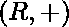是阿贝尔群，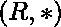是半群，它们也遵循左右分配律。

对于两个环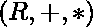和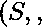【Tex】\次[/Tex] 来说，映射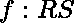被称为环同态，如果

1.  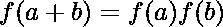、∀a、b∑。
2.  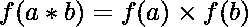、∀a、b∑。
3.  【Tex】([/Tex]IR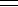IS，如果 I R 和 I S 分别是集于和集于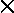操作的身份(如果存在的话)。

注:*环* 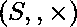 *称为环*  *的同形像。*

**示例:**

1.  函数 f(x) = x mod(n)从组(，+，*)到( n ，+，*)∀x∑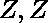是一组整数。+和*分别是简单的加法和乘法运算。
2.  对于任意两个群(r，+，*)和(S,⨁， ) ∀x ∈ R，函数 f(x) = x，称为同态环同态。
3.  对于∀x ∈ N，函数 f(x) = 0。
4.  函数 f(x) =它本身是复共轭形式群(C，+，*)，这里 C 是复数的集合。+和*分别是简单的加法和乘法运算。

**注:** *如果 f 是来自(r，+，*)和(S,⨁，*  *的同态，那么 f(O  R  ) = f(O S )，其中 O R 和 O S 分别是集合 R over +和集合 S over ⨁运算的恒等式。*

**注:** *如果 f 是来自(r，+，*)和(S,⨁，*  *)的环同态，那么 f : (R，+) → (S,⨁)就是群同态。*

**环同构:**
从环到环的一一并到同态称为环同构，和是同构的。

**环自同构:**
从环到自身的同态称为环自同构。

**场同态:**
对于两个场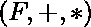和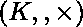一个映射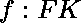被称为场同态，如果

1.  、∀a、b∑。
2.  、∀a、b∑。
3.  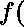 I  F    I K ，其中 I F 和 I K 分别是设置于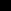和设置于操作的身份。
4.   O  F    O K ，其中 O F 和 O K 分别是设置于和设置于操作的标识。