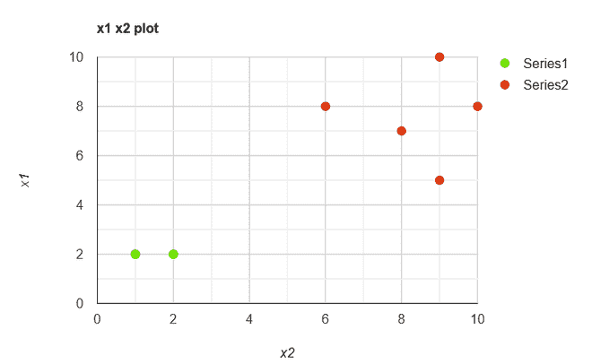
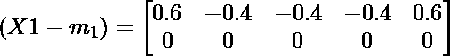
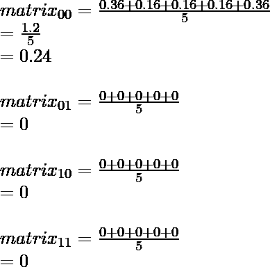
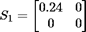
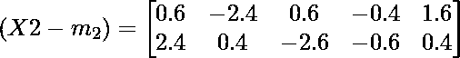
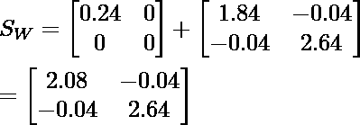
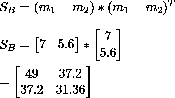
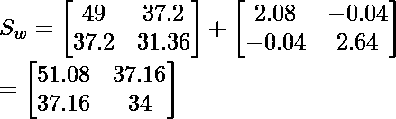

# 分散矩阵上的问题求解

> 原文:[https://www . geeksforgeeks . org/分散矩阵解题/](https://www.geeksforgeeks.org/problem-solving-on-scatter-matrix/)

**先决条件:** [散点图矩阵](https://www.geeksforgeeks.org/scatter-plot-matrix/)

我们计算可用数据点的 S <sub>w</sub> (类散布矩阵内)和 S <sub>B</sub> (类散布矩阵间)。

S <sub>W</sub> :为了最小化类内的可变性，类内分散。
S <sub>B</sub> :增加阶级之间的可变性，阶级之间的分散性。



点的散点图

```
X1 = (y1, y2) ={ (2,2), (1,2), (1,2), (1,2), (2,2) }
X2 = (y1,y2) ={ (9, 10), (6,8), (9,5), (8,7), (10,8) }
```

**类内分散矩阵:**


```
Si is the class specific covariance matrix.
mi is the mean of indivisual class
```

**平均值计算:**

我们计算课堂上每个点的平均值。这里的平均值是观测值的总和除以观测值的数量，我们需要这个平均值来计算矩阵的协方差。

![m_1 = [\frac{2+1+1+1+2}{5} , \frac{2+2+2+2+2}{5} ] \\  =  [1.4,2]](img/b22d9caa827e03aa85c2fa1f8af3138a.png "Rendered by QuickLaTeX.com")

![m_2 = [\frac{9+6+9+8+10}{5} , \frac{10+8+5+7+8}{5} ] \\  =  [8.4,7.6]](img/f5628c0591e210c5b73748779043d2c5.png "Rendered by QuickLaTeX.com")

**协方差矩阵计算:**
我们从每个观测值中减去平均值，然后用矩阵的转置进行矩阵乘法后计算平均值。

**第一个类别的类别特定协方差:**



![1) \begin{bmatrix} 0.6 \\ 0 \end{bmatrix} * \begin{bmatrix} 0.6 &0 \end{bmatrix} = \begin{bmatrix} 0.36 &0 \\ 0 &0 \end{bmatrix} \\\\ 2) \begin{bmatrix} -0.4 \\ 0 \end{bmatrix} * \begin{bmatrix} -0.4 &0 \end{bmatrix} = \begin{bmatrix} 0.16 &0 \\ 0 &0 \end{bmatrix} \\\\ 3) \begin{bmatrix} -0.4 \\ 0 \end{bmatrix} * \begin{bmatrix} -0.4 &0 \end{bmatrix} = \begin{bmatrix} 0.16 &0 \\ 0 &0 \end{bmatrix} \\\\ 4) \begin{bmatrix} -0.4 \\ 0 \end{bmatrix} * \begin{bmatrix} -0.4 &0 \end{bmatrix} = \begin{bmatrix} 0.16 &0 \\ 0 &0 \end{bmatrix} \\\\ 5) \begin{bmatrix} 0.6 \\ 0 \end{bmatrix} * \begin{bmatrix} 0.6 &0 \end{bmatrix} = \begin{bmatrix} 0.36 &0 \\ 0 &0 \end{bmatrix} \\\\](img/2fe35359ac2784bb926c2c258f3183f9.png "Rendered by QuickLaTeX.com")

取 1、2、3、4 和 5 的平均值。
我们计算 S1 矩阵中每个元素的所有值之和，除以观测值的个数，在当前计算中是 5。



因此 S <sub>1</sub> 为:



**第二类的类特定协方差:**



![1) \begin{bmatrix} 0.6 \\ 2.4 \end{bmatrix} * \begin{bmatrix} 0.6 &2.4 \end{bmatrix} = \begin{bmatrix} 0.36 &1.44 \\ 1.44 &05.76 \end{bmatrix} \\\\ 2) \begin{bmatrix} -2.4 \\ 0.4 \end{bmatrix} * \begin{bmatrix} -2.4 &0.4 \end{bmatrix} = \begin{bmatrix} 5.76 &-0.96 \\ -0.96 &0.16 \end{bmatrix} \\\\ 3) \begin{bmatrix} 0.6 \\ -2.6 \end{bmatrix} * \begin{bmatrix} 0.6 &-2.6 \end{bmatrix} = \begin{bmatrix} 0.36 &-1.56 \\ 1.56 &6.76 \end{bmatrix} \\\\ 4) \begin{bmatrix} -0.4 \\ -0.6 \end{bmatrix} * \begin{bmatrix} -0.4 &-0.6 \end{bmatrix} = \begin{bmatrix} 0.16 &0.24 \\ 0.24 &0.36 \end{bmatrix} \\\\ 5) \begin{bmatrix} 1.6 \\ 0.4 \end{bmatrix} * \begin{bmatrix} 1.6 &0.4 \end{bmatrix} = \begin{bmatrix} 2.56 &0.64 \\ 0.64 &0.16 \end{bmatrix} \\\\](img/93e25b1a0e4a6a3df547cbaee5b223c2.png "Rendered by QuickLaTeX.com")

平均来自 1、2、3、4 和 5 的值
我们计算 S2 矩阵中每个元素的所有值的和，并除以观测值的数量，在当前计算中是 5。


因此 S2 是:


**类内散布矩阵 S <sub>w</sub> :**

```
SW = S1 + S2
```



**类间散点矩阵 S <sub>B</sub> :**



**总散射矩阵:**

```
S<sub>T = SB + SW</sub>
```



因此，我们计算了可用数据点的类间散布矩阵和类内散布矩阵。

我们在特征提取中利用这些计算，其中主要目标是在点的投影中增加类之间的距离，并在投影中减少类内点之间的距离。这里，我们旨在生成所需维度的数据投影。