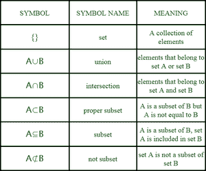
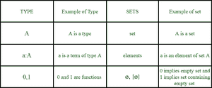

# 集合与类型的语义差异

> 原文:[https://www . geeksforgeeks . org/语义-集合与类型的区别/](https://www.geeksforgeeks.org/semantic-difference-between-set-and-type/)

**引言:**
从词源学上来说，集合是不同元素的集合，这些元素可能有一些特定的共同点，类型的意思是——“特定种类的”。

这两个术语在数学方面至关重要，因为它们产生了集合论和类型论。本文提供了集合和类型在数学上的语义差异。

**1。套装:**
**套装概述–**

*   在数学中，集合是不同元素的集合。
*   集合用斜体大写字母表示，如 *A、E、D* 等。
*   与 set 相关的问题可能会导致真或假的结果。
*   集合导致集合论。
*   Set 成立于 19 世纪。
*   乔治·坎特创立了集合论，也被称为集合论之父
*   集合论最终导致了格的概念，然后是布尔代数。它是布尔代数的根。

集合论

**意识形态–**

*   集合的意识形态是“集合”。
*   考虑数学中的预定义对象。这些预先定义的对象可以被分析、研究，并且可以基于某些因素被放在不同的组中。这些组形成一个集合，一个集合就是一个“集合”。
*   示例圆、点和线位于一个平面上，因此它们可以形成一个集合。

**集合的特征–**

*   集合有关联的“元素”。
*   在集合论中，一个元素可以属于多个集合。
*   数字可以用来表示集合。(0 表示空集，1 表示包含空集的集)。
*   集合论源于逻辑。因此，像谓词逻辑这样概念需要一个独立的系统。
*   集合有关联的操作。一些基本运算是——并、交、补和笛卡儿积。
*   为了检查一个元素是否属于集合，需要“证明”。

**器械包的应用–**

*   集合在数学中有其应用。集合在数学中是通用的(就语言而言)。集合用于构建关系。
*   Set 用于识别和存储计算机编程中的独特元素。
*   集合奠定了布尔代数的基础。
*   Set 奠定了计算机科学的一个非常重要的分支，即数字电子的基础。
*   集合最终导致了类型理论的建立。

**示例–**
N 是所有自然数的集合，因此 N={1，2，3，4，..} .Z 是所有整数的集合，这样 Z={-3，-2，-1，0，1，2，3，..}.集合 B={true，false}是一组布尔值。

**2。类型:**

类型理论

**类型概述–**

*   数学中的类型是在对一个术语求值时产生的某种值的集合。
*   类型用τ表示。
*   在第一种情况下，人们需要证明问的问题是否有意义。
*   类型导致类型理论。
*   类型理论最终在 1902 年至 1908 年间建立，当时伯特兰·罗素提出了各种类型理论。
*   类型源于集合论。
*   类型理论的提出是为了消除形式逻辑、重写系统和朴素集合论的不一致性。

**意识形态–**

*   类型的意识形态是“建构”。
*   在数学中，物体是根据规则构造的。
*   这些对象的组织基于它们的结构，将它们分类为不同的“类型”。
*   数学中的对象以独特的方式构造，导致独特的类型。

**类型特征–**

*   类型有与之关联的“术语”。
*   在类型理论中，术语一般只属于一种类型。
*   在类型理论中，数字被用来表示函数。术语“和”以及“或”可以被编码为类型本身。不需要单独的系统。
*   与类型相关联的特征有依赖类型、等式类型、归纳类型、宇宙类型和计算组件。
*   为了检查术语是否属于特定类型，需要“算法”。

**类型的应用–**

*   类型理论对证明助手、编程语言、数学基础、语言学和社会科学产生实际影响。
*   在编程语言中，类型系统用于识别错误。
*   证明检查器、证明助手、自动证明定理使用类型理论对数学中的证明进行编码。
*   格雷戈里·贝特森逻辑层次和双重束缚概念源于类型理论。
*   不同类型的语法使用类型理论对类型(如名词、动词)进行分类。
*   类型理论用于语言语义学。

**示例–**
如果 3 是类型 **nat** ，则存在类型***I*****NAT 3**的术语。3+(7∫8)5也是 Nat 型。(在集合中，这可以用表达式 3∈{n∈N∣∀x,y,z∈N+(xn+yn≠zn)}来表示)。类型理论中的 A 被评估为 M 是数据类型 A 的一个术语

简短而基本的例子

**结论–**
虽然集合和类型不同，但它们有明显的相关性。每种类型都会产生一组该类型的实体。事实上，类型理论的根源在于集合论。如果在扩展中考虑，集合也可以被视为类型。不同的类型可能会产生相同的集合。