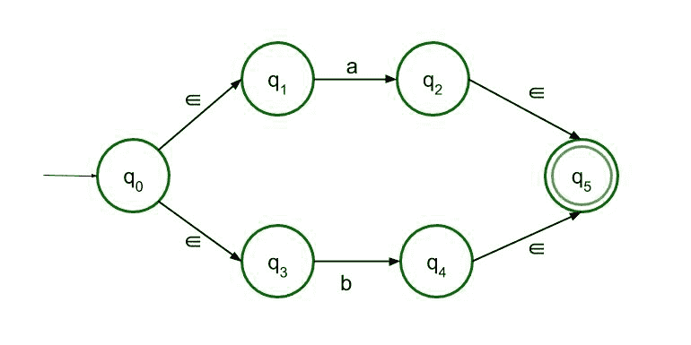
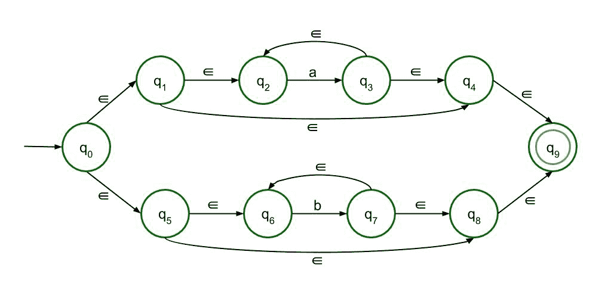

# ∑-L 的 NFA =(a *+b *)

> 原文:[https://www.geeksforgeeks.org/%e2%88%88-nfa-of-l-a-b/](https://www.geeksforgeeks.org/%e2%88%88-nfa-of-l-a-b/)

先决条件–[有限自动机介绍](https://www.geeksforgeeks.org/introduction-of-finite-automata/)

非确定性有限自动机和[∑-非确定性有限自动机](https://www.geeksforgeeks.org/conversion-of-epsilon-nfa-to-nfa/)除了它们的转移函数和有一些构造∑-NFA 的特殊规则外，几乎是一样的。

在∑-NFA，下列各州如下。

```
∈-NFA is defined in 5 tuple representation {Q, q0, Σ, δ, F} where
Q is the set of all states,
q0 is the initial state,
Σ is the set of input symbols,
δ is the transition function which is δ:Q × (Σ∪∈)->2Q and
F is the set of final states.

```

**构造∑-NFA 的规则:**

∑-NFA 构造的简单规则如下。

```
∈-NFA for a+ :

```

此结构用于 a+，这意味着表达式中必须至少有一个“a”。它的前面是ε，后面也是 1。从状态 q2 到 q1 有ε反馈，因此表达式中可以有多个“a”。


```
∈-NFA for a* :

```

这个结构是 a*的，这意味着表达式中可以有任意数量的“a”，甚至是 0。前面的结构只是修改了一点，以验证空输入符号，因此该表达式也是有效的。


```
∈-NFA for a+b :

```

该结构接受 a 或 b 作为输入。所以有两条路，都通向最终状态。



```
∈-NFA for ab :

```

对于串联，a 后面必须跟 b，只有这样才能达到最终状态。这里允许两种结构，但是因为它是∑-NFA，所以推荐第二种结构。


```
∈-NFA for L = (a* + b*) :

```

遵循上述规则，将构造正则语言 L =a* + b*的∞-NFA。上面的语言可以分成两部分。第一部分是 a*，第二部分是 b*，可以像第一部分一样构造。由于有一个“+”符号连接这两个部分，所以将有两条路径，这两条路径都将通向最终状态。

第一部分是 a*，所以它的绘制将与第二条规则完全相同。再次，使用第二个规则，用 b 替换 a，我们得到第二个部分，b*。

**决赛∑-NFA:**

决赛∑-NFA 将是:

