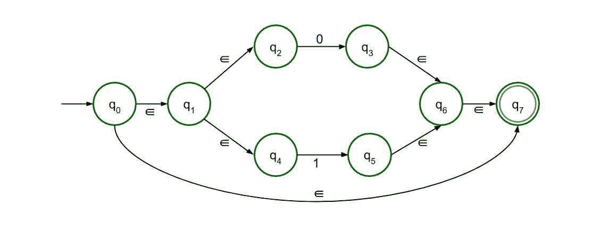
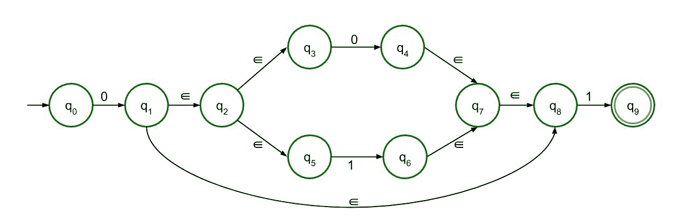
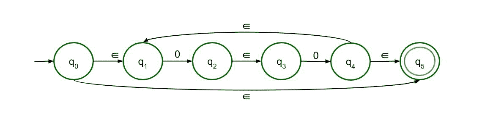
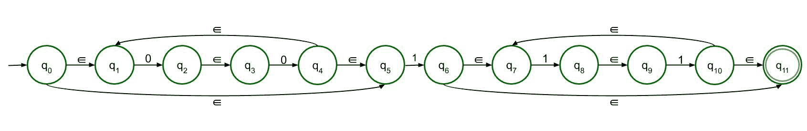

# ∑-正则语言的 NFA L = 0(0+1)* 1 和 L = (00)*1(11)*

> 原文:[https://www . geesforgeks . org/% E2 % 88% 88-NFA-of-regular-language-l-0011-and-l-00111/](https://www.geeksforgeeks.org/%e2%88%88-nfa-of-regular-language-l-0011-and-l-00111/)

非确定性有限自动机和∑-非确定性有限自动机除了它们的转移函数和构造∑-NFA 的一些特殊规则外，几乎是相同的。

```
∈-NFA is defined in 5 tuple representation {Q, q0, Σ, δ, F} where -
Q is the set of all states,
q0 is the initial state,
Σ is the set of input symbols,
δ is the transition function which is δ:Q × (Σ∪∈)->2Q and
F is the set of final states.
```

**简单规则建设∑-NFA:**
**∑-NFA 为 a+ :**


此结构用于 a+，这意味着表达式中必须至少有一个“a”。它的前面是ε，后面也是 1。从状态 q2 到 q1 有ε反馈，因此表达式中可以有多个“a”。

**∑-NFA 为一* :**


这个结构是 a*的，这意味着表达式中可以有任意数量的“a”，甚至是 0。前面的结构只是修改了一点，这样即使没有输入符号，即如果输入符号为空，那么表达式也是有效的。

**∑-a+b 的 NFA:**


该结构接受 a 或 b 作为输入。所以有两条路，都通向最终状态。

**∑-ab 的 NFA:**


对于串联，a 后面必须跟 b，只有这样才能达到最终状态。这里允许两种结构，但是因为它是∑-NFA，所以推荐第二种结构。

**∑-L 的 NFA = 0(0+1)* 1:**

遵循上述规则，将构造正则语言 L =0(0+1)*1 的∑-NFA。

L = 0(0+1)*1 可以分为三个部分- 0、(0+1)*、1。第二部分(0+1)*，将借助第三规则(a+b)绘制，其中 a = 0，b = 1，然后是第二规则 a*其中 a = (0+1)。下面是它的∑-NFA。



由于 0 和 1 只是连接到第二部分，最终的∑-NFA 是在第四个规则 ab 的帮助下绘制的。

**决赛∑-NFA 将–**



**∑-NFA 为 L = (00)*1(11)* :**

遵循上述规则，将构造正则语言 L = (00)*1(11)*的∑-NFA。

L = (00)*.1。(11)*为了便于构造∑-NFA，可以分为三个部分。第一部分是(00)*，第二部分是 1，第三部分是(11)*。由于它们都相互连接在一起，所以主要结构是借助第四条规则 ab 绘制的。现在，为了理解第一部分(00)*的结构，引用必须取自第四个，即 ab 和第二个规则，即 a*。首先连接 00，然后将其视为一个单位，并应用第二个规则，绘制(00)*。下面是它的∑-NFA。



类似地，可以画出(11)*。语言的第二部分很简单。第一部分和第三部分之间用“1”连接。

**决赛∑-NFA 将–**

