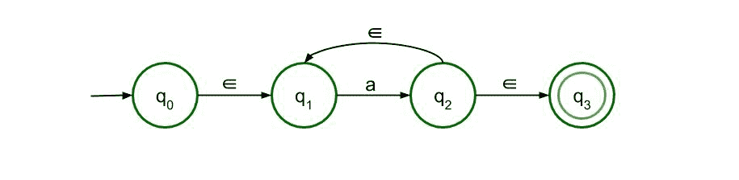
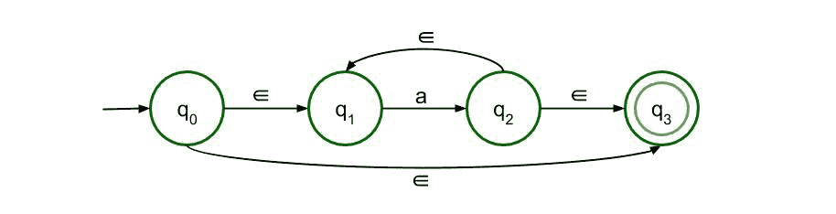
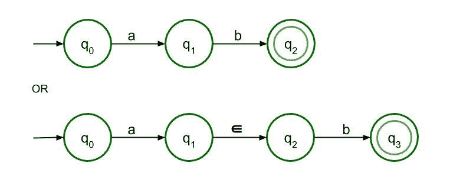
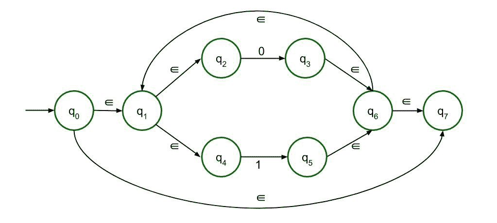
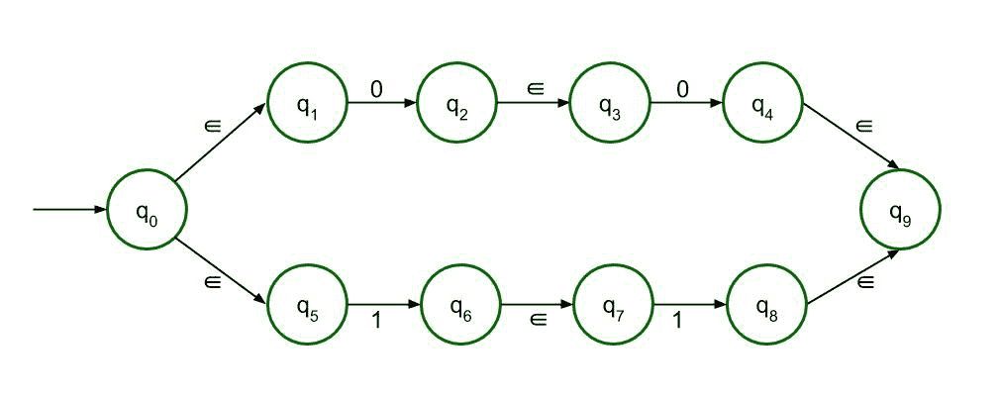
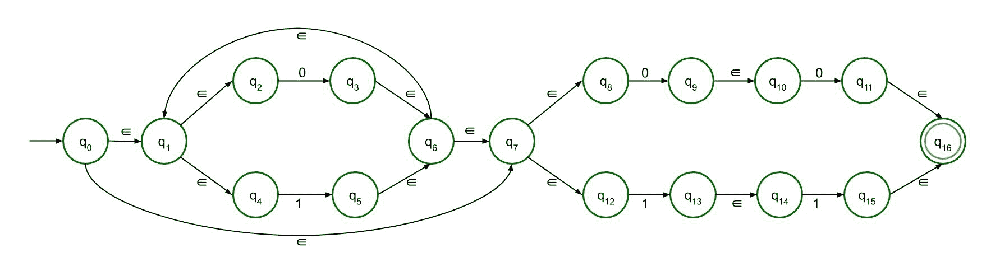

# ∑-正则语言的 NFA L =(0+1)*(00+11)L = b+ ba *

> 原文:[https://www . geesforgeks . org/% E2 % 88% 88-NFA-of-regular-language-l-0100-11-and-l-B- ba/](https://www.geeksforgeeks.org/%e2%88%88-nfa-of-regular-language-l-0100-11-and-l-b-ba/)

非确定性有限自动机和∑-非确定性有限自动机除了它们的转移函数和构造∑-NFA 的一些特殊规则外，几乎是相同的。

```
∈-NFA is defined in 5 tuple representation {Q, q0, Σ, δ, F} 
where -
Q is the set of all states,
q0 is the initial state,
Σ is the set of input symbols,
δ is the transition function which is δ:Q × (Σ∪∈)->2Q and
F is the set of final states.

```

**施工简单规则∑-NFA:**
**∑-NFA 为 a+ :**


此结构用于 a+，这意味着表达式中必须至少有一个“a”。它的前面是ε，后面也是 1。从状态 q2 到 q1 有ε反馈，因此表达式中可以有多个“a”。

**∑-NFA 为一* :**
为

这个结构是 a*的，这意味着表达式中可以有任意数量的“a”，甚至是 0。前面的结构只是修改了一点，这样即使没有输入符号，即如果输入符号为空，那么表达式也是有效的。

**∑-NFA 为 a+b :**
为

该结构接受 a 或 b 作为输入。所以有两条路，都通向最终状态。
**∑-NFA 为 ab :**

为串联，a 后面必须跟 b，只有这样才能达到最终状态。这里允许两种结构，但是因为它是∑-NFA，所以推荐第二种结构。

**∑-正则语言 L 的 NFA =(0+1)*(00+11):**
遵循上述规则，构造正则语言 L 的∑-NFA =(0+1)*(00+11)。
L = (0+1)*(00 + 11)可分为–( 0+1)*和(00 + 11)两部分。由于它们被连接在一起，这两个部分将彼此线性连接。

*   The first part can be drawn using the third rule and the second rule. (0+1) is easy to draw following the third rule and considering (0+1) as one unit, (0+1)* can also be drawn applying the second rule.

    下面是第一部分。
    

*   The second part can be drawn with the help of fourth rule. In the fourth rule, a and b both are 0\. That is how we construct 00\. Similarly, we can construct 11\. now since they are connected by ‘+’ sign, there will be two paths connecting both these structures.

    下面是第二部分。
    

**最终的∑-NFA 将是:**
将两个结构线性连接起来，我们就得到最终的∑-NFA。


**∑-正则语言 L = b + ba*的 NFA:**
遵循上述规则，构造正则语言 L =b + ba*的∑-NFA。
L =b + ba*有两个术语。第一个术语相当容易构建。由于这两个术语都用“+”符号连接，所以从第一个节点出来会有两条路径。第二项是根据第二条构造规则画出的，a*前面是 b。

**决赛∑-NFA 将:**
T3】