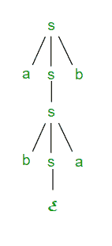
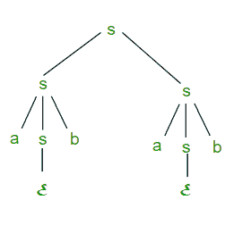

# 上下文无关语法和上下文无关语言中的歧义

> 原文:[https://www . geesforgeks . org/上下文无关歧义语法和上下文无关语言-2/](https://www.geeksforgeeks.org/ambiguity-in-context-free-grammar-and-context-free-languages-2/)

先决条件–[下推自动机](https://www.geeksforgeeks.org/introduction-of-pushdown-automata/)和[上下文无关语言](https://www.geeksforgeeks.org/closure-properties-of-context-free-languages/)。

假设我们有一个带有产生式规则的上下文无关语法 g:s->asb|bsa|ss|ℇ

**最左边的派生(LMD)和派生树:**从起始符号 S 开始的字符串最左边的派生是通过用对应产生式规则的 RHS 替换最左边的非终结符号来完成的。例如:上面语法 G 中字符串 abab 最左边的推导如下:

```
 S => aSb => abSab => abab
```

带下划线的符号使用生产规则替换。

**派生树:**它讲述了如何使用生产规则从 S 中派生字符串，如图 1 所示。

[](https://media.geeksforgeeks.org/wp-content/uploads/cfg-1.png)

图 1

**最右求导(RMD):** 从起始符号 S 开始的字符串的最右求导是通过用相应产生规则的 RHS 替换最右非终结符号来完成的。例如:字符串 abab 从上面的语法 G 中最右边的推导如下:

```
S => SS => SaSb => Sab => aSbab => abab
```

带下划线的符号使用生产规则替换。图 2 显示了使用最右侧派生的 abab 派生树。

图 2

派生可以是 LMD 或 RMD，或者两者都有，或者都没有。例如:

```
S => aSb => abSab => abab is LMD as well as RMD

but S => SS => SaSb => Sab => aSbab => abab is RMD but not LMD.

```

**歧义上下文无关语法:**如果由语法生成的字符串存在多个 LMD 或多个 RMD，则上下文无关语法称为歧义。在不明确的语法中，一个字符串也有多个派生树。上面描述的语法是不明确的，因为有两个派生树(图 1 和图 2)。字符串 abab 可以有多个 RMD，它们是:

```
S => SS => SaSb => Sab => aSbab => abab

S => aSb => abSab => abab

```

**模棱两可的上下文无关语言:**如果没有明确的语法来定义一种上下文无关语言，这种语言就被称为模棱两可的语言，这种语言也被称为固有模棱两可的上下文无关语言。

**注:**

*   如果上下文无关的语法 G 是不明确的，那么由语法 L(G)生成的语言可能是不明确的，也可能是不明确的
*   将模糊的 CFG 转换为明确的 CFG 并不总是可能的。只有一些模棱两可的 CFG 才能转换成不含糊的 CFG。
*   没有算法可以把模棱两可的 CFG 转换成毫不含糊的 CFG。
*   总有一个明确的 CFG 对应于明确的 CFL。
*   决定性的 CFL 总是毫不含糊的。

**问题:**考虑以下关于上下文无关语法的陈述

```
G = {S->SS, S->ab, S->ba, S->ℇ}
```

*   **I** G 模棱两可
*   **II** G 生成所有 a 和 b 数量相等的字符串
*   **III** G 可以被确定性的 PDA 接受

下面哪个组合表达了关于 G 的所有真实陈述？

1.  我只
2.  仅一级和三级
3.  仅第二和第三部分
4.  一、二和三

**解决方案:**有不同的 LMD 的字符串 abab，可以是

```
S => SS => SSS => abSS => ababS => abab

S => SS => abS => abab

```

**所以语法是模棱两可的。所以声明一是真的。**

语句二声明语法 G 产生所有 a 和 b 数目相等的字符串，但是它不能产生 aabb 字符串。所以陈述二是不正确的。

陈述三也是正确的，因为它可以被决定性的 PDA 所接受。所以正确的选项是(B)。

* * *

****提问:**以下哪个说法是假的？**

1.  **存在上下文无关的语言，因此生成它们的所有上下文无关语法都是不明确的。**
2.  **一个明确的上下文无关语法对于它生成的语言的每个字符串总是有一个唯一的解析树。**
3.  **确定性和非确定性下推自动机总是接受同一组语言。**
4.  **一个字母表中有限一组字符串始终是一种常规语言。**

****解:** (A)是正确的，因为对于模棱两可的 CFL，与之对应的所有 CFG 都是模棱两可的。**

**(B)也是正确的，因为明确的 CFG 对它生成的语言的每个字符串都有一个唯一的解析树。**

**(C)是错误的，因为某些语言被非确定性的 PDA 接受，但不被确定性的 PDA 接受。**

**(D)也是真的，因为有限串集总是正则的。**

****所以选项(C)是正确的选项。****

**本文由 Sonal Tuteja 供稿。如果您发现任何不正确的地方，或者您想分享更多关于上述主题的信息，请写评论**