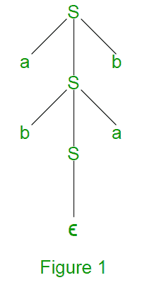
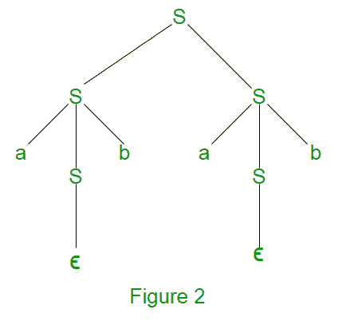

# 上下文无关语法和上下文无关语言中的歧义

> 原文:[https://www . geesforgeks . org/上下文无关歧义语法和上下文无关语言/](https://www.geeksforgeeks.org/ambiguity-in-context-free-grammar-and-context-free-languages/)

在阅读本文之前，我们建议您先阅读[下推自动机](https://www.geeksforgeeks.org/introduction-of-pushdown-automata/)和[上下文无关语言](https://www.geeksforgeeks.org/closure-properties-of-context-free-languages/)。

假设我们有一个带有产生式规则的上下文无关语法 G:S->aSb | bSa | SS | e

**最左侧派生(LMD)和派生树:**从起始符号 S 开始的字符串的最左侧派生是通过用相应产生式规则的 RHS 替换最左侧非终结符号来完成的。例如，字符串 abab 从上面的语法 G 最左边的推导如下:
<u>S</u>=>a<u>S</u>b =>ab<u>S</u>ab =>abab
带下划线的符号使用生产规则替换。

派生树:它讲述了如何使用生产规则从 S 中派生出一个字符串，如图 1 所示。

**最右求导(RMD) :** 从起始符号 S 开始的字符串的最右求导是通过用对应产生式规则的 RHS 替换最右非终结符号来完成的。例如:字符串 abab 从上面的语法 G 最右边的推导如下:
<u>S</u>=>S<u>S</u>=>Sa<u>S</u>b =>T33】Sab =>a<u>S</u>Bab =>abab
带下划线的符号使用生产规则替换。图 2 显示了使用最右侧派生的 abab 派生树。

一个派生可以是 LMD 或 RMD，也可以是两者都有，也可以没有。比如<u>S</u>=>a<u>S</u>b =>ab<u>S</u>ab =>abab 是 LMD 也是 RMD 但是<u>S</u>=>S<u>S</u>=>Sa<u>S</u>b =>T13】Sab =>a<u>S【T16

**歧义上下文无关语法:**如果由语法生成的字符串存在多个 LMD 或多个 RMD，则上下文无关语法称为歧义。在不明确的语法中，一个字符串也有多个派生树。上面描述的语法是不明确的，因为有两个派生树(图 1 和图 2)。字符串 abab 可以有多个 RMD，它们是:
T22 S</u>=>S<u>S</u>=>Sa<u>S</u>b =>T28 Sab =>A<u>S</u>Bab =>abab
T33】S=>A<u>S【T36 如果没有明确的语法来定义这种语言，这种语言就是模棱两可的，它也被称为本质上模棱两可的上下文无关语言。
eg-L = { anbncmU { anbmcm}

T58】注:</u>

*   如果一个上下文无关的语法 G 是模棱两可的，那么由语法 L(G)生成的语言可能是模棱两可的，也可能不是。
*   将模糊的 CFG 转换为明确的 CFG 并不总是可能的。只有一些模棱两可的 CFG 才能转换成不含糊的 CFG。
*   没有算法可以把模棱两可的 CFG 转换成毫不含糊的 CFG。
*   总有一个明确的 CFG 对应于明确的 CFL。
*   确定性 CFL 总是明确的，并且由 LR 解析器解析。

**问题:**考虑以下关于上下文无关语法的陈述
G = {S - > SS，S - > ab，S - > ba，S - >？}
I. G 模棱两可
II。g 产生 a 和 b 数量相等的所有字符串
III。G 可以被确定性的 PDA 接受

下面哪个组合表达了关于 G 的所有真实陈述？
A. I 只
B. I 和 III 只
C. II 和 III 只
D. I、II 和 III

**解:**弦 abab 有不同的 LMD，可以是
S =>T18】SS =>T20】SSS =>ab<u>S</u>S =>ABA 所以声明一是真的。

语句二声明语法 G 产生 a 和 b 个数相等的所有字符串，但不能产生 aabb 字符串。所以陈述二是不正确的。
陈述三也是正确的，因为它可以被确定性 PDA 所接受。所以正确的选项是(B)。

**提问:**以下哪一项陈述为 FALSE？
答:存在上下文无关语言，因此生成它们的所有上下文无关语法都是不明确的。
B .一个明确的上下文无关语法对于它生成的语言的每个字符串总是有一个唯一的解析树。
C .确定性和非确定性下推自动机总是接受同一组语言。
D .一个字母表中有限一组字符串始终是一种常规语言。

**解答:** (A)是正确的，因为对于模棱两可的 CFL 氏，与其对应的所有 CFG 都是模棱两可的。
(B)也是正确的，因为明确的 CFG 对它生成的语言的每个字符串都有一个唯一的解析树。
(C)为假，因为某些语言被非确定性的 PDA 接受，但不被确定性的 PDA 接受。
(D)也是如此，因为有限集合的字符串总是正则的。
所以选项(C)是正确的选项。

歧义是自然语言的一个普遍特征，在自然语言中，歧义是可以容忍的，并且有多种处理方式。在编程语言中，每个语句应该只有一种解释，在可能的情况下，必须消除歧义。通常，我们可以通过以等价的、明确的形式重写语法来实现这一点。

本文由 **Sonal Tuteja** 供稿。

如果发现有不正确的地方，或者想分享更多关于上述话题的信息，请写评论