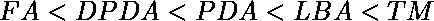

# 各种自动机的应用

> 原文:[https://www . geesforgeks . org/applications-of-variable-automator/](https://www.geeksforgeeks.org/applications-of-various-automata/)

自动机是一种机器，它可以接受语言 L 的字符串，而不是输入字母 T4 的 T2。
到目前为止，我们已经熟悉了自动机的类型。现在，让我们讨论自动机的表达能力，并进一步了解它的应用。

**<u>各种自动机的表现力</u> :**
任何机器的表现力都可以从该特定类型的机器所接受的一类或一组语言中确定。以下是机器表达能力的递增顺序:



正如我们可以观察到的，FA 没有任何其他机器强大。需要注意的是，DFA 和 NFA 的权力是一样的，因为每个 NFA 都可以转换成 DFA，每个 DFA 都可以转换成 NFA。
图灵机即 TM 比其他任何机器都更强大。

(一)有限自动机等价:

```
Finite Automata 
≡ PDA with finite Stack 
≡ TM with finite tape 
≡ TM with unidirectional tape 
≡ TM with read only tape 
```

(二)下推自动机(PDA)等价:

```
PDA ≡ Finite Automata with Stack 
```

(三)图灵机等价:

```
Turing Machine 
≡ PDA with additional Stack 
≡ FA with 2 Stacks 
```

这些自动机的**应用**如下所示:

**1。[有限自动机(FA)](https://www.geeksforgeeks.org/toc-finite-automata-introduction/)–**

*   用于编译器的词法分析设计。
*   使用正则表达式识别模式。
*   使用迈利和摩尔机器设计组合电路和时序电路。
*   用于文本编辑器。
*   为了实现拼写检查。

**2。[下推自动机(PDA)](https://www.geeksforgeeks.org/theory-of-computation-pushdown-automata/)–**

*   用于设计编译器的解析阶段(语法分析)。
*   用于堆栈应用程序的实现。
*   用于计算算术表达式。
*   为了解决河内塔问题。

**3。线性有界自动机(LBA)–**

*   为了实现基因编程。
*   用于为编译器的语义分析构建语法分析树。

**4。[图灵机(TM)](https://www.geeksforgeeks.org/turing-machine/)–**

*   用于解决任何递归枚举问题。
*   理解复杂性理论。
*   用于实现神经网络。
*   用于机器人应用的实现。
*   为了实现人工智能。