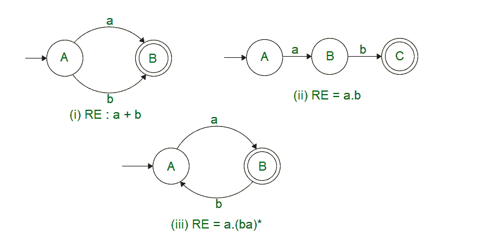
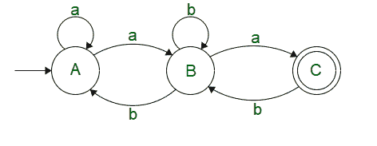
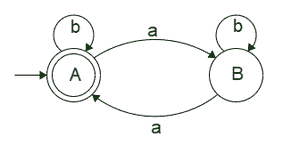

# 阿登定理和具有挑战性的应用|第 2 集

> 原文:[https://www . geesforgeks . org/ardens-定理与挑战-应用-set-2/](https://www.geeksforgeeks.org/ardens-theorem-and-challenging-applications-set-2/)

已经掌握了如何绘制基本[有限状态机](https://www.geeksforgeeks.org/toc-finite-automata-introduction/) ( DFA，NFA 或
 -NFA)的知识。我们将从提供的状态机中导出正则表达式。

对于下面提供的某些示例，导出它相当简单。



但是对于下面的例子，仅仅通过观察有限状态机很难推导出正则表达式。为此，我们利用阿登定理来简化我们的单个状态方程，并得出我们的最终状态方程(可能是也可能不是简化版本)



***阿登定理**指出，如果 P & Q 是超过*  *的两个正则表达式，并且如果 P 不包含*  *，那么由 R = Q + RP 给出的下列方程 R 有唯一解；R = QP** 

```
PROOF  :- 
R = Q + RP
R = Q + QP*P   ( Substituting the value of R )
R = Q( + P*P)

R = QP *( P*P = ,  +  = P* )

```

让我们借助阿登定理来求解上面提供的自动机。

我们看到，在状态 C 上，当 a 是输入时，有一个来自 B 的状态转移

```
 C = Ba 

```

在状态 B 上，输入 B 上有一个自循环，当输入为 A 时，从状态 A 转换，当输入为 B 时，从状态 C 转换

```
 B = Bb + Cb + Aa 

```

在状态 A 上，有一个转换(作为开始状态，转换必须包括在内)，输入 A 上的自循环，当输入为 B 时，从 B 的转换。

```
 A =  + Aa + Bb  

```

将(2)放入(1)中，我们得到

```
C = Ba
C = (Aa + Bb + Cb)a
C = Aaa + Bba + Cba

```

把(1)放入(2)，我们得到

```
B = Bb + Cb + Aa
B = Aa + Bb + (Ba)b
B = Aa + B(b + ab)
B = Aa(b + ab)*  (Using R = QP*)

```

把(2)放入(3)，我们得到

```
A =  + Aa + Bb
A =  + Aa + Aa(b + ab)*b
A =  + A(a + a(b + ab)*b)
A =  (a + a(b + ab)*b)*
A = (a + a(b + ab)*b)*

```

作为最后一步，让我们将所有简化的方程合并到最终状态 C

```
C = Ba
C = Aa(b + ab)*a
C = (a + a(b + ab)*b)* a (b + ab)* a

```

这个例子对应于从提供的 NFA 到正则表达式的直接推导。

假设，我们遇到了这样一个问题

***问题:*** 导出一个正则表达式来表示一种甚至没有 a 的语言

在这种情况下，仅仅用试错法很难得到一个正则表达式。
我们可能会遇到如下示例解决方案

这可能会满足某些情况，但也会导致不需要的情况和具有交替 a 和 b 的缺失情况。
解决这个问题最好的方法是先为同一个画一个有限状态机，然后从同一个导出正则表达式。

下图显示了所提供问题的 DFA



现在我们有了 DFA，让我们用阿登单态方程定理来解决它。

我们看到，在状态 A 下，有一个带有输入 B 的自循环和带有输入 A 的从 B 的转换

```
A =  + Ab + Ba 

```

我们看到，在状态 B 上，输入 B 上有一个自循环，当输入为 A 时，从 A 转换。

```
B = Aa + Bb

```

取方程为 B，我们可以应用阿登定理

```
B = Aa + Bb
B = Aab*

```

将 B 的值代入 A 中，我们得到

```
A =  + Ab + Ba
A =  + Ab + (Aab*)a
A =  ( b + ab*a )*
A = ( b + ab*a )*

```

因此，所提供问题的正则表达式是 ***RE : ( b + ab*a )****

我们看到阿登定理可以作为一个强大的简化工具来确定正则表达式，并根据正则表达式设计所需的有限状态机。

请参考[第 1 集](https://www.geeksforgeeks.org/theory-of-computation-ardens-theorem/)