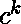
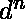
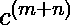
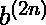
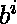
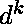
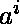
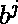
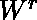
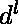

# 检查语言是否与上下文无关

> 原文:[https://www . geesforgeks . org/check-如果语言是上下文无关的或不相关的/](https://www.geeksforgeeks.org/check-if-the-language-is-context-free-or-not/)

先决条件–[抽取引理](https://www.geeksforgeeks.org/theory-of-computation-pumping-lemma/)、[如何识别一种语言是否正规](https://www.geeksforgeeks.org/how-to-identify-if-a-language-is-regular-or-not/)
我们通常会面临一些问题，以识别哪些给定的语言是上下文无关的。对于常规语言来说，回答这个问题相对容易，但是对于上下文无关语言来说，这个问题有时很棘手。Pumping Lemma 为我们提供了执行否定测试的能力，即如果一种语言不满足 pumping lemma，那么我们可以肯定地说它不是上下文无关的，但是如果它满足，那么该语言可能是上下文无关的，也可能不是上下文无关的。泵引理更多的是一种数学证明，需要更多的时间，并且将其应用于上下文无关语言是一项乏味的任务，并且为复杂的语言表达式找到反例并不困难。基于常见的观察和分析，我们可以非常快速地解决这个问题:

1.  每种常规语言都是上下文无关的。
    **示例–**{| m，l，k，n > = 1 }是上下文无关的，因为它也是常规的。
2.  Given an expression such that it is possible to obtain a center or mid point in the strings, so we can carry out comparison of left and right sub-parts using stack.
    **Example 1 –** L = {  | n >= 1} is context free, as we can push a’s and then we can pop a’s for each occurrence of b.

    **例 2–**L = {}是上下文无关的。我们可以改写为{     }。

    **示例 3–**L = {}是上下文无关的，因为我们可以为 b 的每次出现推两个 a 并弹出一个 a。因此，我们在这里也得到一个中点。

    **例 4–**L = {}并非上下文无关。

3.  Given expression is a combination of multiple expressions with mid-points in them, such that each sub-expression is independent of other sub-expressions, then it is context free.
    **Example 1 –** L = {     } is context free. It contains multiple expressions with a mid-point in each of them.

    **例 2–**L = {}并非上下文无关。

4.  给定的表达式由一个操作组成，在这个操作中可以找到中间点以及中间的一些独立的正则表达式，从而得到上下文无关的语言。
    **例–**L = {}是上下文无关语言。
    这里，我们有 b^i 和 d^k 作为中间独立的正则表达式，这不会影响堆栈。
5.  没有形成可以使用堆栈进行线性比较的模式的表达式不是上下文无关语言。
    **示例 1–**l = { a^m b^n^2 }不是上下文无关的。
    **示例 2–**l = { a^n b^2^n }不是上下文无关的。
    **示例 3–**l = { a^n^2 }不是上下文无关的。
    **例 4–**L = {| m 为素数}不是上下文无关的。
6.  An expression that involves counting and comparison of three or more variables independently is not context free language, as stack allows comparison of only two variables at a time.
    **Example 1 –** L = {    } is not context free.

    **示例 2–**L = { w | na(w)= nb(w)= NC(w)}不是上下文无关的。

    **例 3–**L = {| I>j>k }不是上下文无关的。

7.  A point to remember is counting and comparison could only be done with the top of stack and not with bottom of stack in Push Down Automata, hence a language exhibiting a characteristic that involves comparison with bottom of stack is not a context free language.
    **Example 1 –** L = {     } is not context free.
    Pushing a’s first then b’s. Now, we will not be able to compare c’s with a’s as the top of the stack has b’s.

    **例 2–**L = { WW | W 属于{a，b}* }不是上下文无关的。
    人们可能会想画一个非确定性的下推自动机，但这没有帮助，因为第一个符号将在堆栈的底部，当第二个 W 开始时，我们将无法将其与堆栈的底部进行比较。

8.  If we can find mid-point in the expression even in a non-deterministic way, then it is context free language.
    **Example 1 –** L = { W  | W belongs to {a, b}* } is context free language.

    **例 2–**L = {| I = k 或 j=l }是上下文无关语言。