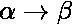
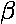

# 计算理论中的乔姆斯基层次结构

> 原文:[https://www . geesforgeks . org/Chomsky-计算理论中的层次结构/](https://www.geeksforgeeks.org/chomsky-hierarchy-in-theory-of-computation/)

根据[乔姆斯基层次结构](https://www.geeksforgeeks.org/toc-chomsky-hierarchy/)，语法分为 4 种类型:

```
Type 0 known as unrestricted grammar.
Type 1 known as context sensitive grammar.
Type 2 known as context free grammar.
Type 3 Regular Grammar.
```


**类型 0:无限制语法:**

在类型 0
中，类型 0 语法包括所有形式语法。图灵机识别 0 型语法语言。这些语言也被称为递归可枚举语言。

形式上的语法生产



在哪里

为(V + T)* V ( V + T)*
V:变量
T:端子。

为(V + T )*。
在类型 0 中，生产的左侧必须至少有一个变量。

例如，

sab–> ba
A–>s。

这里，变量是 S，A 和终端 A，b

**类型 1:上下文敏感语法)**
类型 1 语法生成上下文敏感语言。语法生成的语言被类型 1
中的[线性边界自动机](https://en.wikipedia.org/wiki/Linear_bounded_automaton)
识别，首先类型 1 语法应该是类型 0。
二。形式上的语法生产


|  | < = |  |

即中的符号计数小于或等于

例如
S–>AB
AB–>ABC
B–>B

**类型 2:上下文无关语法:**
类型 2 语法生成上下文无关语言。语法生成的语言由[下推自动机](https://www.geeksforgeeks.org/theory-of-computation-pushdown-automata/)识别。
在类型 2 中，
1。首先应该是 1 型。
2。生产的左侧只能有一个变量。

|  | = 1。

他们对没有限制。

例如
S–>AB
A–>A
B–>B

**类型 3:常规语法:**
类型 3 语法生成常规语言。这些语言完全是有限状态自动机可以接受的所有语言。

类型 3 是最受限制的语法形式。
类型 3 只能是给定的形式:

**V–>VT/T**(左-常规语法)

**(或)**

**V–>TV/T**(右-常规语法)

例如:

s–> a

上述形式被称为严格规则语法。

还有一种形式的常规语法叫做扩展常规语法。以这种形式:

**V–>VT */T *。**(扩展左-正则语法)
**(或)**
**V–>T * V/T ***(扩展右-正则语法)

例如:
S–>ab。

**参考文献**
[https://en.wikipedia.org/wiki/Chomsky_hierarchy](https://en.wikipedia.org/wiki/Chomsky_hierarchy)

如果发现有不正确的地方，请写评论，或者想分享更多关于以上讨论话题的信息