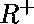
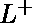
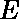
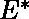
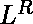
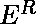
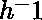

# 正则语言的闭包属性

> 原文:[https://www . geesforgeks . org/closure-properties-of-regular-languages/](https://www.geeksforgeeks.org/closure-properties-of-regular-languages/)

**[正则语言](https://www.geeksforgeeks.org/regular-expressions-regular-grammar-and-regular-languages/)上的闭包属性**被定义为正则语言上的某些操作，这些操作保证产生正则语言。闭包指的是对一种语言的某种操作，从而产生一种与最初操作的语言“类型”相同的新语言，即正则语言。

常规语言在下列操作下关闭。

**考虑 L 和 M 是正则语言:**

1.  **Kleen 闭包:**
    RS 是语言为 L 的正则表达式，M. R*是语言为 L*的正则表达式。

*   **正闭包:**
    RS 是语言为 L 的正则表达式，M. 是语言为的正则表达式。*   **补语:**
    语言 L 的补语(相对于字母表使得包含 L)是–L。由于肯定是规则的，所以规则语言的补语总是规则的。*   **反转运算符:**
    给定语言 L，是反转在 L 中的字符串集合。
    例:L = {0，01，100 }；
     ={0，10，001}。
    **证明:**让 E 为 l 的正则表达式，我们展示如何反转 E，为提供正则表达式。*   **补语:**
    语言 L 的补语(相对于字母表使得包含 L)是–L。由于肯定是规则的，所以规则语言的补语总是规则的。*   **Union:**
    让 L 和 M 分别是正则表达式 R 和 S 的语言。那么 R+S 就是语言为(L U M)的正则表达式。*   **交集:**
    设 L 和 M 分别是正则表达式 R 和 S 的语言，那么它就是语言为 L 的正则表达式
    **证明:**设 A 和 B 分别是语言为 L 和 M 的 DFA。构造 C，A 和 B 的乘积自动机使 C 的最终状态成为由 A 和 B 的最终状态组成的对*   **Set Difference operator:**
    If L and M are regular languages, then so is L – M = strings in L but not M.

    **证明:**设 A 和 B 分别是语言为 L 和 M 的 DFA。构造 C，A 和 B 的乘积自动机使 C 的最终状态成为对，其中 A 态是最终的，而 B 态不是。

    *   **Homomorphism:**
    A homomorphism on an alphabet is a function that gives a string for each symbol in that alphabet. Example: h(0) = ab; h(1) = . Extend to strings by h(a1…an) =h(a1)…h(an). Example: h(01010) = ababab.

    如果 L 是正则语言，h 是其字母表上的同态，那么 h(L)= {h(w) | w 在 L 中}也是正则语言。
    **证明:**设 E 为 L 的正则表达式，将 h 应用于 E 语言中的每个符号，得到的 R，E 为 h(L)。

    *   **Inverse Homomorphism :** Let h be a homomorphism and L a language whose alphabet is the output language of h.  (L) = {w | h(w) is in L}.

    **注:**在正则语言的闭包性质下，像对称差算符、前缀算符、代换这样的性质比较少。

    **决策属性:**
    在有限自动机的情况下，几乎所有的属性都是[可决策的](https://www.geeksforgeeks.org/decidable-and-undecidable-problems-in-theory-of-computation/)。

    ```
    (i) Emptiness 
    (ii) Non-emptiness 
    (iii) Finiteness 
    (iv) Infiniteness 
    (v) Membership 
    (vi) Equality  
    ```

    这些解释如下。

    **(一)空与非空:**

    *   **步骤-1:** 从初始状态中选择无法到达的状态&删除它们(删除无法到达的状态)。
    *   **步骤 2:** 如果生成的机器至少包含一个最终状态，那么有限自动机接受非空语言。
    *   **Step 3:** if the resulting machine is free from final state, then finite automata accepts empty language.

        **(ii)有限性和无限性:**

        *   **步骤-1:** 从初始状态&中选择无法到达的状态，将其删除(删除无法到达的状态)。
        *   **第 2 步:**选择我们无法到达最终状态的状态&删除它们(移除死状态)。
        *   **步骤 3:** 如果结果机器包含循环或循环，那么有限自动机接受无限语言。
        *   **步骤-4:** 如果结果机器不包含循环或循环，那么有限自动机接受无限语言。

        **(iii)成员资格:**
        成员资格是验证任意字符串是否被有限自动机接受的属性，即它是否是该语言的成员。

        设 M 是一个有限自动机，接受字母表上的一些字符串，设‘w’是字母表上定义的任意字符串，如果 M 中存在一个过渡路径，从初始状态开始&在最终状态的任意一个结束，那么字符串‘w’就是 M 的成员，否则‘w’不是 M 的成员。

        **(iv)相等:**
        两个有限状态自动机 M1 & M2 据说是相等的当且仅当，它们接受相同的语言。最小化有限状态自动机，最小化的 DFA 将是唯一的。