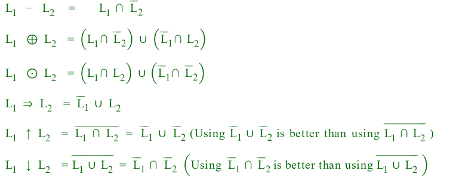

# 目录中的闭包属性表

> 原文:[https://www . geesforgeks . org/closure-properties-table-in-TOC/](https://www.geeksforgeeks.org/closure-properties-table-in-toc/)

下表显示了形式语言的闭包属性:

**REG** =正则语言
**DCFL** =确定性上下文无关语言，
**CFL** =上下文无关语言，
**CSL** =上下文相关语言，
**RC** =递归。
**RE** =递归可枚举

**考虑 L 和 M 是正则语言:**

1.  **Kleene star–**
    ∑*，是一组符号或字符串上的一元运算符，∑，它给出了所有可能长度的所有可能字符串在∑包括λ上的无限集合。
2.  **Kleen Plus–**
    集合∑+是除λ之外的所有可能长度的所有可能字符串的无限集合。
3.  **补语–**
    语言 L 的补语(相对于字母表 E，E * 包含 L)是 E*–L。因为 E *肯定是正则的，所以正则语言的补语总是正则的。
4.  **反向运算符–**
    给定语言 L，L R 是其反向位于 L 的字符串集
5.  **补语–**
    语言 L 的补语(相对于字母表 E，E * 包含 L)是 E*–L。因为 E *肯定是正则的，所以正则语言的补语总是正则的。
6.  **Union–**
    让 L 和 M 分别是正则表达式 R 和 S 的语言。那么 R+S 就是语言为(L U M)的正则表达式。
7.  **交集–**
    让 L 和 M 分别是正则表达式 R 和 S 的语言，那么它就是语言为 L 交集 M 的正则表达式
8.  **设置差异运算符–**
    如果 L 和 M 是正则语言，那么 L–M = L 中的字符串而不是 M 也是正则语言
9.  **同态–**
    字母表上的同态是为该字母表中的每个符号给出一个字符串的函数。
10.  **逆同态–**
    设 h 为同态，L 为字母表为 h 的输出语言的语言. h -1 (L) = {w | h(w)在 L}中。
11.  **替换–**
    替换是字母到语言的映射，同样扩展到字符串到语言的映射。通过向 tx 标识单例语言{x}，变形被视为替换的特殊情况。
12.  **左商–**左商，或语言 L 除以一个单词 w 的商是语言 Lw = { x∈σ* | wx∈L }
    L1 与 L2 的右商是所有字符串 x 的集合，在这里你可以从 L2 挑选一些 y，并将其附加到 x 上，以从 L1 获得一些东西。也就是说，如果 L2 有 y，而 xy 在 L1，那么 x 就是商。)

<figure class="table">

| **操作** | reg | dcfl | CFL | csl | **RC** | **RE** |
| 联盟 | Y | 普通 | Y | Y | Y | Y |
| 交集 | Y | 普通 | 普通 | Y | Y | Y |
| 设置差异 | Y | 普通 | 普通 | Y | Y | 普通 |
| 补充 | Y | Y | 普通 | Y | Y | 普通 |
| 与常规语言的交集 | Y | Y | Y | Y | Y | Y |
| 与常规语言的结合 | Y | Y | Y | Y | Y | Y |
| 串联 | Y | 普通 | Y | Y | Y | Y |
| 克莱尔之星 | Y | 普通 | Y | Y | Y | Y |
| 不要再擦了 | Y | 普通 | Y | Y | Y | Y |
| 反转 | Y | Y | Y | Y | Y | Y |
| 无ε同态 | Y | 普通 | Y | Y | Y | Y |
| 同形 | Y | 普通 | Y | 普通 | 普通 | Y |
| 逆同态 | Y | Y | Y | Y | Y | Y |
| 无ε取代 | Y | 普通 | Y | Y | Y | Y |
| 代替 | Y | 普通 | Y | 普通 | 普通 | Y |
| 子集 | 普通 | 普通 | 普通 | 普通 | 普通 | 普通 |
| 正则语言的左差(左正则) | Y | Y | Y | Y | Y | Y |
| 正则语言的右差 | Y | Y | 普通 | Y | Y | 普通 |
| 正则语言的左商 | Y | Y | Y | 普通 | Y | Y |
| 正则语言的右商 | Y | Y | Y | 普通 | Y | Y |

</figure>

**注:**如果我们把任何语言与常规语言做并集、交集或集差，语言是不会变的。
例子

*   CFL ∩正规的是 CFL。
*   CFL ∪正则是 CFL。

将次要操作转换为主要操作总是一个好主意。
让 L 1 和 L 2 成为两种语言。

**注:为** **⊆、⊇，无限合纵，无限交集，无限集差，无语即合。**
在这些操作下，语言可能有规律，也可能没有规律。

**我们来考虑一些级联运算的情况:**

*   常规**。**常规
*   常规**。**不定期可能定期也可能不定期
*   非常规**。**不定期可能定期也可能不定期
*   如果 L1。L2 是常客 L1 可能是常客也可能不是
*   如果 L1。L2 是常客 L2 可能是常客也可能不是
*   如果 L1。L2 不正规至少有一个不正规。