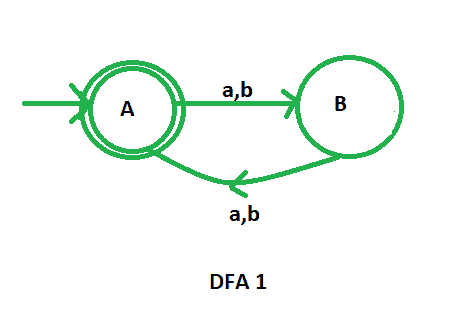
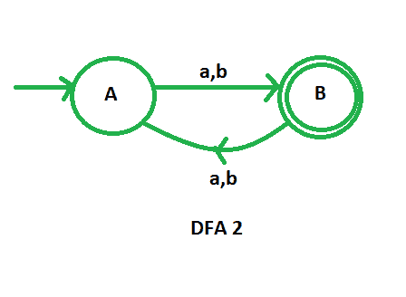
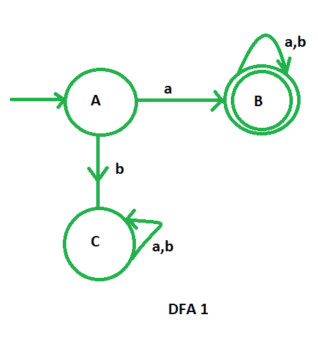
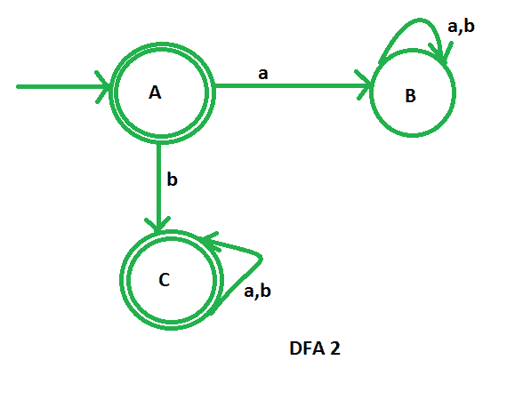

# DFA 中的互补过程

> 原文:[https://www . geesforgeks . org/complexing-process-in-DFA/](https://www.geeksforgeeks.org/complementation-process-in-dfa/)

先决条件–[设计有限自动机](https://www.geeksforgeeks.org/designing-finite-automata-from-regular-expression/)
假设我们有一个由(Q、、、q0、F)定义的 DFA，它接受语言 L <sub>1</sub> 。那么，接受语言 L <sub>2</sub> 的 DFA，其中 L <sub> 2 </sub> = ̅L <sub>1</sub> ，定义如下:

```
( Q, , , q0, Q-F )
```

DFA 的补码可以通过**使非最终状态成为最终状态来获得，反之亦然**。补语 DFA L <sub>2</sub> 所接受的语言是 L <sub>1</sub> 语言的补语。

**示例-1:**
L <sub>1</sub> :偶数长度{a，b}上的所有弦的集合

```
L1 = {, ab, aa, abaa, aaba, ....} 
```

L <sub>2</sub> :奇数长度{a，b}的所有弦的集合

```
L2 = { a, b, aab, aaa, bba, bbb, ...} 
```

在这里，我们可以看到 L <sub>2</sub> = ̅L <sub>1</sub>

让我们首先绘制接受偶数长度字符串的 L <sub>1</sub> 的 DFA。



现在，为了设计 L <sub>2</sub> 的 DFA，我们只需要补充上面的 DFA。我们将把非最终状态更改为最终状态，将最终状态更改为非最终状态。



这是我们必需的补充 DFA。

**示例-2:**
L <sub>1</sub> :以‘a’开头的{a，b}上所有字符串的集合。

```
L1 ={ a, ab, aa, aba, aaa, aab, ..} 
```

L <sub>2</sub> :不以‘a’开头的{a，b}上所有字符串的集合。

```
L2 ={ , b, ba, bb, bab, baa, bba, ...} 
```

在这里，我们可以看到 L <sub>2</sub> = ̅L <sub>1</sub>

让我们首先绘制 L <sub>1</sub> 的 DFA，它接受{a，b}上以“a”开头的所有字符串的集合



现在，为了设计 L <sub>2</sub> 的 DFA，我们只需要补充上面的 DFA。我们将把非最终状态更改为最终状态，将最终状态更改为非最终状态。



这是我们必需的补充 DFA，它接受不以“a”开头的字符串。
**注:**常规语言在补语下闭合(即常规语言的补语也将是常规的)。