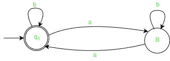
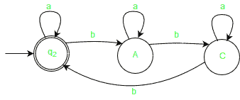
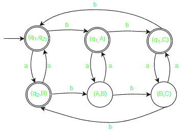
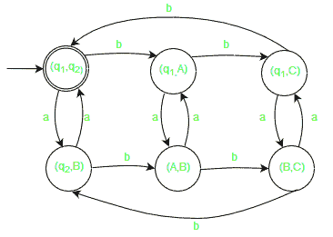
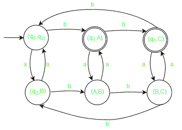
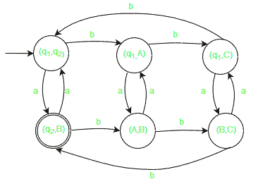

# 复合有限自动机(FA)

> 原文:[https://www.geeksforgeeks.org/compound-finite-automata-fa/](https://www.geeksforgeeks.org/compound-finite-automata-fa/)

先决条件–[有限自动机(FA)](https://www.geeksforgeeks.org/toc-finite-automata-introduction/)
复合 FA 是在给定的 d FA D1 和 D2 上执行操作(∩、∩、-)后形成的合成 DFA。

```
D1 = (Q1, ∑, δ, q1, F1) and D2 = (Q2, ∑, δ, q2, F2) 
```

其中，
Q <sub>1</sub> 和 Q <sub>2</sub> :分别为 DFA D1 和 D2 的有限状态集合。
∞:输入字母表包含有限数量的输入符号。
δ:过渡函数(δ:Qx∑- > Q)
q <sub>1</sub> 和 q <sub>2</sub> :分别为 D1 和 D2 的初始状态。
F <sub>1</sub> 和 F <sub>2</sub> :分别为 DFA D1 和 D2 的最终状态集合。

**复合有限自动机(FA)的性质:**

1.  化合物 FA (D1XD2)中的州数等于 m*n，其中 m 是 D1 的州数，n 是 D2 的州数。
2.  复合 FA 的初始状态是 D1 和 D2 初始状态的组合。
3.  复合 FA 的最终状态取决于所执行的操作。

**示例:**

```
D1 = no. of a's divisible by 2
D2 = no. of b's divisible by 3

D1 ({q1, B}, {a, b}, δ, q1, {q1}), 
D1 ({q2, A, C}, {a, b}, δ, q2, {q2}) 
```

为以下内容构建最小 FA:

```
(D1∪D2), 
(D1∩D2), 
(D1-D2),
(D2-D1) 
```

**说明:**

**DFA D1:**



**DFA D2:**



**1。联合(D1∪D2):**
任何属于 D1 语言**或 D2 语言**的字符串 w 都被合成复合自动机接受。
<u>最终状态</u>:如果 D1 的最终状态或 D2 的最终状态包含在复合 FA 的任何状态中。



**2。交集(D1∪D2):**
属于 D1 语言**和 D2 语言**的任何字符串都被合成复合自动机接受。
<u>最终状态</u>:如果 D1 的最终状态和 D2 的最终状态都包含在复合 FA 的任何状态中。



**3。差异(D1-D2):**
D1 接受的任何字符串，而不是 D2 接受的字符串。
<u>最终状态</u>:如果 D1 的最终状态和 D2 的非最终状态包含在复合 FA 的任何状态中。



**4。差异(D2-D1):**
D2 接受的任何字符串，而不是 D1 接受的字符串。
<u>最终状态</u>:如果 D2 的最终状态和 D1 的非最终状态包含在复合 FA 的任何状态中。

