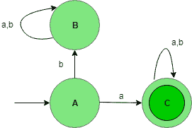
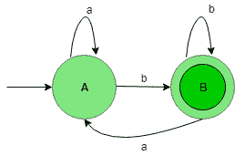
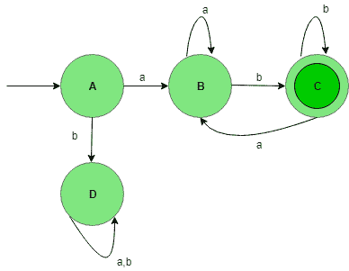

# DFA 中的串联过程

> 原文:[https://www.geeksforgeeks.org/concatenation-process-in-dfa/](https://www.geeksforgeeks.org/concatenation-process-in-dfa/)

先决条件–[设计有限自动机](https://www.geeksforgeeks.org/designing-finite-automata-from-regular-expression/)
为{a，b}上的字符串集设计一个 DFA，使得语言的字符串以“a”开头，以“b”结尾。将形成两种期望的语言:

```
L1 = {a, aab, aabab, .......}
L2 = {b, bbab, bbabab, .......} 
```

在 L1，开始元素是“a ”,在 L2，结束元素是 b。

语言 L1 的状态转换图:



这个 DFA 接受所有以“a”开头的字符串。在这里，状态 C 是最终状态，B 是死亡状态，之所以这样叫，是因为得到任何字母表后，这个状态永远不会进入最终状态。

语言 L2 的状态转换图:



这个 DFA 接受所有以字母“b”结尾的字符串。在这里，状态 B 被称为最终状态。

现在，把 L1 语和 L2 语连在一起，得到以“a”开头，以“b”结尾的语言的最终结果。

L1 状态转换图。L2，即 L1·康卡特·L2:



这个 DFA 接受所有以 a 开头，以 b 结尾的字符串。这里，状态 C 是最终状态，D 是死状态，之所以这样叫，是因为在得到任何输入字母表后，它永远不会进入最终状态。