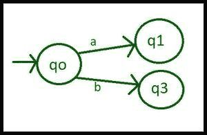
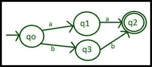
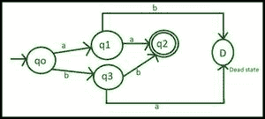
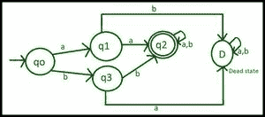

# 构建以 aa 或 bb 开头的 DFA

> 原文:[https://www . geesforgeks . org/construct-a-DFA-the-start-aa-or-bb/](https://www.geeksforgeeks.org/construct-a-dfa-that-start-with-aa-or-bb/)

**先决条件:** [设计有限自动机](https://www.geeksforgeeks.org/designing-finite-automata-from-regular-expression/)

DFA(确定性有限自动机或接受者)是一种接受或拒绝符号串的有限状态机。如果字符串达到最终状态，DFA 接受它，否则拒绝它。在这些类型的问题中，我们有一些给定的参数，根据这些参数我们应该设计 DFA。

***问题***–从输入(a，b)构建一个以 aa 或 bb 开头的 DFA。

***解***–在这个问题中，给出了两个参数:

*   **DFA 应以 aa** 开头

**或**

*   **DFA 应以 bb** 开头

这意味着，生成的 DFA 应该接受诸如 aa、bb、aab、bba、aaa、bbb…等字符串。但是它不应该接受诸如 a、b、ba、bab、abb、ABBA…等字符串。

### 逐步设计 DFA:

**Step-1:** 取初始状态 **qo** ，最小可能串为 aa 和 bb 如果 **qo** 以‘a’为第一输入字母则进入状态 **q1** ，如果 **qo** 以‘b’为第一输入字母则进入状态 **q3** 。

DFA 构建的第 1 步

**第 2 步:**现在想想状态 **q1** ，如果它取输入字母‘b’，它就打破了我们‘aa’的条件，但是如果取输入字母‘a’，它就变成了一个可接受的字符串，现在它进入状态 **q2** ，它被设置为最终状态。

DFA 构建的步骤 2

**步骤-3:** On 状态 **q3** 如果它接受输入字母‘a’，它就打破了我们的‘bb’条件，但是如果接受输入字母‘b’，它就成为一个可接受的字符串，现在它进入状态 **q2** ，它被设置为最终状态。

DFA 构建的第 3 步

**第 4 步:**如果输入状态的字母“a”**Q3**打破条件，输入状态的字母“b”**Q1**打破条件，因此它们进入某个死状态( **D** )。

DFA 构建的第 4 步

**第 5 步:**到目前为止，我们的机器接受从‘aa’或‘bb’开始的字符串，但我们也必须在字符串从‘aa’或‘bb’开始后处理所有符号，因此我们在 **q2** (最终状态)和 **D** (死状态)中介绍自己的循环。

DFA 构建的第 5 步

### **上图过渡表及过渡规则:**

**有限状态集= {**Q0，q1，q2，q3，D **}**

在过渡表中，**初始状态(qo)** 用 **→** 表示，**最终状态为 q2** ，有**两个圆。**

**输入字母集= {a，b}**

### **过渡表**

<figure class="table">

| 状态 | a | b |
| --- | --- | --- |
| ->qo | 雌三醇环戊醚 | q3 |
| 雌三醇环戊醚 | q2 | d(死亡) |
| q3 | d(死亡) | q2 |
| q2 | q2 | q2 |
| d(死亡) | d(死亡) | d(死亡) |

</figure>