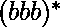
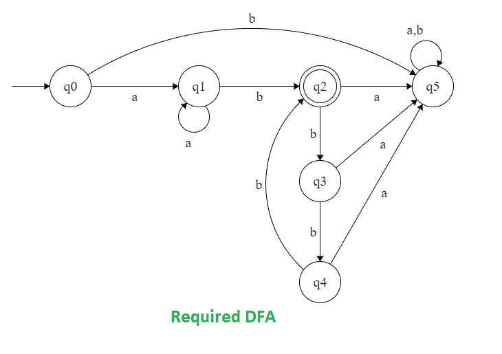

# 构造一个接受语言 L = {anbm | n > =1，(m) mod 3 = 1}

的 DFA

> 原文:[https://www . geeksforgeeks . org/construct-a-DFA-哪些接受语言-l-anbm-n-1-m-mod-3-1/](https://www.geeksforgeeks.org/construct-a-dfa-which-accept-the-language-l-anbm-n-1-m-mod-3-1/)

**问题:**构造一个接受语言 L = { a<sup>n</sup>b<sup>m</sup>| n>= 1，(m) mod 3 = 1}的 DFA。

**解释:**
为了构建 DFA，需要记住以下几点:

```
 which means any no of elements, and
 =  which means any no of elements greater than 1.
```

**示例:**

```
Input: a a b b b           
Output: NOT ACCEPTED
// n = 2 (>=1), m=3 ((3) mod3 != 1)

Input: a a a b        
Output: ACCEPTED
 // n = 3 (>=1), m = 1 ((1) mod 3= 1)

Input: b b b b        
Output: NOT ACCEPTED
// n = 0(must be >=1), m = 4 ((4) mod 3 = 1) 
```

**进场:**
其施工应包含以下步骤:

*   **步骤-1:** 为构建 FA 意味着拥有大于 1 的任意数量的 a。
*   **步骤 2:** 为构建 FA 意味着准确地拥有
*   **步骤-3:** 为构建 FA 意味着 b 等于 3 的倍数。
*   **第 4 步:**将三个 FA 串联起来，做成单个 DFA。始终保持 a、b、c 的顺序

    ```
    ACCEPTED
    ```

    给定的 DFA 具有以下状态。状态 2 导致接受字符串。而状态 0、1、3、4 和 5 导致字符串被拒绝。

    **DFA 状态转移图:**

    

    让我们看看演示的代码:

    ## C/C++

    ```
    // C program to implement DFS that accepts
    // all string which follow the language
    // L = { a^n b^m ; n >=1, (m)mod 3=1}
    #include <stdio.h>
    #include <string.h>

    // dfa tells the number associated
    // string end in which state.
    int dfa = 0;

    // This function is for
    // the starting state (Q0)of DFA
    void start(char c)
    {
        if (c == 'a') {
            dfa = 1;
        }
        else if (c == 'b') {
            dfa = 5;
        }

        // -1 is used to check for any invalid symbol
        else {
            dfa = -1;
        }
    }

    // This function is for the first state (Q1) of DFA
    void state1(char c)
    {
        if (c == 'a') {
            dfa = 1;
        }
        else if (c == 'b') {
            dfa = 2;
        }
        else {
            dfa = -1;
        }
    }

    // This function is for the second state (Q2) of DFA
    void state2(char c)
    {
        if (c == 'b') {
            dfa = 3;
        }
        else if (c == 'a') {
            dfa = 5;
        }
        else {
            dfa = -1;
        }
    }

    // This function is for the third state (Q3)of DFA
    void state3(char c)
    {
        if (c == 'b') {
            dfa = 4;
        }
        else if (c == 'a') {
            dfa = 5;
        }
        else {
            dfa = -1;
        }
    }

    // This function is for the forth state (Q4)of DFA
    void state4(char c)
    {
        if (c == 'b') {
            dfa = 2;
        }
        else if (c == 'a') {
            dfa = 5;
        }
        else {
            dfa = -1;
        }
    }

    // This function is for the fifth state (Q5) of DFA
    void state5(char c)
    {
        dfa = -1;
    }

    int isAccepted(char str[])
    {
        // store length of string
        int i, len = strlen(str);

        for (i = 0; i < len; i++) {
            if (dfa == 0)
                start(str[i]);

            else if (dfa == 1)
                state1(str[i]);

            else if (dfa == 2)
                state2(str[i]);

            else if (dfa == 3)
                state3(str[i]);

            else if (dfa == 4)
                state4(str[i]);

            else if (dfa == 5)
                state5(str[i]);

            else
                return 0;
        }
        if (dfa == 2)
            return 1;
        else
            return 0;
    }

    // driver code
    int main()
    {
        char str[] = "aaabbbb";
        if (isAccepted(str))
            printf("ACCEPTED");
        else
            printf("NOT ACCEPTED");
        return 0;
    }

    // This code is contributed by SHUBHAMSINGH10.
    ```

    ## Java 语言(一种计算机语言，尤用于创建网站)

    ```
    // Java program to implement DFS that accepts
    // all string which follow the language
    // L = { a^n b^m ; n >=1, (m)mod 3=1}
    import java.util.*;
    class GFG {

    // dfa tells the number associated
    // string end in which state.
    static int dfa = 0;

    // This function is for
    // the starting state (Q0)of DFA
    static void start(char c)
    {
        if (c == 'a') {
            dfa = 1;
        }
        else if (c == 'b') {
            dfa = 5;
        }

        // -1 is used to check for any invalid symbol
        else {
            dfa = -1;
        }
    }

    // This function is for the first state (Q1) of DFA
    static void state1(char c)
    {
        if (c == 'a') {
            dfa = 1;
        }
        else if (c == 'b') {
            dfa = 2;
        }
        else {
            dfa = -1;
        }
    }

    // This function is for the second state (Q2) of DFA
    static void state2(char c)
    {
        if (c == 'b') {
            dfa = 3;
        }
        else if (c == 'a') {
            dfa = 5;
        }
        else {
            dfa = -1;
        }
    }

    // This function is for the third state (Q3)of DFA
    static void state3(char c)
    {
        if (c == 'b') {
            dfa = 4;
        }
        else if (c == 'a') {
            dfa = 5;
        }
        else {
            dfa = -1;
        }
    }

    // This function is for the forth state (Q4)of DFA
    static void state4(char c)
    {
        if (c == 'b') {
            dfa = 2;
        }
        else if (c == 'a') {
            dfa = 5;
        }
        else {
            dfa = -1;
        }
    }

    // This function is for the fifth state (Q5) of DFA
    static void state5(char c)
    {
        dfa = -1;
    }

    static int isAccepted(char str[])
    {
        // store length of string
        int i, len = str.length;

        for (i = 0; i < len; i++) {
            if (dfa == 0)
                start(str[i]);

            else if (dfa == 1)
                state1(str[i]);

            else if (dfa == 2)
                state2(str[i]);

            else if (dfa == 3)
                state3(str[i]);

            else if (dfa == 4)
                state4(str[i]);

            else if (dfa == 5)
                state5(str[i]);

            else
                return 0;
        }
        if (dfa == 2)
            return 1;
        else
            return 0;
    }

    // Driver code
    public static void main(String[] args) {
       char str[] = "aaabbbb".toCharArray();
        if (isAccepted(str)==1)
            System.out.println("ACCEPTED");
        else
            System.out.println("NOT ACCEPTED");
        }
    }

    // This code is contributed by Rajput-Ji
    ```

    ## 蟒蛇 3

    ```
    # Python3 program to implement DFS that accepts   
    # all Stringing which follow the language   
    # L = {a ^ n b ^ m | n >= 1, (m)mod 3 = 1 }

    # This function is for the dfa = starting  
    # dfa = state (zeroth) of DFA   
    def start(c):  
        if (c == 'a'):  
            dfa = 1
        elif (c == 'b'):  
            dfa = 5

        # -1 is used to check for any  
        # invalid symbol   
        else:  
            dfa = -1
        return dfa  

    # This function is for the first   
    # dfa = state of DFA   
    def state1(c):   
        if (c == 'a'):  
            dfa = 1
        elif (c == 'b'):  
            dfa = 2
        else:  
            dfa = -1
        return dfa  

    # This function is for the second   
    # dfa = state of DFA   
    def state2(c):  
        if (c == 'b'):  
            dfa = 3
        elif (c == 'a'):  
            dfa = 5
        else:  
            dfa = -1
        return dfa  

    # This function is for the third   
    # dfa = state of DFA   
    def state3(c):  
        if (c == 'b'):  
            dfa = 4
        elif (c == 'a'):  
            dfa = 5
        else:  
            dfa = -1
        return dfa  

    # This function is for the fouth   
    # dfa = state of DFA   
    def state4(c):  
        if (c == 'b'):  
            dfa = 2
        elif (c == 'a'):  
            dfa = 5
        else:  
            dfa = -1
        return dfa 

    # This function is for the fifth  
    # dfa = state of DFA   
    def state5(c):  
        dfa = -1
        return dfa  

    def isAccepted(String):  

        # store length of Stringing   
        l = len(String)  

        # dfa tells the number associated  
        # with the present dfa = state  
        dfa = 0
        for i in range(l):   
            if (dfa == 0):   
                dfa = start(String[i])   

            elif (dfa == 1):   
                dfa = state1(String[i])   

            elif (dfa == 2) :  
                dfa = state2(String[i])   

            elif (dfa == 3) :  
                dfa = state3(String[i])   

            elif (dfa == 4) :  
                dfa = state4(String[i]) 

            elif (dfa == 5) :  
                dfa = state5(String[i])
            else:  
                return 0
        if(dfa == 2) :  
            return 1
        else:  
            return 0

    # Driver code   
    if __name__ == "__main__" :  
        String = "aaabbbb"
        if (isAccepted(String)) :  
            print("ACCEPTED")   
        else:  
            print("NOT ACCEPTED")   

    # This code is contributed by SHUBHAMSINGH10.
    ```

    ## C#

    ```
    // C# program to implement DFS that accepts
    // all string which follow the language
    // L = { a^n b^m ; n >=1, (m)mod 3=1}
    using System;
    public class GFG {

    // dfa tells the number associated
    // string end in which state.
    static int dfa = 0;

    // This function is for
    // the starting state (Q0)of DFA
    static void start(char c)
    {
        if (c == 'a') {
            dfa = 1;
        }
        else if (c == 'b') {
            dfa = 5;
        }

        // -1 is used to check for any invalid symbol
        else {
            dfa = -1;
        }
    }

    // This function is for the first state (Q1) of DFA
    static void state1(char c)
    {
        if (c == 'a') {
            dfa = 1;
        }
        else if (c == 'b') {
            dfa = 2;
        }
        else {
            dfa = -1;
        }
    }

    // This function is for the second state (Q2) of DFA
    static void state2(char c)
    {
        if (c == 'b') {
            dfa = 3;
        }
        else if (c == 'a') {
            dfa = 5;
        }
        else {
            dfa = -1;
        }
    }

    // This function is for the third state (Q3)of DFA
    static void state3(char c)
    {
        if (c == 'b') {
            dfa = 4;
        }
        else if (c == 'a') {
            dfa = 5;
        }
        else {
            dfa = -1;
        }
    }

    // This function is for the forth state (Q4)of DFA
    static void state4(char c)
    {
        if (c == 'b') {
            dfa = 2;
        }
        else if (c == 'a') {
            dfa = 5;
        }
        else {
            dfa = -1;
        }
    }

    // This function is for the fifth state (Q5) of DFA
    static void state5(char c)
    {
        dfa = -1;
    }

    static int isAccepted(char []str)
    {
        // store length of string
        int i, len = str.Length;

        for (i = 0; i < len; i++) {
            if (dfa == 0)
                start(str[i]);

            else if (dfa == 1)
                state1(str[i]);

            else if (dfa == 2)
                state2(str[i]);

            else if (dfa == 3)
                state3(str[i]);

            else if (dfa == 4)
                state4(str[i]);

            else if (dfa == 5)
                state5(str[i]);

            else
                return 0;
        }
        if (dfa == 2)
            return 1;
        else
            return 0;
    }

    // Driver code
    public static void Main(String[] args) {
       char []str = "aaabbbb".ToCharArray();
        if (isAccepted(str)==1)
            Console.WriteLine("ACCEPTED");
        else
            Console.WriteLine("NOT ACCEPTED");
        }
    }
    // This code has been contributed by 29AjayKumar
    ```

    **输出:**