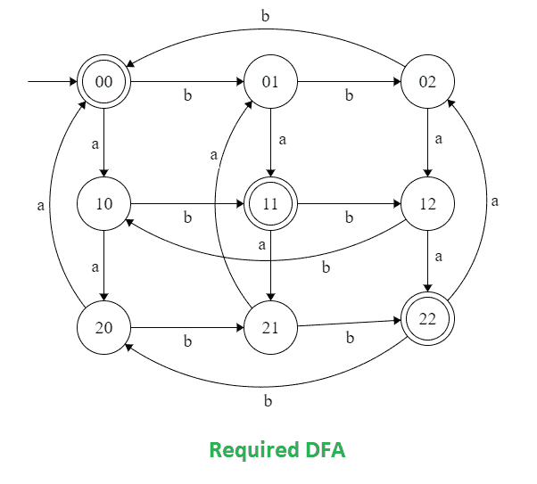

# 构造一个接受语言 L = { w | w∑{ a，b}*和 Na(w) mod 3 = Nb (w) mod 3}的 DFA

> 原文:[https://www . geesforgeks . org/construct-a-DFA-哪-接受语言-l-w-w-ab-and-naw-mod-3-nb-w-mod-3/](https://www.geeksforgeeks.org/construct-a-dfa-which-accept-the-language-l-w-w-ab-and-naw-mod-3-nb-w-mod-3/)

**问题:**构造一个接受语言 L = { w | w∑{ a，b}*和 Na(w) mod 3 = Nb (w) mod 3}的确定性有限自动机(DFA)。

语言 L={w | Na(w) = Nb(w)mod 3}这意味着所有字符串包含的 a 的计数模数等于 b 的计数模数乘以 3。

**示例:**

> **输入:**a a b b b
> T3】输出:不接受
> // n = 2，m=3 (2 mod 3！= 3 mod 3)
> 
> **输入:**a a b b
> T3】输出:接受
> // n = 2，m = 2 (2 mod 3 = 2 mod 3)
> 
> **输入:**b b b
> T3】输出:不接受
> // n = 0，m = 3 ((0 mod 3 = 3 mod 3) < = > (0=0))

**接近:**

1.  为{w | w  {a，b}}构造 FA，Na = 0 mod 3 表示 a 的倍数为 3。
2.  为{w | w  {a，b}}构造 FA，Nb = 0 mod 3 表示 b 是 3 的倍数。
3.  使用 DFA 中的[连接过程，连接两个 FA 并制作单个 DFA。](https://www.geeksforgeeks.org/toc-concatenation-process-in-dfa/)
4.  使状态成为最终状态，接受 a 和 b 的等模计数。

    **DFA 状态转移图:**
    

    状态 00、11 和 22 导致接受字符串。而状态 01、02、10、12、20 和 21 导致字符串被拒绝。

    让我们看看演示的代码:

    ## C/C++

    ```
    // C/C++ Program to construct a DFA which accept the language
    // L = { w | w is in {a, b}* and Na(w) mod 3 = Nb(w) mod 3}
    #include <stdio.h>
    #include <string.h>

    // dfa tells the number associated
    // string end in which state.
    int dfa = 0;

    // This function is for
    // the starting state (00)of DFA
    void start(char c)
    {
        if (c == 'a') {
            dfa = 10;
        }
        else if (c == 'b') {
            dfa = 1;
        }

        // -1 is used to check for any invalid symbol
        else {
            dfa = -1;
        }
    }

    // This function is for the first state (01) of DFA
    void state01(char c)
    {
        if (c == 'a') {
            dfa = 11;
        }
        else if (c == 'b') {
            dfa = 2;
        }
        else {
            dfa = -1;
        }
    }

    // This function is for the second state (02) of DFA
    void state02(char c)
    {
        if (c == 'b') {
            dfa = 0;
        }
        else if (c == 'a') {
            dfa = 12;
        }
        else {
            dfa = -1;
        }
    }

    // This function is for the third state (10)of DFA
    void state10(char c)
    {
        if (c == 'b') {
            dfa = 11;
        }
        else if (c == 'a') {
            dfa = 20;
        }
        else {
            dfa = -1;
        }
    }

    // This function is for the forth state (11)of DFA
    void state11(char c)
    {
        if (c == 'b') {
            dfa = 12;
        }
        else if (c == 'a') {
            dfa = 21;
        }
        else {
            dfa = -1;
        }
    }

    void state12(char c)
    {
        if (c == 'b') {
            dfa = 10;
        }
        else if (c == 'a') {
            dfa = 22;
        }
        else {
            dfa = -1;
        }
    }

    void state20(char c)
    {
        if (c == 'b') {
            dfa = 21;
        }
        else if (c == 'a') {
            dfa = 0;
        }
        else {
            dfa = -1;
        }
    }

    void state21(char c)
    {
        if (c == 'b') {
            dfa = 22;
        }
        else if (c == 'a') {
            dfa = 1;
        }
        else {
            dfa = -1;
        }
    }

    void state22(char c)
    {
        if (c == 'b') {
            dfa = 20;
        }
        else if (c == 'a') {
            dfa = 2;
        }
        else {
            dfa = -1;
        }
    }

    int isAccepted(char str[])
    {
        // store length of string
        int i, len = strlen(str);

        for (i = 0; i < len; i++) {
            if (dfa == 0)
                start(str[i]);

            else if (dfa == 1)
                state01(str[i]);

            else if (dfa == 2)
                state02(str[i]);

            else if (dfa == 10)
                state10(str[i]);

            else if (dfa == 11)
                state11(str[i]);

            else if (dfa == 12)
                state12(str[i]);

            else if (dfa == 20)
                state20(str[i]);

            else if (dfa == 21)
                state21(str[i]);

            else if (dfa == 22)
                state22(str[i]);

            else
                return 0;
        }
        if (dfa == 0 || dfa == 11 || dfa == 22)
            return 1;
        else
            return 0;
    }

    // driver code
    int main()
    {
        char str[] = "aaaabbbb";
        if (isAccepted(str))
            printf("ACCEPTED");
        else
            printf("NOT ACCEPTED");
        return 0;
    }

    // This code is contributed by SHUBHAMSINGH10.
    ```

    ## Java 语言(一种计算机语言，尤用于创建网站)

    ```
    // Java  Program to construct a DFA which accept the language
    // L = { w | w is in {a, b}* and Na(w) mod 3 = Nb(w) mod 3}
    class GFG{
    // dfa tells the number associated
    // string end in which state.
    static int dfa = 0;

    // This function is for
    // the starting state (00)of DFA
    static void start(char c)
    {
        if (c == 'a') {
            dfa = 10;
        }
        else if (c == 'b') {
            dfa = 1;
        }

        // -1 is used to check for any invalid symbol
        else {
            dfa = -1;
        }
    }

    // This function is for the first state (01) of DFA
    static void state01(char c)
    {
        if (c == 'a') {
            dfa = 11;
        }
        else if (c == 'b') {
            dfa = 2;
        }
        else {
            dfa = -1;
        }
    }

    // This function is for the second state (02) of DFA
    static void state02(char c)
    {
        if (c == 'b') {
            dfa = 0;
        }
        else if (c == 'a') {
            dfa = 12;
        }
        else {
            dfa = -1;
        }
    }

    // This function is for the third state (10)of DFA
    static void state10(char c)
    {
        if (c == 'b') {
            dfa = 11;
        }
        else if (c == 'a') {
            dfa = 20;
        }
        else {
            dfa = -1;
        }
    }

    // This function is for the forth state (11)of DFA
    static void state11(char c)
    {
        if (c == 'b') {
            dfa = 12;
        }
        else if (c == 'a') {
            dfa = 21;
        }
        else {
            dfa = -1;
        }
    }

    static void state12(char c)
    {
        if (c == 'b') {
            dfa = 10;
        }
        else if (c == 'a') {
            dfa = 22;
        }
        else {
            dfa = -1;
        }
    }

    static void state20(char c)
    {
        if (c == 'b') {
            dfa = 21;
        }
        else if (c == 'a') {
            dfa = 0;
        }
        else {
            dfa = -1;
        }
    }

    static void state21(char c)
    {
        if (c == 'b') {
            dfa = 22;
        }
        else if (c == 'a') {
            dfa = 1;
        }
        else {
            dfa = -1;
        }
    }

    static void state22(char c)
    {
        if (c == 'b') {
            dfa = 20;
        }
        else if (c == 'a') {
            dfa = 2;
        }
        else {
            dfa = -1;
        }
    }

    static boolean isAccepted(String st)
    {
        // store length of string
        int i, len = st.length();
        char[] str = st.toCharArray();
        for (i = 0; i < len; i++) {
            if (dfa == 0)
                start(str[i]);

            else if (dfa == 1)
                state01(str[i]);

            else if (dfa == 2)
                state02(str[i]);

            else if (dfa == 10)
                state10(str[i]);

            else if (dfa == 11)
                state11(str[i]);

            else if (dfa == 12)
                state12(str[i]);

            else if (dfa == 20)
                state20(str[i]);

            else if (dfa == 21)
                state21(str[i]);

            else if (dfa == 22)
                state22(str[i]);

            else
                return false;
        }
        if (dfa == 0 || dfa == 11 || dfa == 22)
            return true;
        else
            return false;
    }

    // driver code
    public static void main(String []args)
        {
        String str = "aaaabbbb";
        if (isAccepted(str))
            System.out.println("ACCEPTED");
        else
            System.out.println("NOT ACCEPTED");
        }
    }

    // This code contributed by Rajput-Ji
    ```

    ## 蟒蛇 3

    ```
    """Python Program to construct a DFA which accept the language 
    L =  {w | w belongs to {a, b}*}
    and Na(w)mod3 = Nb(w)mod 3"""

    # This function is for 
    # the starting state (00)of DFA 
    def start( c): 

        if (c == 'a'):  
            dfa = 10 

        elif (c == 'b') : 
            dfa = 1 

         #-1 is used to check for any invalid symbol 
        else:  
            dfa = -1
        return dfa

    # This function is for the first state (01) of DFA 
    def state01( c): 

        if (c == 'a'):  
            dfa = 11 

        elif (c == 'b') : 
            dfa = 2 

        else:  
            dfa = -1
        return dfa

    # This function is for the second state (02) of DFA 
    def state02( c): 

        if (c == 'b') : 
            dfa = 0 

        elif(c =='a'):

            dfa = 12

        else:  
            dfa = -1
        return dfa

    # This function is for the third state (10)of DFA 
    def state10( c): 

        if (c == 'b') : 
            dfa = 11 

        elif(c =='a'):

            dfa = 20

        else:  
            dfa = -1
        return dfa

    # This function is for the forth state (11)of DFA 
    def state11( c): 

        if (c == 'b') : 
            dfa = 12 

        elif(c =='a'):

            dfa = 21

        else:  
            dfa = -1
        return dfa

    def state12( c): 

        if (c == 'b') : 
            dfa = 10 

        elif(c =='a'):

            dfa = 22

        else:  
            dfa = -1
        return dfa

    def state20( c): 

        if (c == 'b') : 
            dfa = 21 

        elif(c =='a'):

            dfa = 0

        else:  
            dfa = -1
        return dfa

    def state21( c): 

        if (c == 'b') : 
            dfa = 22 

        elif(c =='a'):

            dfa = 1

        else:  
            dfa = -1
        return dfa

    def state22( c): 

        if (c == 'b') : 
            dfa = 20 

        elif(c =='a'):

            dfa = 2

        else:  
            dfa = -1
        return dfa

    def isAccepted(str): 

        # store length of string 
        l = len(str)
        # dfa tells the number associated  
        # with the present dfa = state  
        dfa = 0

        for i in range(l):  
            if (dfa == 0) :
                start(str[i]) 

            elif (dfa == 1): 
                state01(str[i]) 

            elif (dfa == 2) :
                state02(str[i]) 

            elif (dfa == 10) :
                state10(str[i]) 

            elif (dfa == 11) :
                state11(str[i]) 

            elif (dfa == 12) :
                state12(str[i]) 

            elif (dfa == 20) :
                state20(str[i]) 

            elif (dfa == 21) :
                state21(str[i]) 

            elif (dfa == 22) :
                state22(str[i]) 

            else:
                return 0 

        if (dfa == 0 or dfa == 11 or dfa == 22) :
            return 1 
        else:
            return 0 

    # Driver code   
    if __name__ == "__main__" : 

        string = "aaaabbbb" 
        if (isAccepted(string)) :
            print("ACCEPTED") 
        else:
            print("NOT ACCEPTED") 

    # This code is contributed by SHUBHAMSINGH10.
    ```

    ## C#

    ```
    // C# Program to construct a DFA which accept the language 
    // L = { w | w is in {a, b}* and Na(w) mod 3 = Nb(w) mod 3} 
    using System;

    class GFG
    { 

    // DFA tells the number associated 
    // string end in which state. 
    static int dfa = 0; 

    // This function is for 
    // the starting state (00)of DFA 
    static void start(char c) 
    { 
        if (c == 'a') { 
            dfa = 10; 
        } 
        else if (c == 'b') { 
            dfa = 1; 
        } 

        // -1 is used to check for any invalid symbol 
        else { 
            dfa = -1; 
        } 
    } 

    // This function is for the first state (01) of DFA 
    static void state01(char c) 
    { 
        if (c == 'a') { 
            dfa = 11; 
        } 
        else if (c == 'b') { 
            dfa = 2; 
        } 
        else { 
            dfa = -1; 
        } 
    } 

    // This function is for the second state (02) of DFA 
    static void state02(char c) 
    { 
        if (c == 'b') { 
            dfa = 0; 
        } 
        else if (c == 'a') { 
            dfa = 12; 
        } 
        else { 
            dfa = -1; 
        } 
    } 

    // This function is for the third state (10)of DFA 
    static void state10(char c) 
    { 
        if (c == 'b') { 
            dfa = 11; 
        } 
        else if (c == 'a') { 
            dfa = 20; 
        } 
        else { 
            dfa = -1; 
        } 
    } 

    // This function is for the forth state (11)of DFA 
    static void state11(char c) 
    { 
        if (c == 'b') { 
            dfa = 12; 
        } 
        else if (c == 'a') { 
            dfa = 21; 
        } 
        else { 
            dfa = -1; 
        } 
    } 

    static void state12(char c) 
    { 
        if (c == 'b') { 
            dfa = 10; 
        } 
        else if (c == 'a') { 
            dfa = 22; 
        } 
        else { 
            dfa = -1; 
        } 
    } 

    static void state20(char c) 
    { 
        if (c == 'b') { 
            dfa = 21; 
        } 
        else if (c == 'a') { 
            dfa = 0; 
        } 
        else { 
            dfa = -1; 
        } 
    } 

    static void state21(char c) 
    { 
        if (c == 'b') { 
            dfa = 22; 
        } 
        else if (c == 'a') { 
            dfa = 1; 
        } 
        else { 
            dfa = -1; 
        } 
    } 

    static void state22(char c) 
    { 
        if (c == 'b') { 
            dfa = 20; 
        } 
        else if (c == 'a') { 
            dfa = 2; 
        } 
        else { 
            dfa = -1; 
        } 
    } 

    static Boolean isAccepted(String st) 
    { 
        // store length of string 
        int i, len = st.Length; 
        char[] str = st.ToCharArray(); 
        for (i = 0; i < len; i++) { 
            if (dfa == 0) 
                start(str[i]); 

            else if (dfa == 1) 
                state01(str[i]); 

            else if (dfa == 2) 
                state02(str[i]); 

            else if (dfa == 10) 
                state10(str[i]); 

            else if (dfa == 11) 
                state11(str[i]); 

            else if (dfa == 12) 
                state12(str[i]); 

            else if (dfa == 20) 
                state20(str[i]); 

            else if (dfa == 21) 
                state21(str[i]); 

            else if (dfa == 22) 
                state22(str[i]); 

            else
                return false; 
        } 
        if (dfa == 0 || dfa == 11 || dfa == 22) 
            return true; 
        else
            return false; 
    } 

    // Driver code 
    public static void Main(String []args) 
    { 
        String str = "aaaabbbb"; 
        if (isAccepted(str)) 
            Console.WriteLine("ACCEPTED"); 
        else
            Console.WriteLine("NOT ACCEPTED"); 
    } 
    } 

    // This code is contributed by 29AjayKumar
    ```

    **输出:**

    ```
    ACCEPTED
    ```