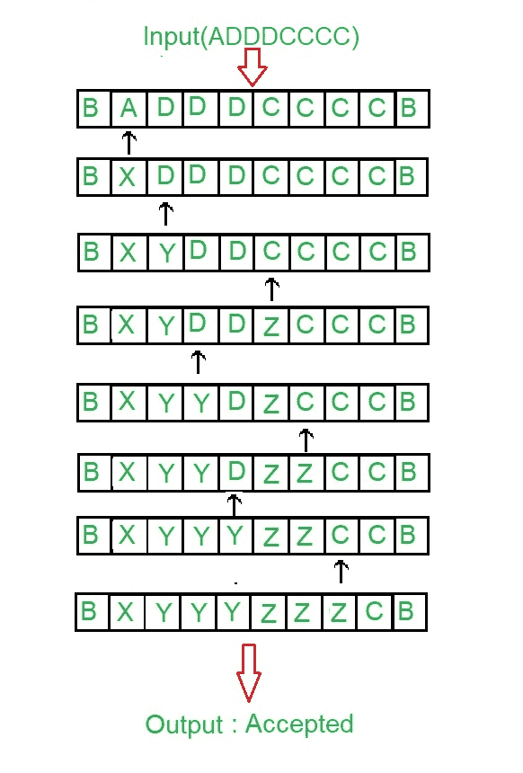
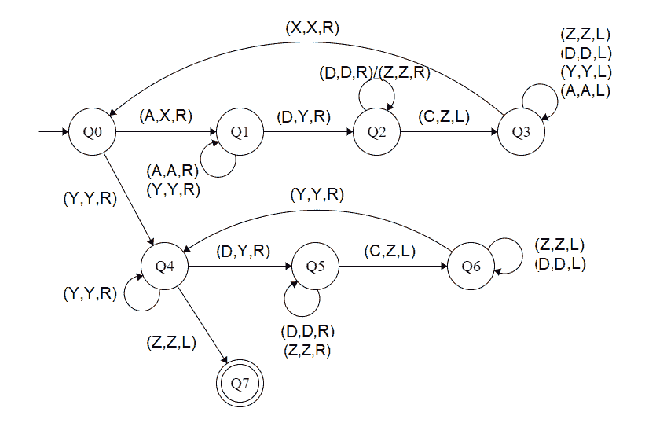

# 为 L = { aibjk | I<j<k 构建图灵机；i ≥ 1}

> 原文:[https://www . geesforgeks . org/construct-a-turing-machine-for-l-aibjck-I-j-k-I-1/](https://www.geeksforgeeks.org/construct-a-turing-machine-for-l-aibjck-i-j-k-i-1/)

先决条件–[图灵机](https://www.geeksforgeeks.org/turing-machine/)
在给定的语言中 L = { a<sup>I</sup>b<sup>j</sup>c<sup>k</sup>| I<j<k；i≥ 1}，每一串' a '，' b '和' c '都有一定数量的 a，然后一定数量的 b，然后一定数量的 c。条件是第一个符号的计数至少应为 1。此后“b”和“c”可以有同样多，但 a 的计数小于“b”的计数，“b”的计数小于“c”的计数。假设字符串以“{content}”结尾。。
**示例:**

```
Input: a a a b b c  
       Here a = 3, b = 2, c = 1 but |a|<|b|<|c|
Output: NOT ACCEPTED

Input: a b b c c c
       Here a = 1, b = 2, c = 3 
Output:ACCEPTED 
```

**磁带表示:**



**进场:**

1.  通过将 D & C 作为单一元素来比较两个元素。
2.  之后是比较研发
3.  如果|A|大于|(D，C)|，则不接受。
4.  如果|C|大于|D|，则不接受。
5.  否则接受。

**步骤:**

*   **步骤-1:** 将 A 转换为 X，向右移动，转到步骤 2。如果找到 Y，忽略它，并向右移动到步骤-5。
*   **第二步:**继续忽略 A 和 Y，向右移动。将 D 转换为 Y，然后向右移动并转到步骤 3。
*   **第三步:**继续忽略 D 和 Z，向右移动。如果找到了 C，把它变成 Z，向左移动到第 4 步。
*   **第四步:**继续忽略 Z、A、Y、D，向左移动。如果找到了 X，忽略它并向右移动，转到步骤 1。
*   **第五步:**继续忽略 Y，向右移动。忽略 Z 向左移动，转到步骤 8。如果找到了 D，把它变成 Y，然后向右移动到第 6 步。
*   **第 6 步:**继续忽略 D 和 Z，向右移动。将 C 转换为 Z，向左移动并转到步骤 7。
*   **第 7 步:**继续忽略 D 和 Z，向左移动。如果找到 Y，忽略它并向右移动，转到步骤-5。
*   **第 8 步:**停止机器(接受字符串)

**状态转移图:**



这里 **Q0** 表示初始状态， **Q1、Q2、Q3、Q4、Q5、Q6** 表示过渡状态， **Q7** 表示最终状态。a、C、D 是所用的变量，R、L 表示左右。

**说明:**

*   使用 Q0，当发现 A 时，将其设为 X，并向右移动，以表示 Q1。并且，当发现 Y 时，忽略它，转到右侧并进入状态 Q4
*   在 Q1 州，忽略所有的 A 和 Y，转到右边。如果找到了 D，做 Y，然后直接去下一个州 Q2。
*   在 Q2，忽略所有的 D，Z，向右移动。如果找到 C，让它向左移动 Z 并移动到 Q3。
*   在 Q3 状态下，忽略所有 Z、D、Y、A，向左移动。如果找到 X，忽略它，向右移动到 Q0。
*   在第四季度，忽略所有 Y 并向右移动。如果找到 Z，忽略它，向左移动到状态 Q6。如果找到 D，将其变为 Y，并向右移动到 Q5。
*   在 Q5 状态下，忽略所有 D，Z，向右移动。如果找到 C，使其从 Z 向左移动到状态 Q6
*   在 Q6 中，忽略所有 D，Z，向左移动。如果找到 Y，忽略它，并向右移动到状态 Q4。
*   如果达到 Q7 状态，将产生接受字符串的结果。

**注:**比较|A|、|D|、|C|，使用[图灵机作为比较器](https://www.geeksforgeeks.org/toc-turing-machine-as-comparator/)的概念。