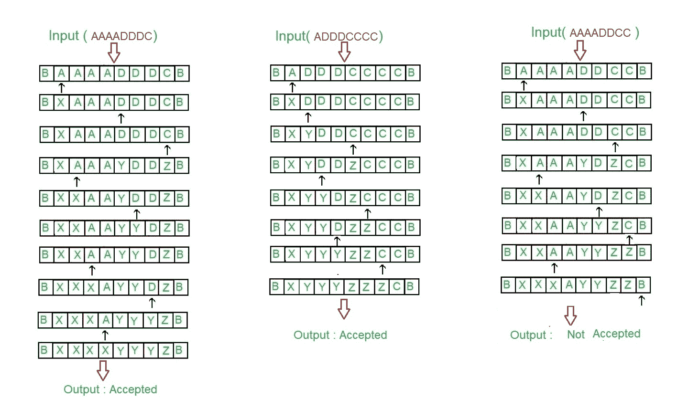
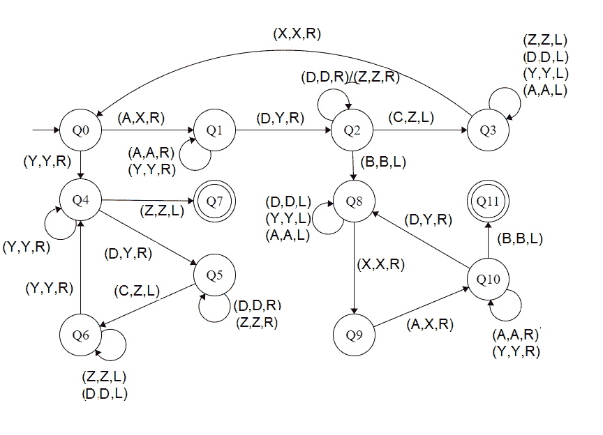

# 为 L = { aibjk | I<j<k 或 i > j > k}

构建图灵机

> 原文:[https://www . geesforgeks . org/construct-a-turing-machine-for-l-aibjk-I-j-k-or-I-j-k/](https://www.geeksforgeeks.org/construct-a-turing-machine-for-l-aibjck-i-j-k-or-i-j-k/)

先决条件–[图灵机](https://www.geeksforgeeks.org/turing-machine/)
语言 L = { a<sup>I</sup>b<sup>j</sup>c<sup>k</sup>| I<j<k 或 i > j > k}与两种语言的并集[L1 = { a<sup>I</sup>b<sup>j</sup>c<sup>k</sup>| I<j<k)】 i > j > k }](https://www.geeksforgeeks.org/construct-a-turing-machine-for-l-aibjck-i-j-k-i-1/)
在这种语言中，“a”、“b”和“c”的每一串都有一定数量的 a，然后是一定数量的 b，然后是一定数量的 c。

*   第一个符号的计数至少应为 1。此后“b”和“c”可以有同样多，但 a 的计数小于“b”的计数，“b”的计数小于“c”的计数。*   The count of 3rd symbols should be atleast 1\. ‘a’ and ‘b’ can have thereafter be as many but count of c is less than count of ‘b’ and count of ‘b’ is less than count of ‘a’

    假设字符串以“{content}”结尾。。

    **Examples:**

    ```
    Input: a a a b b c  
           Here a = 3, b = 2, c = 1
    Output: ACCEPTED

    Input: a b b c c c
           Here a = 1, b = 2, c = 3 
    Output: ACCEPTED

    Input: a a b b c c c
           Here a = 2, b = 2, c = 3 but |a|>|b|>|c| or |a|<|b|<|c|
    Output: NOT ACCEPTED 
    ```

    **磁带表示:**

    

    **进场:**

    1.  通过将两个元素作为一个元素来比较两个元素。
    2.  之后，被视为单个元素的元素被再次比较。
    3.  如果|第一|大于|(第二，第三)|和|第二|大于|第三|，则接受。
    4.  如果|第三|大于|(第一，第二)|和|第一|大于|第二|，则接受。
    5.  否则不接受。

    **步骤:**

    *   **步骤-1:** 将 A 转换为 X，向右移动，转到步骤 2。如果找到 Y，忽略它，并向右移动到步骤-5。
    *   **第二步:**继续忽略 A 和 Y，向右移动。将 D 转换为 Y，然后向右移动并转到步骤 3。
    *   **第三步:**继续忽略 D 和 Z，向右移动。如果找到了 C，把它变成 Z，向左移动到第 4 步。如果找到 B，忽略它，向左移动，转到步骤 8。
    *   **第四步:**继续忽略 Z、A、Y、D，向左移动。如果找到了 X，忽略它并向右移动，转到步骤 1。
    *   **第五步:**继续忽略 Y，向右移动。忽略 Z 向左移动，转到步骤 11。如果找到了 D，把它变成 Y，然后向右移动到第 6 步。
    *   **第 6 步:**继续忽略 D 和 Z，向右移动。将 C 转换为 Z，向左移动并转到步骤 7。
    *   **第 7 步:**继续忽略 D 和 Z，向左移动。如果找到 Y，忽略它并向右移动，转到步骤-5。
    *   **第 8 步:**继续忽略 D、Y、A，向左移动。忽略 X 向右移动，转到步骤 9。
    *   **步骤-9:** 将 A 转换为 X，向右移动，转到步骤-10。
    *   **第 10 步:**继续忽略 Y 和 A，向右移动。如果发现 B，忽略它，向左移动，转到步骤 11。如果 D 变成 Y，向右移动，转到第 8 步。
    *   **步骤-11:** 停止机器(接受字符串)

    **状态转移图:**

    

    这里 **Q0** 表示初始状态， **Q1、Q2、Q3、Q4、Q5、Q6、Q8、Q9、Q10** 表示过渡状态， **Q7、Q11** 表示最终状态。a、C、D 是所用的变量，R、L 表示左右。

    **说明:**

    *   使用 Q0，当找到 A 时，将其设为 X，然后向右移动并陈述 Q1。当发现 Y 时，忽略它，转到右侧，进入状态 Q4
    *   在 Q1 州，忽略所有的 A 和 Y，转到右边。如果找到了，就做 Y，直接去下一个州 Q2。
    *   在 Q2，忽略所有的 D，Z，向右移动。如果发现 B，忽略它，向左移动，转到状态 Q4，如果发现 C，让它向左移动，转到状态 Q3。
    *   在 Q3 状态下，忽略所有 Z、D、Y、A，向左移动。如果发现 X，忽略它，向右移动到 Q0。
    *   在第四季度，忽略所有 Y 并向右移动。如果发现 Z 忽略它，向左移动到状态 Q6。如果找到 D，将其变为 Y，并向右移动到 Q5。
    *   在 Q5 状态下，忽略所有 D，Z，向右移动。如果找到 C，使其从 Z 向左移动到状态 Q6
    *   在 Q6 中，忽略所有 D，Z，向左移动。如果发现 Y，忽略它并向右移动到状态 Q4。
    *   如果达到 Q7 状态，将产生接受字符串的结果。
    *   在 Q8 中，忽略所有 A、Y、D，向左移动。如果发现 X，忽略它，向右移动到状态 Q9。
    *   在 Q9 状态下，如果 A 找到了，让它向右移动到 Q10 状态
    *   在 Q10 中，忽略所有 A，Y，向右移动。如果找到 D，将其变为 Y，并向右移动到状态 Q8。如果发现 B，忽略它，向左移动到 Q11
    *   如果达到 Q11 状态，将产生接受字符串的结果。

    **注:**比较|A|、|D|、|C|，使用[图灵机作为比较器](https://www.geeksforgeeks.org/toc-turing-machine-as-comparator/)的概念