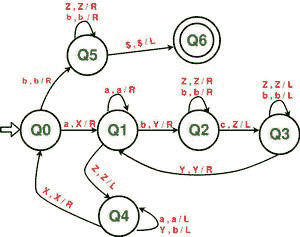

# 为 L = { aibjck | i * j = k 构建图灵机；I，j，k ≥ 1}

> 原文:[https://www . geesforgeks . org/construct-a-turing-machine-for-l-aibjk-ij-k-I-j-k-% E2 % 89% a5-1/](https://www.geeksforgeeks.org/construct-a-turing-machine-for-l-aibjck-ij-k-i-j-k-%e2%89%a5-1/)

先决条件–[图灵机](https://www.geeksforgeeks.org/turing-machine/)
在给定的语言中，L = { a<sup>I</sup>b<sup>j</sup>c<sup>k</sup>| I * j = k；I，j，k ≥ 1}，其中' a '，' b '和' c '的每个字符串都有一定数量的 a，然后是一定数量的 b，然后是一定数量的 c。条件是这 3 个符号中的每一个至少出现一次。“a”和“b”可以出现多次，但是“c”的出现次数必须等于“a”和“b”出现次数的乘积。假设字符串以“{content}”结尾。。

**示例–**

```
Input: a a b b b c c c c c c  
       Here a = 2, b = 3, c = 2 * 3 = 6  
Output: ACCEPTED

Input: a a b b c c c
       Here a = 2, b = 2, c = 3 but c should be 4 
Output: NOT ACCEPTED 
```

**使用的方法–**从左侧扫描输入。

1.  首先，用“X”替换“a”，然后向右移动 1 步。然后跳过所有的 a，向右移动。
2.  当指针到达第一个“b”点时。将一个“b”替换为“Y”，然后向右移动跳过所有中间的 b，与替换的“b”相对应，现在将一个“c”替换为“Z”，然后向左移动。
3.  现在向左移动，跳过所有的“Z”和“b”。
4.  当指针到达最近的“Y”时，向右移动。
5.  如果指针指向“b”，则重复步骤 2 至 4，否则如果指针指向“Z”，则向左移动，同时将所有“Y”替换为“b”，并跳过所有“a”。
6.  当指针指向最近的“X”时，向右移动一步。
7.  如果指针仍然指向“a”，则重复上述所有步骤，否则如果指针位于“b”，则向右移动，跳过所有“b”和“Z”。
8.  当达到$时，向左移动。字符串被接受。

