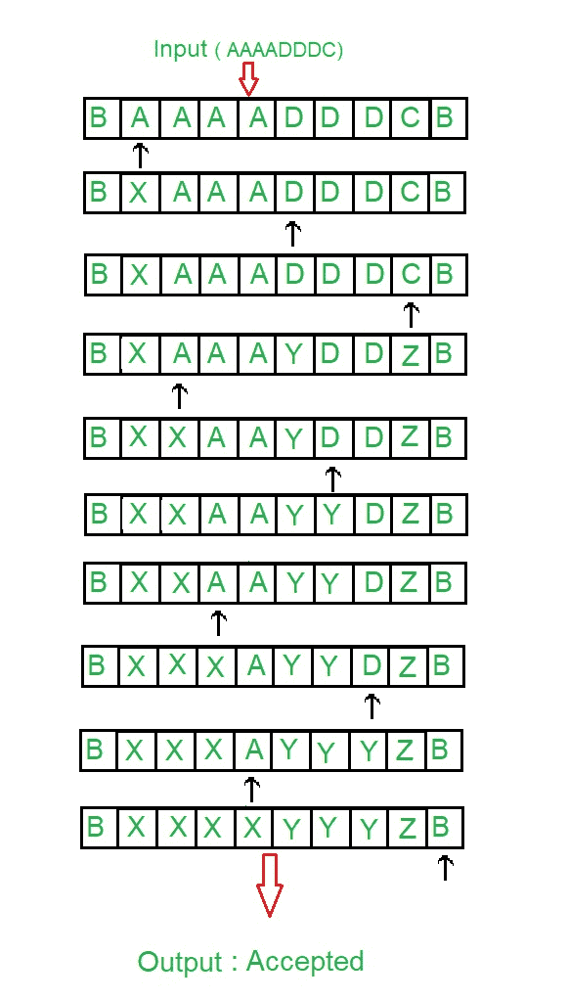
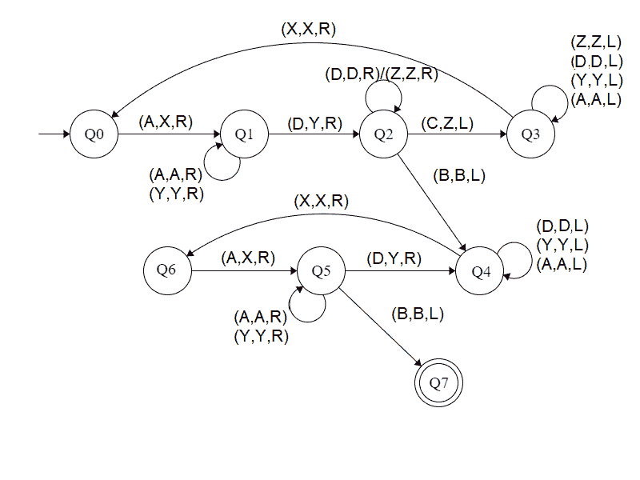

# 为 L = { aibjk | I>j>k 构建图灵机；k ≥ 1}

> 原文:[https://www . geesforgeks . org/construct-a-turing-machine-for-l-aibjk-ijk-k-1/](https://www.geeksforgeeks.org/construct-a-turing-machine-for-l-aibjck-ijk-k-1/)

先决条件–[图灵机](https://www.geeksforgeeks.org/turing-machine/)

在给定的语言中，L = { a<sup>I</sup>b<sup>j</sup>c<sup>k</sup>| I>j>k；k ≥ 1}，每一串' a '，' b '和' c '都有一定数量的 a，然后一定数量的 b，然后一定数量的 c。条件是第三个符号的计数至少应为 1。此后“a”和“b”可以一样多，但是 c 的计数小于“b”的计数，“b”的计数小于“a”的计数。假设字符串以“{content}”结尾。。
**举例:**

```
Input: a a a b b c  
       Here a = 3, b = 2, c = 1
Output: ACCEPTED

Input: a a b b c c c
       Here a = 2, b = 2, c = 3 but |a|>|b|>|c|
Output: NOT ACCEPTED 
```

**磁带表示:**



**进场:**

1.  通过将 A & D 作为单一元素来比较两个元素。
2.  之后比较模数
3.  如果|C|大于|(A，D)|，则不接受。
4.  如果|D|大于|A|，则不接受。
5.  否则接受。

**步骤:**

*   **步骤-1:** 将 A 转换为 X，向右移动，转到步骤 2。

*   **第二步:**继续忽略 A 和 Y，向右移动。将 D 转换为 Y，然后向右移动并转到步骤 3。
*   **第三步:**继续忽略 D 和 Z，向右移动。如果找到了 C，把它变成 Z，向左移动到第 4 步。如果找到 B，忽略它，向左移动，转到步骤 5。
*   **第四步:**继续忽略 Z、A、Y、D，向左移动。如果找到了 X，忽略它并向右移动，转到步骤 1。
*   **第五步:**继续忽略 D、Y、A，向左移动。忽略 X 向右移动，转到步骤 6。
*   **步骤-6:** 将 A 转换为 X，向右移动，转到步骤-7。
*   **第 7 步:**继续忽略 Y 和 A，向右移动。如果找到 B，忽略它，向左移动，转到步骤 8。如果 D 变成 Y，向右移动，转到第 5 步。
*   **第 8 步:**停止机器(接受字符串)

**状态转移图:**



这里 **Q0** 表示初始状态， **Q1、Q2、Q3、Q4、Q5、Q6** 表示过渡状态， **Q7** 表示最终状态。a、C、D 是所用的变量，R、L 表示左右。

**说明:**

*   使用 Q0，当找到 A 时，将其设为 X，然后向右移动并陈述 Q1。
*   在 Q1 州，忽略所有的 A 和 Y，转到右边。如果找到了，就做 Y，直接去下一个州 Q2。
*   在 Q2，忽略所有的 D，Z，向右移动。如果发现 B，忽略它，向左移动，转到状态 Q4，如果发现 C，让它向左移动，转到状态 Q3。
*   在 Q3 状态下，忽略所有 Z、D、Y、A，向左移动。如果发现 X，忽略它，向右移动到 Q0。
*   在第四季度，忽略所有的 A、Y、D，向左移动。如果发现 X，忽略它，向右移动到状态 Q6。
*   在 Q6 状态下，如果 A 找到了，让它向右移动到 Q5 状态
*   在 Q5 中，忽略所有 A，Y，向右移动。如果找到 D，则将其变为 Y，并向右移动到状态 Q4。如果发现 B，忽略它，向左移动到 Q7
*   如果达到 Q7 状态，将产生接受字符串的结果。

**注:**比较|A|、|D|、|C|，使用[图灵机作为比较器](https://www.geeksforgeeks.org/toc-turing-machine-as-comparator/)的概念。