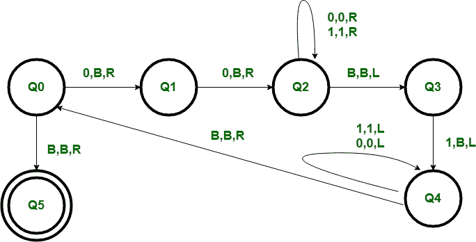

# 为语言 L = {02n1n | n > =0}

构建图灵机

> 原文:[https://www . geesforgeks . org/construct-a-turing-机器换语言-l-02n1n-n0/](https://www.geeksforgeeks.org/construct-a-turing-machine-for-language-l-02n1n-n0/)

先决条件–[图灵机](https://www.geeksforgeeks.org/turing-machine/)

语言 L = { 0<sup>2n</sup>1<sup>n</sup>| n>= 0 }代表一种我们只使用 2 个符号的语言，即 0 和 1。在开始的语言中，数字 0 后面跟的是数字 1 的一半。任何属于这一类的字符串都将被这种语言接受。

**示例:**

```
Input : 001
Output : YES

Input : 00001
Output : NO 

Input :  or empty string
Output : YES 
```

基本表示–


**计算开始:**
磁带包含输入字符串 w，磁带头在 w 最左边的符号上，图灵机处于开始状态 Q0。

**基本思路:**
磁带磁头读取最左边的符号 w，它是 0，make 为空，然后下一个最左边的 0 为空，之后我们遍历字符串最右边的 1，使其为空。以第 n 种方式，我们将字符串减少到 0 <sup>2n-2</sup> 1 <sup>n-1</sup> 。如果字符串属于语言 L，那么在末尾将留下空字符串，从而被机器接受。



**所用符号的含义:**
R，L–任一侧一个单位的运动方向。
B-空白。
0，1–要测试其组合字符串的符号。

**工序:**

*   **Step-1:**
    正如我们所知，字符串在起始处的零数量是 1 的两倍。因此，我们首先将前两个零留空，从 Q0 州到 Q1，从 Q1 州到 Q2。
*   **步骤-2:**
    在使它们成为空白之后，我们将遍历字符串的末尾，直到我们在状态 Q3 中获得最右边的 1，并使其成为空白，达到状态 Q4。
*   **步骤-3:**
    现在我们将往回遍历，直到得到字符串中最左边的零，并从 Q4 返回到状态 Q0。
*   **步骤-4:**
    我们只是通过将最左边的两个零留空和最右边的 1 留空来减少字符串，如果字符串属于该语言，则它将留空，因此在状态 Q5(最终状态)下被接受。如果字符串为空，它也将在 Q5 被接受。