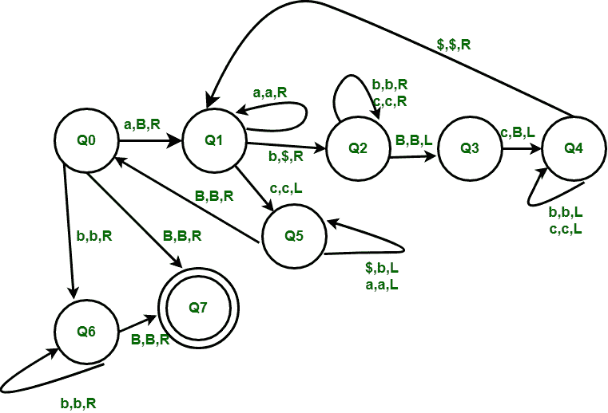

# 为语言 L = {a^n b^m c^nm 构建图灵机，其中 n > =0，m > = 0}

> 原文:[https://www . geesforgeks . org/construct-a-turing-机器换语言-l-an-BM-CNM-where-n-0-and-m-0/](https://www.geeksforgeeks.org/construct-a-turing-machine-for-language-l-an-bm-cnm-where-n-0-and-m-0/)

先决条件–[图灵机](https://www.geeksforgeeks.org/turing-machine/)

语言 L = { a<sup>n</sup>b<sup>m</sup>c<sup>nm</sup>| n>= 0 和 m > =0}代表一种我们只使用 3 个符号的语言，即 a、b 和 c。在开始的语言中有 n 个 a，然后是 m 个 b，然后是 n*m 个 c。任何属于这一类别的字符串都将被该语言接受。

**示例:**

```
Input : abbcc
Output : YES

Input : abbbcc
Output : NO

Input :  or empty string
Output : YES 
```

**基本表示:**


**计算开始:**
磁带包含输入字符串 w，磁带头在 w 最左边的符号上，图灵机处于开始状态 Q0。

**基本思路:**
磁带磁头读取 w 最左边的符号，这是一个 a，只有在开始时，我们才会将其设为空白。然后我们将遍历，使最左边的 b 变成 a $并用一个 Blank 替换最右边的 c，我们将执行这个之字形模式，用$替换 b，用 Blank 替换 c，直到所有的 b 都没有被$替换。在这之后，我们将向左遍历，直到得到最左边的 a，并用 b 替换遍历中的所有$为止。在此之后，我们将字符串简化为 a<sup>n-1</sup>b<sup>m</sup>c<sup>nm-m</sup>这样我们就可以计算出如果所有的 a 都被空白所取代，并且如果字符串属于 L 语言，那么就没有 c 了，因此它将被接受。



**所用符号的含义:**
R，L–任一侧一个单位的运动方向。
B-空白、
a、B、c-组合字符串待测试的符号。
$-暂时符号代替 b。

**工序:**

*   **Step-1:**
    我们首先用 Blank 替换最左边的 a，然后遍历用$替换最左边的 b，用 Blank 替换最右边的 c。从 Q1 州开始重复这个步骤，直到没有剩下 b。
*   **第 2 步:**
    在用$替换了所有的 b 之后，我们也用 Blanks 替换了 m 个最右边的 c，然后我们将回到最左边的 a，用 b 替换所有的$。在这一步之后，如果检查字符串，它现在被简化为 a<sup>n-1</sup>b<sup>m</sup>c<sup>nm-m</sup>形式。现在我们将从第 1 步开始重复，直到所有的 a 都变成空白。
*   **第三步:**
    所以在所有的 a 都变成空白之后，如果字符串属于语言 L，那么必须留下 0 个 c，我们在状态 Q0 和 Q6 检查，因为只有 b 会留下，之后如果发现空白，那么所有的 c 必须被空白替换，因为我们从字符串的最右端开始制造 c 的空白。
*   **第 4 步:**
    所以如果我们在状态 Q6 得到一个空白符号，那么这个字符串在最终状态 Q7 被接受。此外，如果字符串为空，那么它也将在状态 Q0 被接受为空白符号输入，然后它将进入状态 Q7 并被接受。