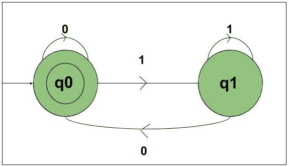
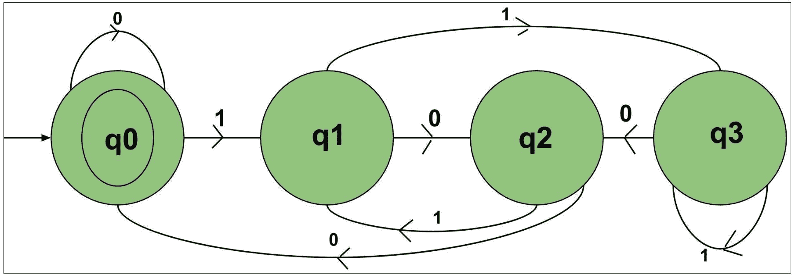

# 构造二进制数可被 2、3、4 整除的 DFA

> 原文:[https://www . geesforgeks . org/construct-DFA-解释为二进制数可被 2-3-4 整除/](https://www.geeksforgeeks.org/construct-dfa-which-interpreted-as-binary-number-is-divisible-by-2-3-4/)

先决条件:[有限自动机简介](https://www.geeksforgeeks.org/toc-finite-automata-introduction/)，[设计有限自动机](https://www.geeksforgeeks.org/designing-finite-automata-from-regular-expression/)
**问题-1:**
构造 DFA，接受{0，1}上所有字符串的集合，解释为二进制数可被 2 整除。

**解释:**
考虑以下输入，

```
{0, 01, 10, 11, 100, 101, 110........}
```

该语言的状态转换图如下所示:



在这个 DFA 中有两个状态 q0 和 q1，输入是{0，1}的字符串，解释为二进制数。
状态 q0 为最终状态，q1 为非最终状态。状态 q0 将代表所有可被 2 整除的数字，即{0，10，100，110…..}.
状态 q1 将代表所有不能被 2 整除的数字，即{01，11，101，…}。

```
def stateq0(n):
    #if length found 0 
    #print not accepted
    if (len(n)==0):
        print("string accepted")
    else:    

        #if at index 0 
        #'0' found call 
        #function stateq0 
        if(n[0]=='0'):
            stateq0(n[1:])

        #else if '1' found 
        #call function q1.    
        elif (n[0]=='1'):
            stateq1(n[1:])

def stateq1(n):
    #if length found 0 
    #print not accepted
    if (len(n)==0):
        print("string not accepted")
    else:    

        #if at index 0 
        #'0' found call 
        #function stateq0 
        if(n[0]=='0'):
            stateq0(n[1:])

        #else if '1' found 
        #call function q1.    
        elif (n[0]=='1'):
            stateq1(n[1:])            

#take number from user
n=int(input())
#converting number to binary
n = bin(n).replace("0b", "") 

#call stateA
#to check the input
stateq0(n)
```

```
INPUT: 5
OUTPUT: String Not Accepted

```

上述自动机将接受{0，1}上所有字符串的集合，当解释为二进制数时，该集合可被 2 整除。
当数不能被 2 整除时，它将从状态 q0 进入 q1。当该数可被 2 整除时，它将从状态 q1 变为 q0，或者如果它最初处于 q0，那么它将接受它。

**问题-2:**
构造 DFA，接受{0，1}上所有字符串的集合，解释为二进制数可被 3 整除。

**解释:**
参考解:[使用 DFA](https://www.geeksforgeeks.org/check-binary-string-multiple-3-using-dfa/) 的 3 的二进制串倍数。

**问题-3:**
构造 DFA，接受{0，1}上所有字符串的集合，解释为二进制数可被 4 整除。

**解释:**
考虑以下输入，

```
{0, 01, 10, 11, 100, 101, 110........}
```

该语言的状态转换图如下所示:



**解释:**
在这个 DFA 中有三个状态 q0、q1、q2、q3，输入是{0，1}的字符串，解释为二进制数。状态 q0 是最终状态，q1、q2、q3 是非最终状态。

*   状态 q0 将代表所有可被 4 整除的数字，即{0，100，1000…..}.
*   状态 q1 将代表所有不能被 4 整除的数字，并在被 4 整除时给出余数 1，即{01，101，…}。
*   状态 q2 将代表所有不能被 4 整除的数，当被 4 整除时给出余数 2，即{10，110，…}。
*   状态 q4 将代表所有不能被 4 整除的数字，并在被 4 整除时给出余数 3，即{11，111，…}。

上述自动机将接受{0，1}上所有字符串的集合，当解释为二进制数时，该集合可被 4 整除。

*   状态每当这个数不能被 4 整除并且给出 1 的余数时，它将进入状态 q1。
*   每当数不能被 4 整除并给出 2 的余数时，它将进入状态 q2。
*   状态每当数不能被 4 整除，并且给出 3 的余数时，它将进入状态 q3。
*   状态每当数可被 4 整除时，它将进入状态 q0，或者如果它最初在 q0 中，它将接受它。

```
def stateq0(n):
    #if length found 0 
    #print not accepted
    if (len(n)==0):
        print("string accepted")
    else:    

        #if at index 0 
        #'0' found call 
        #function stateq0 
        if(n[0]=='0'):
            stateq0(n[1:])

        #else if '1' found 
        #call function q1.    
        elif (n[0]=='1'):
            stateq1(n[1:])

def stateq1(n):
    #if length found 0 
    #print not accepted
    if (len(n)==0):
        print("string not accepted")
    else:    

        #if at index 0 
        #'0' found call 
        #function stateq2 
        if(n[0]=='0'):
            stateq2(n[1:])

        #else if '1' found 
        #call function q3.    
        elif (n[0]=='1'):
            stateq3(n[1:])            

def stateq2(n):
    #if length found 0 
    #print not accepted
    if (len(n)==0):
        print("string not accepted")
    else:    

        #if at index 0 
        #'0' found call 
        #function stateq0 
        if(n[0]=='0'):
            stateq0(n[1:])

        #else if '1' found 
        #call function q1.    
        elif (n[0]=='1'):
            stateq1(n[1:])   

def stateq3(n):
    #if length found 0 
    #print not accepted
    if (len(n)==0):
        print("string not accepted")
    else:    

        #if at index 0 
        #'0' found call 
        #function stateq2
        if(n[0]=='0'):
            stateq2(n[1:])

        #else if '1' found 
        #call function q3.    
        elif (n[0]=='1'):
            stateq3(n[1:])            

#take number from user
n=int(input())
#converting number to binary
n = bin(n).replace("0b", "") 

#call stateA
#to check the input
stateq0(n)
```