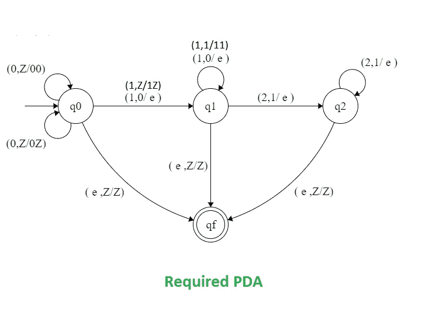

# 构造 L = {0m1(n+m)2n | m，n ≥ 0}的下推自动机

> 原文:[https://www . geesforgeks . org/construct-push down-automat-for-l-0 m1 nm2n-Mn-0/](https://www.geeksforgeeks.org/construct-pushdown-automata-for-l-0m1nm2n-mn-0/)

先决条件–[下推自动机](https://www.geeksforgeeks.org/theory-of-computation-pushdown-automata/)， [NPDA 接受语言 L = { a<sup>m</sup>b<sup>(n+m)</sup>c<sup>m</sup>| m，n > = 1}](https://www.geeksforgeeks.org/npda-for-accepting-the-language-l-ambmncn-mn-%E2%89%A5-1/)
**问题:**构造 L = { 0<sup>m</sup>1<sup>(n+m)</sup>2<sup>n</sup>| m，n ≥

**示例:**

```
Input: 011122
Output: Accepted

Input: 00000112222
Output: Not Accepted 
```

**在这个 PDA–**
中使用的方法在处理给定的输入字符串时可能有四种情况。

**情况 1- m=0:**
在这种情况下，输入字符串的形式为{1 <sup>n</sup> 2 <sup>n</sup> }。在这种情况下，继续推动堆栈中的 1，直到我们遇到 2。收到 2 时，检查堆栈顶部是否为 1，然后将其从堆栈中弹出。继续弹出 1，直到处理完字符串的所有 2。如果我们到达输入字符串的末尾，堆栈变空，然后到达最终状态，即接受输入字符串，否则移动到死状态。

**情况 2- n=0:**
在这种情况下，输入字符串的形式为{0 <sup>m</sup> 1 <sup>m</sup> }。在这种情况下，继续推动堆栈中的 0，直到我们遇到 1。收到 1 时，检查堆栈顶部是否为 0，然后将其从堆栈中弹出。继续弹出 0，直到处理完字符串的所有 1。如果我们到达输入字符串的末尾，堆栈变空，然后到达最终状态，即接受输入字符串，否则移动到死状态。

**情况 3- m，n > 0:**
在这种情况下，输入字符串的形式为{ 0<sup>m</sup>1<sup>(m+n)</sup>2<sup>n</sup>}。在这种情况下，继续推动堆栈中的 0，直到我们遇到 1。收到 1 时，检查堆栈顶部是否为 0，然后将其从堆栈中弹出。继续弹出 0，直到所有 0 都弹出，堆栈变空。之后，继续在堆栈中推动 1，直到我们遇到 2。

收到 2 时，检查堆栈顶部是否为 1，然后将其从堆栈中弹出。继续弹出 1，直到处理完输入字符串的所有 2。如果我们到达输入字符串的末尾，堆栈变空，则到达最终状态，即接受输入字符串，否则进入死状态。

**情况 4- m=0，n=0:**
在这种情况下，输入字符串将为空。因此直接跳到最终状态。

**状态转移图:**

