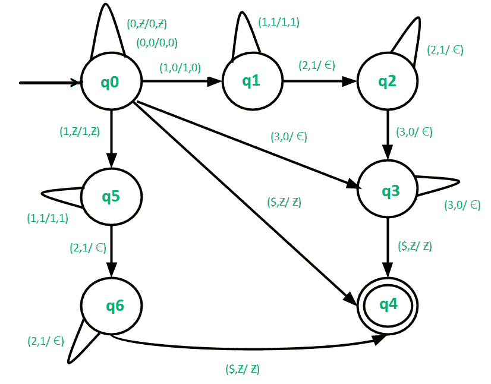

# 构造 L = {0n1m2m3n | m，n ≥ 0}的下推自动机

> 原文:[https://www . geeksforgeeks . org/construct-push down-automat-for-l-0n 1m 2m3n-Mn-% E2 % 89% a5-0/](https://www.geeksforgeeks.org/construct-pushdown-automata-for-l-0n1m2m3n-mn-%e2%89%a5-0/)

先决条件–[下推自动机](https://www.geeksforgeeks.org/theory-of-computation-pushdown-automata/)、[下推自动机最终状态接受](https://www.geeksforgeeks.org/pushdown-automata-acceptance-final-state/)、
下推自动机(PDA)在编译器设计中起着重要作用。因此，有必要好好管管 PDA。我们的目标是为 L = { 0<sup>n</sup>1<sup>m</sup>2<sup>m</sup>3<sup>n</sup>| m，n ≥ 0}构建一个 PDA

**示例–**

```
Input : 00011112222333
Output : Accepted

Input : 0001122233
Output : Not Accepted

```

**在这个 PDA–**
中使用的方法在处理给定的输入字符串时可以有 4 种情况。

*   **Case-1:m = 0–**在这种情况下，输入字符串的形式为{0 <sup>n</sup> 3 <sup>n</sup> }。在这种情况下，继续推动堆栈中的 0，直到我们遇到 3。收到 3 时，检查堆栈顶部是否为 0，然后将其从堆栈中弹出(0)。弹出 0，直到处理完输入字符串的所有 3。如果我们到达输入字符串的末尾，堆栈变空，那么到达最终状态，即接受输入字符串，否则移动到死状态。
*   **Case-2:n = 0–**在这种情况下，输入字符串的形式为{1 <sup>m</sup> 2 <sup>m</sup> }。在这种情况下，继续推动堆栈中的 1，直到我们遇到 2。收到 2 时，检查堆栈顶部是否为 1，然后将其从堆栈中弹出(1)。继续弹出 1，直到处理完输入字符串的所有 2。如果我们到达输入字符串的末尾，堆栈变空，那么到达最终状态，即接受输入字符串，否则移动到死状态。
*   **情况-3: m，n>0–**在这种情况下，输入字符串的形式为{ 0<sup>n</sup>1<sup>m</sup>2<sup>m</sup>3<sup>n</sup>}。在这种情况下，继续推动堆栈中的 0 和 1，直到我们遇到 2。收到 2 时，检查堆栈顶部是否为 1，然后将其从堆栈中弹出(1)。继续弹出 1，直到处理完输入字符串的所有 2。然后在收到 3 时检查堆栈顶部是否为 0，然后从堆栈中弹出(0)。弹出 0，直到处理完输入字符串的所有 3。如果我们到达输入字符串的末尾，堆栈变空，那么到达最终状态，即接受输入字符串，否则移动到死状态。
*   **Case-4: m = 0，n = 0–**在这种情况下，输入字符串将为空。因此直接跳到最终状态。

给定语言的最终下推自动机是:

