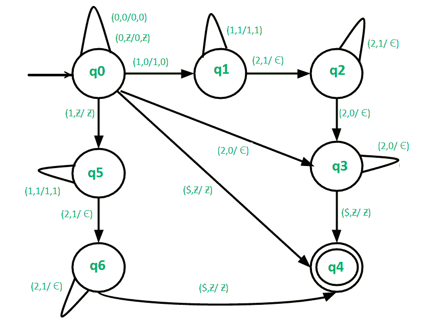

# 构造 L = {0n1m2(n+m) | m，n ≥ 0}的下推自动机

> 原文:[https://www . geesforgeks . org/construct-push down-automate-for-l-0n 1m 2nm-Mn-% E2 % 89% a5-0/](https://www.geeksforgeeks.org/construct-pushdown-automata-for-l-0n1m2nm-mn-%e2%89%a5-0/)

先决条件–[下推自动机](https://www.geeksforgeeks.org/theory-of-computation-pushdown-automata/)、 [NPDA 接受语言 L = { a<sup>m</sup>b<sup>n</sup>c<sup>(m+n)</sup>| m，n ≥ 1}](https://www.geeksforgeeks.org/npda-for-accepting-the-language-l-ambncmn-mn-%E2%89%A5-1/)
PDA 在编译器设计任务中起着非常重要的作用。这就是为什么需要有一个关于 PDA 的良好做法。我们的目标是构建一个 PDA，它接受一串{(0^n)(1^m)(2^(n+m))}格式的字符串

**示例-**

```
Input: 00001112222222
Output: Accepted

Input: 00011112222
Output: Not Accepted 
```

**在这个 PDA–**
中使用的方法在处理给定的输入字符串时可能有四种情况。

**情况 1- m=0:** 在这种情况下，输入字符串的形式为{0 <sup>n</sup> 2 <sup>n</sup> }。在这种情况下，继续推动堆栈中的 0，直到我们遇到 2。收到 2 时，检查堆栈顶部是否为 0，然后将其从堆栈中弹出。继续弹出 0，直到处理完字符串的所有 2。如果我们到达输入字符串的末尾，堆栈变空，然后到达最终状态，即接受输入字符串，否则移动到死状态。

**情况 2- n=0:** 在这种情况下，输入字符串的形式为{1 <sup>m</sup> 2 <sup>m</sup> }。在这种情况下，继续推动堆栈中的 1，直到我们遇到 2。收到 2 时，检查堆栈顶部是否为 1，然后将其从堆栈中弹出。继续弹出 1，直到处理完字符串的所有 2。如果我们到达输入字符串的末尾，堆栈变空，然后到达最终状态，即接受输入字符串，否则移动到死状态。

**情况 3- m，n > 0:** 在这种情况下，输入字符串的形式为{ 0<sup>n</sup>1<sup>m</sup>2<sup>(n+m)</sup>}。在这种情况下，继续推动堆栈中的 0 和 1，直到我们遇到 2。收到 2 时，检查堆栈顶部是 1 还是 0，然后从堆栈中弹出(1 或 0)。继续弹出 1 或 0，直到处理完输入字符串的所有 2。如果我们到达输入字符串的末尾，堆栈变空，那么到达最终状态，即接受输入字符串，否则移动到死状态。

**情况 4- m=0，n=0:** 在这种情况下，输入字符串将为空。因此直接跳到最终状态。

