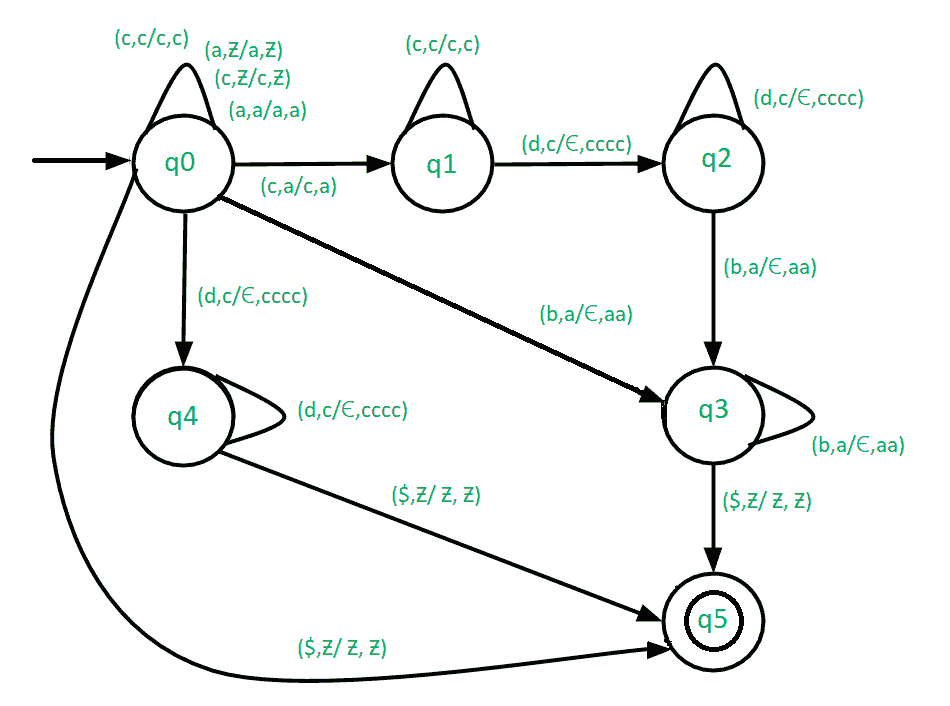

# 构造 L = {a(2*m)c(4*n)dnbm | m，n ≥ 0}的下推自动机

> 原文:[https://www . geesforgeks . org/construct-push down-automate-for-l-a2mc 4 ndnbm-Mn-% E2 % 89% a5-0/](https://www.geeksforgeeks.org/construct-pushdown-automata-for-l-a2mc4ndnbm-mn-%e2%89%a5-0/)

先决条件–[下推自动机](https://www.geeksforgeeks.org/theory-of-computation-pushdown-automata/)、[下推自动机最终状态接受](https://www.geeksforgeeks.org/pushdown-automata-acceptance-final-state/)、
PDA 在编译器设计任务中起着非常重要的作用。这就是为什么需要有一个关于 PDA 的良好做法。我们的目标是为 L = { a<sup>(2 * m)</sup>c<sup>(4 * n)</sup>d<sup>n</sup>b<sup>m</sup>| m，n ≥ 0}构建一个 PDA

**示例–**

```
Input: aaccccdb
Output: Accepted

Input: aaaaccccccccddbb
Output: Accepted

Input: acccddb
Output: Not Accepted 
```

**在这个 PDA–**
中使用的方法在处理给定的输入字符串时可能有四种情况。

**Case-1:m = 0–**在这种情况下，输入字符串的形式将是{c <sup>(4*n)</sup> d <sup>n</sup> }。在这种情况下，继续推动堆栈中的 c，直到我们遇到 d。收到“d”时，检查堆栈顶部是否为“c”，然后从堆栈中弹出“cccc”。继续弹出 cccc，直到处理完字符串的所有 d。如果我们到达输入字符串的末尾，堆栈变成空的，那么到达最终状态，即接受输入字符串，否则移动到死状态。

**Case-2:n = 0–**在这种情况下，输入字符串的形式为{a <sup>(2*m)</sup> b <sup>m</sup> }。在这种情况下，继续推动堆栈中的 a，直到遇到 b。收到 b 时，检查栈顶是否为 a，然后从栈中弹出 aa。继续弹出 aa，直到字符串的所有 b 都被处理完。如果我们到达输入字符串的末尾，堆栈变空，则到达最终状态，即接受输入字符串，否则移动到死状态。

**Case-3: m，n>0–**在这种情况下，输入字符串的形式为{(a<sup>(2 * m)</sup>c<sup>(4 * n)</sup>d<sup>n</sup>b<sup>m</sup>}。在这种情况下，继续推动堆栈中的 a 和 c，直到我们遇到“d”。收到数据后，检查堆栈顶部是否为“c”，然后从堆栈中弹出“cccc”。继续打开 cccc，直到处理完输入字符串的所有 d。然后在收到 b 时，检查堆栈顶部是否为“a”，然后从堆栈中弹出“aa”。继续点击 aa，直到输入字符串的所有 b 都被处理完。如果我们到达输入字符串的末尾，堆栈变空，那么到达最终状态，即接受输入字符串，否则移动到死状态。

**Case-4: m，n = 0–**在这种情况下，输入字符串将为空。因此直接跳到最终状态。



**注–**

1.  我们用(b，a/€，aa)来弹出 2 a，即遇到 b 时 aa。
2.  我们用(d，c/€，cccc)来弹出 4 c，即遇到 d 时的 cccc。