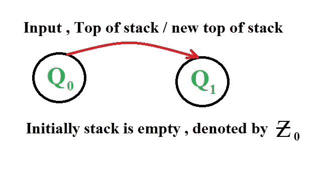
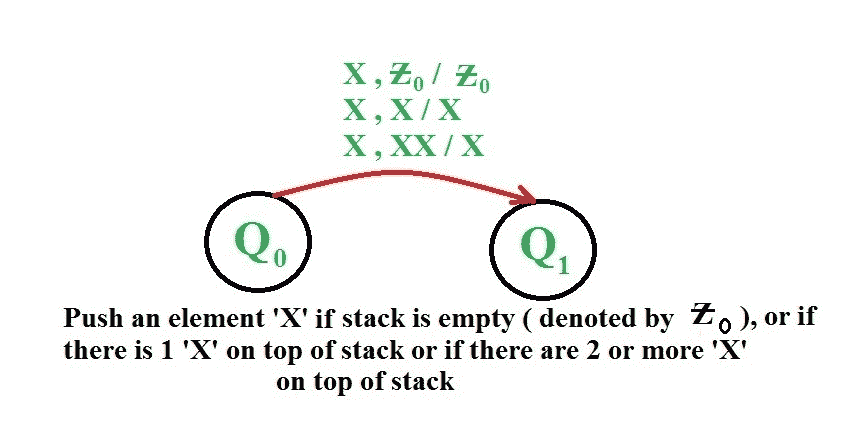
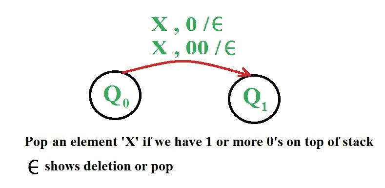
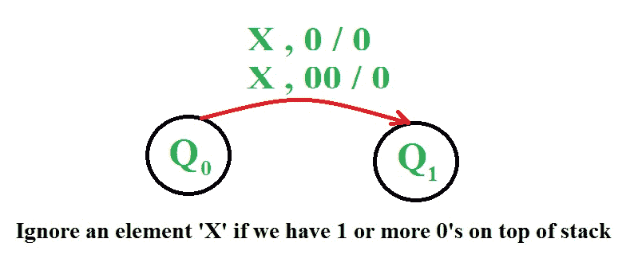
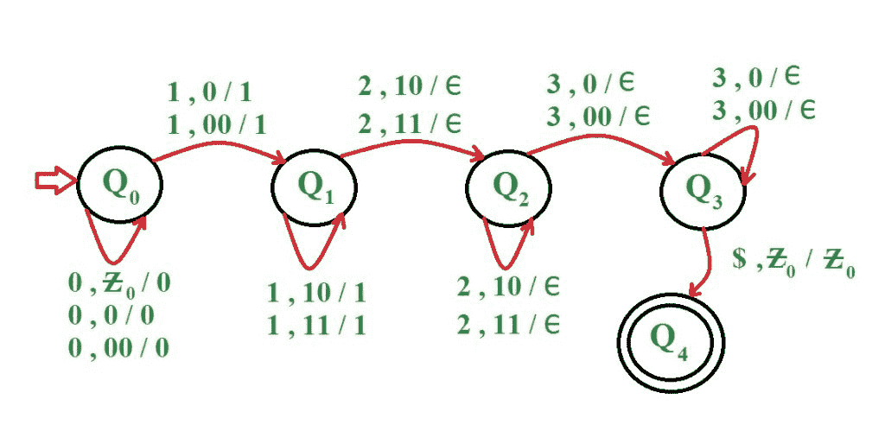
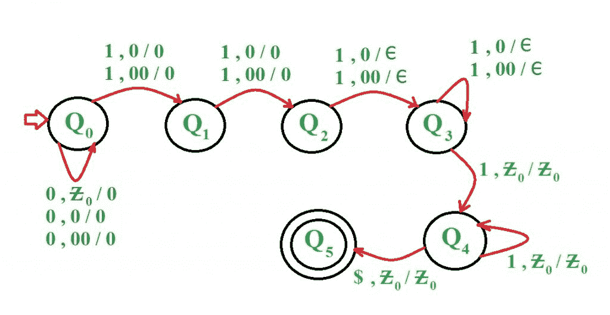

# 为给定语言构造下推自动机

> 原文:[https://www . geeksforgeeks . org/construct-push down-automate-given-languages/](https://www.geeksforgeeks.org/construct-pushdown-automata-given-languages/)

先决条件–[下推自动机](https://www.geeksforgeeks.org/theory-of-computation-pushdown-automata/)、[按最终状态接受下推自动机](https://www.geeksforgeeks.org/pushdown-automata-acceptance-final-state/)、
下推自动机类似于确定性有限自动机，只是它比 DFA 多了一些属性。用于实现 PDA 的数据结构是堆栈。PDA 有一个与每个输入相关联的输出。所有输入要么被推入堆栈，要么被忽略。用户可以对用于 PDA 的堆栈执行基本的推送和弹出操作。与 DFAs 相关的一个问题是无法计算输入机器的字符数。PDA 避免了这个问题，因为它使用的堆栈也为我们提供了这个功能。

**下推自动机(PDA)可以定义为–**
M =(Q，σ，γ，δ，q0，ζ，F)其中

*   q 是一组有限的状态
*   σ是一个有限集合，称为输入字母表
*   γ是一个有限集合，称为栈字母表
*   δ是 Q X 的有限子集(σ∑{ε} XγX Q Xγ<sup>*</sup>)的过渡关系。
*   q <sub>0</sub> ∈ Q 为启动状态
*   ζ∈γ是初始堆栈符号
*   F ⊆ Q 是接受状态的集合

**状态转换的表示–**



**PDA 中的推送表示–**



**PDA 流行音乐的表现–**



**PDA 中忽略的表示–**



### q)为语言构建一个 PDA L = { 0<sup>n</sup>1<sup>m</sup>2<sup>m</sup>3<sup>n</sup>| n>= 1，m > =1}

**PDA–**
中使用的方法将前 0 推入堆栈。然后 1 被推入堆栈。
则每 2 个作为输入，栈中弹出 1。如果还剩下一些 2，栈顶是 0，那么 PDA 不接受字符串。此后，如果完成了 2，并且栈顶为 0，则每 3 个作为输入，从栈中弹出相等数量的 0。如果字符串结束，堆栈为空，则字符串被 PDA 接受，否则不被接受。

*   **第 1 步:**收到 0 时，将其推到堆栈上。接收到 1 时，将其推送到堆栈上并进入下一个状态
*   **步骤 2:** 收到 1 时，将其推到堆栈上。收到 2 时，从堆栈弹出 1 并进入下一状态
*   **步骤 3:** 从堆栈中接收到 2 个 pop 1 时。如果所有的 1 都从堆栈中弹出，现在接收到 3，那么从堆栈中弹出一个 0，并进入下一个状态
*   **第 4 步:**从堆栈中收到 3 个 pop 0 时。如果输入完成，堆栈为空，则转到最后一个状态，字符串被接受



示例:

```
Input  : 0 0 1 1 1 2 2 2 3 3
Result : ACCEPTED

Input  : 0 0 0 1 1 2 2 2 3 3 
Result : NOT ACCEPTED 
```

### q)为语言构建一个 PDA L = { 0<sup>n</sup>1<sup>m</sup>| n>= 1，m > = 1，m > n+2}

**PDA–**
中使用的方法将前 0 推入堆栈。完成 0 后，将忽略两个 1。此后，每输入 1，就有 0 从堆栈中弹出。当堆栈为空并且还剩下一些 1 时，所有 1 都被忽略。

*   **第 1 步:**收到 0 时，将其推到堆栈上。收到 1 时，忽略它并进入下一个状态
*   **步骤-2:** 收到 1 时，忽略它，进入下一个状态
*   **步骤 3:** 收到 1 时，从堆栈顶部弹出 0，进入下一状态
*   **第 4 步:**收到 1 时，从堆栈顶部弹出 0。如果堆栈为空，在接收 1 时忽略它并进入下一个状态
*   **第 5 步:**收到 1 忽略。如果输入完成，则进入最后状态



示例:

```
Input  : 0 0 0 1 1 1 1 1 1
Result : ACCEPTED

Input  : 0 0 0 0 1 1 1 1
Result : NOT ACCEPTED
```