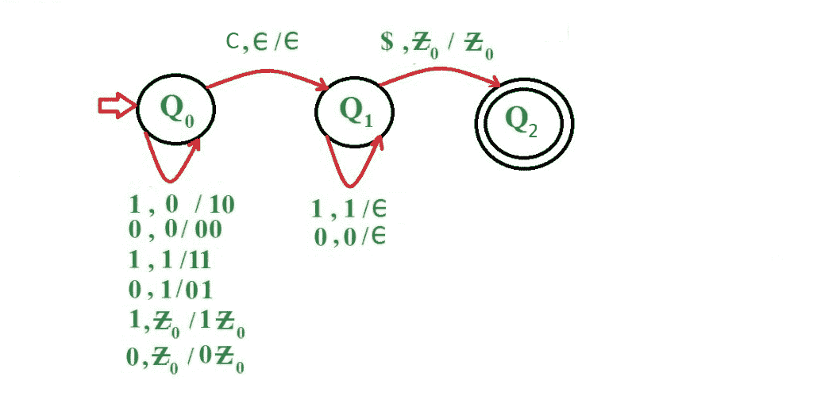
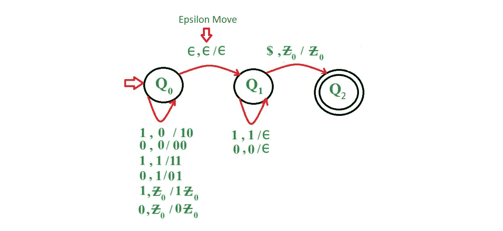
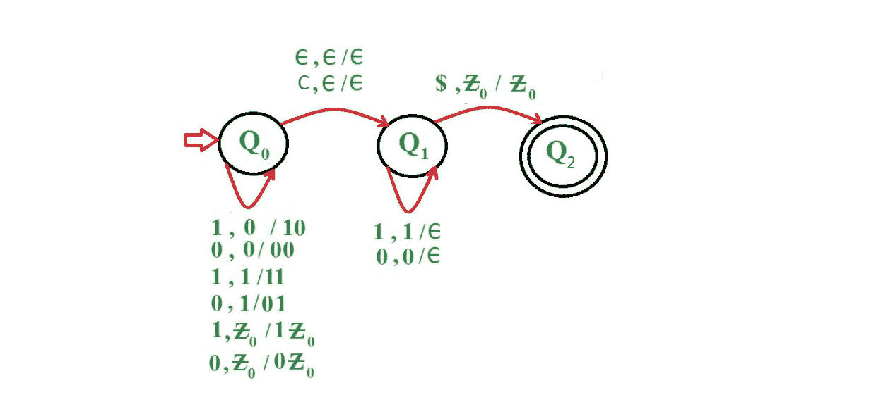

# 为所有长度回文构建下推自动机

> 原文:[https://www . geesforgeks . org/construct-push down-automate-length-回文/](https://www.geeksforgeeks.org/construct-pushdown-automata-length-palindrome/)

一个[下推自动机](https://www.geeksforgeeks.org/theory-of-computation-pushdown-automata/) (PDA)就像一个无限栈的ε不确定有限自动机(NFA)。PDA 是实现上下文无关语言的一种方式。因此，学习如何画 PDA 是很重要的。

*这里以奇数长度回文为例:*
**Que-1:** 为语言 L = {wcw' | w={0，1}*}构造一个 PDA，其中 w '是 w 的反义词。

**在这个 PDA 中使用的方法–**
继续推 0 和 1，不管堆栈顶部是什么，直到到达中间元素。当扫描中间元素' c '时，处理它，而不对堆栈进行任何更改。现在，如果扫描的符号为“1”，并且堆栈顶部也包含“1”，则从堆栈顶部弹出元素，或者如果扫描的符号为“0”，并且堆栈顶部也包含“0”，则从堆栈顶部弹出元素。如果字符串为空或扫描的符号为“{ content }”；并且堆栈变空，然后到达最终状态，否则移动到死状态。

*   **第一步:**收到 0 或 1 时，继续将其推到堆栈顶部，不进入下一个状态。
*   **步骤 2:** 接收到元素‘c’后，移动到下一个状态，而不改变堆栈。
*   **步骤 3:** 接收到元素后，检查扫描的符号是否为“1”，堆栈顶部是否也包含“1”，或者扫描的符号是否为“0”，堆栈顶部是否也包含“0”，然后从堆栈顶部弹出元素，否则移动到死状态。继续重复步骤 3，直到字符串变为空。
*   **步骤 4:** 检查扫描的符号是否为“{ content }”；并且堆栈不包含任何元素，则移动到最终状态，否则移动到死状态。



**示例:**

```
Input : 1 0 1 0 1 0 1 0 1
Output :ACCEPTED

Input : 1 0 1 0 1 1 1 1 0
Output :NOT ACCEPTED

```

*现在，以偶数长度回文为例:*
**Que-2:** 为语言 L = { ww“| w = { 0，1}*}构造一个 PDA，其中 w '是 w 的反义词。

**在这个 PDA 中使用的方法–**
对于偶数长度回文的构造，用户必须使用非确定性下推自动机(NPDA)。一个 NPDA 基本上是一个 NFA 加上一个堆栈。
除了ε跃迁外，该语言的 NPDA 与前一语言相同。然而，有一个显著的区别，那就是这个 PDA 必须猜测什么时候停止推送符号，跳到最终状态并开始匹配堆栈。因此，这台机器是绝对不确定的。
不管栈顶是什么，继续推 0 和 1，同时检查输入字符串，是否到达输入字符串的后半部分。如果到达输入字符串前半部分的最后一个元素，则在处理完输入字符串前半部分的最后一个元素后，进行ε移动并移动到下一个状态。现在，如果扫描的符号为“1”，并且堆栈顶部也包含“1”，则从堆栈顶部弹出元素，或者如果扫描的符号为“0”，并且堆栈顶部也包含“0”，则从堆栈顶部弹出元素。如果字符串为空或扫描的符号为“{ content }”；并且堆栈变空，然后到达最终状态，否则移动到死状态。

*   **第 1 步:**在接收到 0 或 1 时，继续将其推到堆栈顶部，同时继续检查是否到达输入字符串的后半部分。
*   **步骤 2:** 如果到达输入字符串前半部分的最后一个元素，则将该元素推到堆栈顶部，然后进行ε移动到下一个状态。
*   **步骤 3:** 接收到元素后，检查扫描的符号是否为“1”，堆栈顶部是否也包含“1”，或者扫描的符号是否为“0”，堆栈顶部是否也包含“0”，然后从堆栈顶部弹出元素，否则移动到死状态。继续重复步骤 3，直到字符串变为空。
*   **步骤 4:** 检查扫描的符号是否为“{ content }”；并且堆栈不包含任何元素，则移动到最终状态，否则移动到死状态。



**示例:**

```
Input : 1 0 0 1 1 1 1 0 0 1
Output :ACCEPTED

Input : 1 0 0 1 1 1
Output :NOT ACCEPTED

```

*现在以全长度回文为例，即一个既能接受奇数长度回文又能接受偶数长度回文的 PDA:*
**Que-3:**为语言 L = {ww' | wcw '，w={0，1}*}构造一个 PDA，其中 w '是 w 的反义词

**在这个 PDA 中使用的方法–**
对于所有长度回文的构造，用户必须使用 NPDA。
该方法类似于上面的例子，除了现在随着 move now，用户必须显示符号‘c’的又一个过渡移动，即如果字符串是奇数长度，并且如果到达中间元素‘c ’,则只处理它并移动到下一个状态，而不对堆栈进行任何改变。

*   **步骤 1:** 在接收到 0 或 1 时，继续将其推到堆栈顶部，同时继续检查，如果输入字符串是偶数长度，则是否到达输入字符串的后半部分，但是如果输入字符串是奇数长度，则继续检查是否到达中间元素。
*   **第二步:**如果输入字符串的长度为偶数，并且到达输入字符串前半部分的最后一个元素，则将该元素推到堆栈顶部，然后进行ε移动到下一个状态，或者如果输入字符串的长度为奇数，则在接收到元素“c”时，移动到下一个状态，而不在堆栈中进行任何更改。
*   **步骤 3:** 接收到元素后，检查扫描的符号是否为“1”，堆栈顶部是否也包含“1”，或者扫描的符号是否为“0”，堆栈顶部是否也包含“0”，然后从堆栈顶部弹出元素，否则移动到死状态。继续重复步骤 3，直到字符串变为空。
*   **步骤 4:** 检查扫描的符号是否为“{ content }”；并且堆栈不包含任何元素，则移动到最终状态，否则移动到死状态。



**示例:**

```
Input : 1 1 0 0 1 1 1 1 0 0 1 1
Output :ACCEPTED

Input : 1 0 1 0 1 0 1
Output :ACCEPTED

```