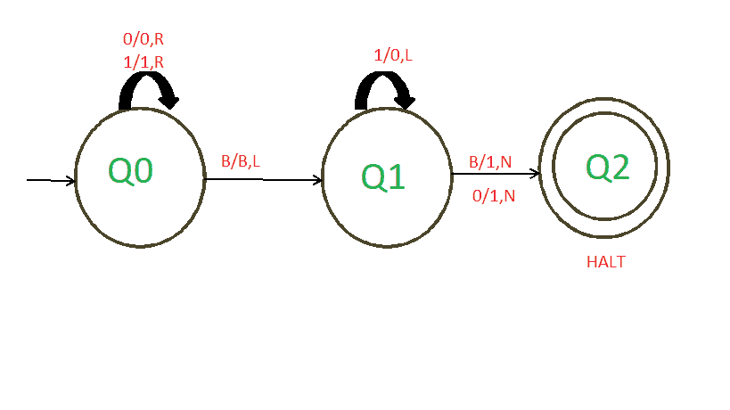

# 构造图灵机，使二进制数增加 1

> 原文:[https://www . geesforgeks . org/construct-turing-machine-for-递增-二进制-number-by-1/](https://www.geeksforgeeks.org/construct-turing-machine-for-incrementing-binary-number-by-1/)

**先决条件:**T2】图灵机

**任务:**
我们必须设计一个图灵机，让二进制数增加 1。

**示例–**

```
Input: 10111
Output: 11000

Input: 1000
Output: 1001

Input: 10101011
Output: 10101100
```

**分析:**
从以上三个例子，我们可以得到两个条件–

*   **当最右边的数字是 0 时:**
    这里我们可以看到，当我们给一个二进制数加上一个以 0 为最右边的数字时，那么这个二进制数的最右边的数字就会发生变化，也就是说，如果最右边的数字是 0，那么它就会变成 1，反之亦然，而其他所有的数字都保持不变，当我们得到 Blank(B)时，我们的机器就会停止。
*   **当最右边的数字是 1 时:**
    这里我们可以看到，当我们给一个二进制数加上一个东西，这个二进制数的最右边的数字是 1，那么所有的 1 都会变成 0，直到我们得到一个 0，然后我们得到的 0 会变成 1，而之后的所有其他数字会保持不变，当我们得到 Blank(B)时，我们的机器就会停止。假设字符串中没有任何 0，例如 1111，然后我们向左移动，直到得到一个空白(B)，将所有的 1 改为 0，并将这个空白(B)改为 1，我们的机器停止。

**进场:**

1.  我们必须从右向左扫描元素。起初，我们的指针在最左边。因此，我们必须将指针移到最右边。
2.  为了将指针移到最右边，我们通常跳过所有的 0 和 1，直到得到一个空白。
3.  完成这一步后，我们现在可以将指针从左向右移动。
4.  如果我们得到第一个数字 1，那么我们把所有的 1 变成 0，直到我们得到一个 0，然后把这个 0 变成 1。之后，所有的数字保持不变，我们的机器停在空白(B)。
5.  如果我们得到第一个数字 1，那么出现一个条件，我们没有得到任何 0，例如 1111，然后我们向左移动，直到我们得到一个空白(B)，把所有的 1 变成 0，把这个空白(B)变成 1，我们的机器停止。
6.  如果我们得到的第一个数字是 0，那么我们必须把 0 变成 1，之后，所有的数字保持不变，我们的机器将停在空白(乙)。

[](https://media.geeksforgeeks.org/wp-content/uploads/20200924004938/GFGArticles.png)