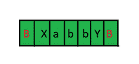
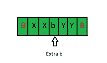
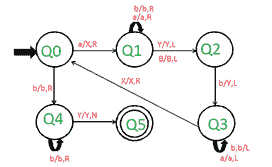

# 为 L = {a^i b^j 构建图灵机| I<j i="">0 }</j>T3】

> 原文:[https://www . geesforgeks . org/construct-turing-machine-for-l-ai-bj-ij-i0/](https://www.geeksforgeeks.org/construct-turing-machine-for-l-ai-bj-ij-i0/)

**先决条件–**[图灵机](https://www.geeksforgeeks.org/turing-machine-in-toc/)

**任务:**
我们必须为 a^i b^j 设计一个图灵机，在那里我< j 和我> 0。

**分析:**
这里主要要注意的是 i < j .意思是字符串中‘b’的计数总是大于‘a’的计数。因此我们可以这样写 a^i b^j——

```
a^i b^j = a^n b^n + extra number of b.
```

**示例–**

```
Input: aabbbb
Output: Accepted

Input: aaabb
Output: Not Accepted
```

**进场:**
让我们以一个字符串“aabbb”来理解进场。

1.  从左侧扫描输入。
2.  首先，用“X”替换“a”，然后向右移动 1 步。然后跳过所有的 a 和 b，向右移动。
3.  When the pointer reaches Blank(B) it scans the input from the right and replaces the first ‘b’ with ‘Y’.

    [](https://media.geeksforgeeks.org/wp-content/uploads/20200922154044/Toc12.png)

4.  指针再次到达空白。它现在从左到右扫描输入。指针向前移动，并用“X”替换“a”。
5.  指针再次到达空白。它现在从右向左扫描输入。指针向前移动，并用“y”替换“b”。
6.  我们重复同样的步骤，直到把所有的 a 转换成 X。b 等于 a 的计数也会转换成‘Y’，剩下的 b 我们会剩下一些。

[](https://media.geeksforgeeks.org/wp-content/uploads/20200922161957/Toc12-1.png) 

