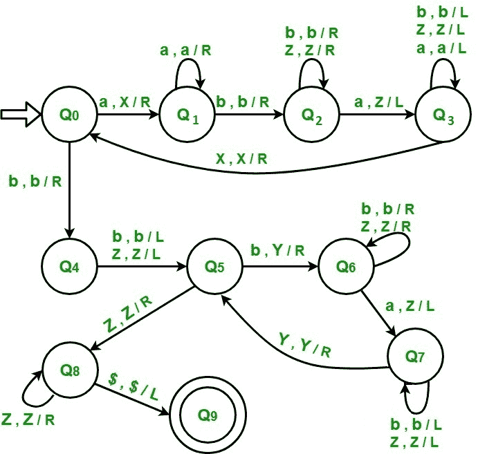

# 为 L = {an bm a(n+m) | n，m≥1}构造图灵机

> 原文:[https://www . geesforgeks . org/construct-turing-machine-l-BM-anm-nm % E2 % 89% a51/](https://www.geeksforgeeks.org/construct-turing-machine-l-bm-anm-nm%e2%89%a51/)

l = { a<sup>n</sup>b<sup>m</sup>a<sup>(n+m)</sup>| n，m≥1}代表一种我们只用 2 个字符的语言，即 a 和 b，语言的第一部分可以是任意数量的“a”(至少 1)。第二部分可以是任何数量的“b”(至少 1)。语言的第三部分是一个数“a”，它的计数是字符串第一部分中 a 的计数和字符串第二部分中 b 的计数之和。任何属于这一类别的字符串都将被该语言接受。字符串的开头和结尾用$符号标记。

**示例:**

```
Input  : a a b b b a a a a a  // n=2, m=3 
Output : Accepted

Input  : a a b a a a a       // n=2, m=1 
Output : Not accepted

```

**采用的方法–**

1.  将第一部分中的“a”转换为“X”，然后向右移动，忽略所有中间符号。当在“b”之后遇到“a”时，将其转换为“Z”，然后向左移动，并停在“X”旁边的位置。重复上述步骤。
2.  When all a’s in first part have been converted then apply the same process on second part. Convert “b” into “Y” and “a” into “Z” in the third part.

    当整个第一和第二部分已经被转换，如果第三部分也被转换，那么字符串将被接受，否则不被接受。

    **步骤–**

    **步骤-0:** 将“a”转换为“X”，向右移动，进入状态 1。如果符号是“b”，忽略它，向右移动并进入状态-4。

    **步骤-1:** 如果符号是“a”，忽略它并向右移动，保持在同一状态。如果符号是“b”，忽略它，向右移动并进入状态-2。

    **第 2 步:**如果符号是“Z”，忽略它并向右移动，保持在同一状态。如果符号是“b”，忽略它并向右移动，保持在相同的状态，如果符号是“a”，将其转换为“Z”，向左移动并转到状态-3。

    **步骤-3:** 如果符号是“Z”，忽略它并向左移动，保持相同的状态。如果符号是“b”，忽略它并向左移动，保持相同的状态。如果符号是“a”，忽略它并向左移动，保持在同一状态，如果符号是“X”，忽略它并向右移动，进入状态-0。

    **步骤-4:** 如果符号是“b”，忽略它向左移动，进入状态 5，如果符号是“Z”，忽略它向左移动，进入状态-5。

    **步骤-5:** 将“b”转换为“Y”，向右移动，进入状态 6，如果符号为“Z”，则忽略，向右移动，进入状态-8。

    **第 6 步:**如果符号是“Z”，忽略它并向右移动，保持在同一状态。如果符号是“b”，忽略它并向右移动，保持在同一状态，如果符号是“a”，将其转换为“Z”，向左移动并转到状态-7。

    **第 7 步:**如果符号是“Z”，忽略它并向左移动，保持相同的状态。如果符号是“b”，忽略它并向左移动，保持在同一状态，如果符号是“Y”，忽略它并向右移动，转到状态-5。

    **Step-8:** 如果符号为“Z”，则忽略它并向右移动，保持在同一状态，如果符号为“{content} ”;，忽略它并向左移动，转到状态-9。

    **第 9 步:**字符串已接受

    