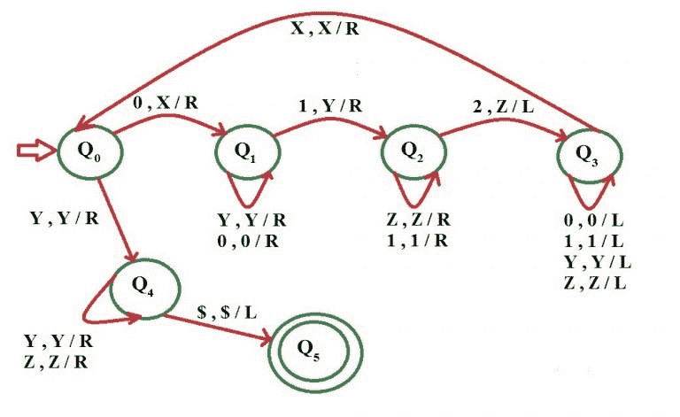

# 为语言 L = {0n1n2n | n≥1}构建图灵机

> 原文:[https://www . geesforgeks . org/construct-turing-machine-language-l-0n 1n 2n-n % E2 % 89% a51/](https://www.geeksforgeeks.org/construct-turing-machine-language-l-0n1n2n-n%e2%89%a51/)

先决条件–[图灵机](https://www.geeksforgeeks.org/turing-machine/)
语言 L = { 0<sup>n</sup>1<sup>n</sup>2<sup>n</sup>| n≥1 }代表一种我们只使用 3 个字符的语言，即 0、1 和 2。在开始的语言中，有一些 0 后面跟有相等数量的 1，然后跟有相等数量的 2。任何属于这一类别的字符串都将被这种语言接受。字符串的开头和结尾用$符号标记。

**示例–**

```
Input  : 0 0 1 1 2 2
Output : Accepted

Input  : 0 0 0  1 1 1 2 2 2 2
Output : Not accepted

```

**假设:**我们用 X 代替 0，用 Y 代替 1，用 Z 代替 2

**使用的方法–**
首先用 X 替换前面的 0，然后继续向右移动，直到找到 1，再用 y 替换这个 1。同样，继续向右移动，直到找到 2，再用 Z 替换它，然后向左移动。现在继续向左移动，直到你找到一个 x。当你找到它时，向右移动，然后按照上面相同的程序。

当你发现一个 X 后面紧跟着一个 Y 时，一个条件就出现了。此时，我们继续向右移动，并继续检查所有的 1 和 2 是否都已转换为 Y 和 z。如果没有，则字符串不被接受。如果我们达到$那么字符串被接受。

*   **第一步:**
    用 X 代替 0，向右移动，前往 Q1 州。
*   **步骤-2:**
    用 0 替换 0 并向右移动，保持在同一状态
    用 Y 替换 Y 并向右移动，保持在同一状态
    用 Y 替换 1 并向右移动，转到状态 Q2。
*   **步骤-3:**
    用 1 替换 1 并向右移动，保持在同一状态
    用 Z 替换 Z 并向右移动，保持在同一状态
    用 Z 替换 2 并向右移动，转到状态 Q3。
*   **步骤-4:**
    用 1 替换 1 并向左移动，保持在同一状态
    用 0 替换 0 并向左移动，保持在同一状态
    用 Z 替换 Z 并向左移动，保持在同一状态
    用 Y 替换 Y 并向左移动，保持在同一状态
    用 X 替换 X 并向右移动，转到状态 Q0。
*   **第 5 步:**
    如果符号是 Y，用 Y 替换它，然后向右移动，进入状态 Q4
    否则进入第 1 步
*   **第 6 步:**
    将 Z 替换为 Z 并向右移动，保持在同一状态
    将 Y 替换为 Y 并向右移动，保持在同一状态
    如果符号为$将它替换为$并向左移动，字符串被接受，转到最终状态 Q5

