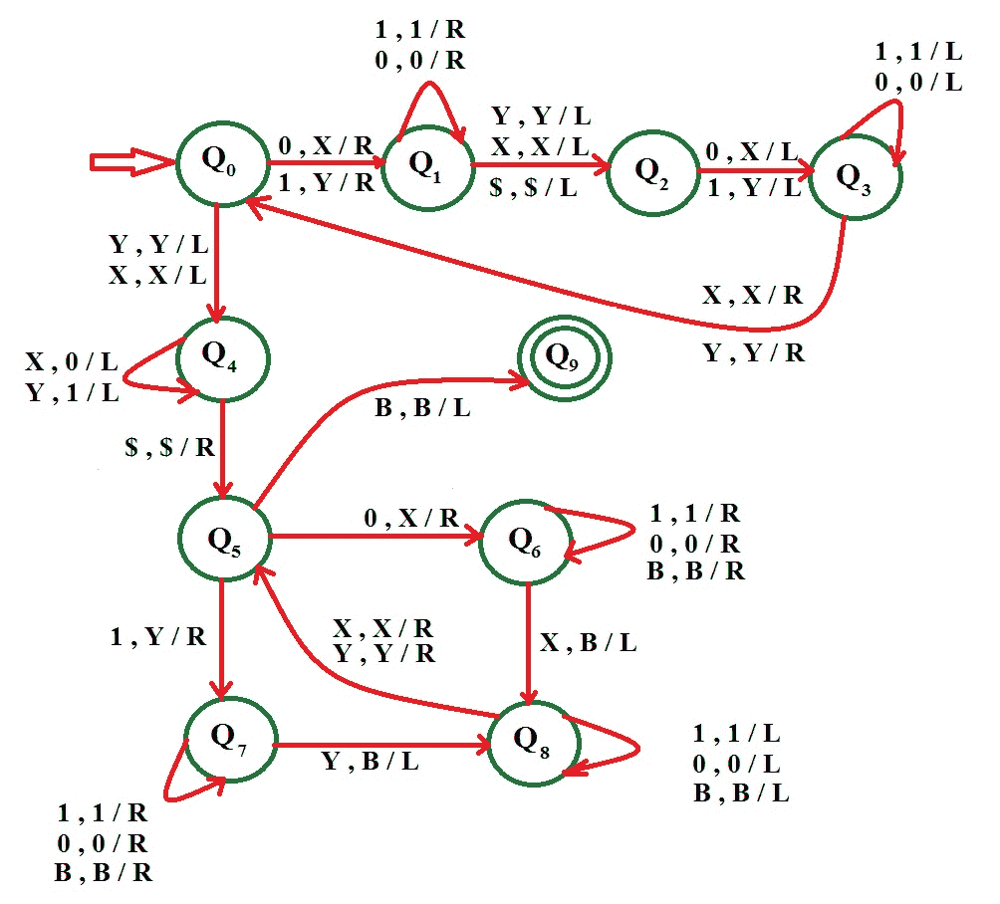

# 为语言 L = { ww | w∑{ 0，1}}

构建图灵机

> 原文:[https://www . geesforgeks . org/construct-turing-machine-language-l-ww-w-01/](https://www.geeksforgeeks.org/construct-turing-machine-language-l-ww-w-01/)

先决条件–[图灵机](https://www.geeksforgeeks.org/turing-machine/)
语言 L = { ww | w∑{ 0，1}}告诉我们，每一个 0 和 1 组成的字符串，后面跟的都属于这种语言。解决这个问题的逻辑可以分为 2 个部分:

1.  找到绳子的中点

2.  找到中点后，我们匹配符号

**示例–**让我们借助一个示例来理解它。让字符串 1 0 1 1 0 1，所以 w = 1 0 1，字符串的形式是(ww)。
我们做的第一件事就是找到中点。为此，我们将开头的 1 转换为 Y，并向右移动，直到字符串的结尾。这里我们把 1 转换成 y。

现在我们的字符串看起来像 Y 0 1 1 0 Y。现在向左移动，直到找到一个 X 或 Y。当我们这样做的时候，把它右边的 0 或 1 分别转换成 X 或 Y，然后在右端做同样的事情。现在我们的字符串看起来像是 Y×11×Y。然后，也转换这些 1，最后看起来像是 Y×Y**Y**X Y

此时，您已经实现了第一个目标，即找到中点。现在将中点左边的所有 X 和 Y 分别转换为 0 和 1，这样字符串就变成了 1 0 1 Y X Y，现在将 1 转换为 Y 并向右移动，直到在字符串右边部分的开头找到 Y 并将这个 Y 转换为空白(用 B 表示)。现在字符串看起来像 Y 0 1 B X Y。

同样，在 0 和 X 上应用这个，然后是 1 和 Y。之后这个字符串看起来像 Y X Y B B B。现在你没有 0 和 1，字符串右边的所有 X 和 Y 都被转换成空白，所以我们的字符串将被接受。

**假设:**我们用 X 代替 0，用 y 代替 1。

**Approach Used–**
首先要找到字符串的中点，将字符串开头的一个 0 或 1 分别转换为 X 或 Y，将字符串结尾对应的 0 或 1 转换为 X 或 Y。连续做一次后，当所有的 0 和 1 分别转换成 X 和 Y 时，就达到了一个点。此时，你在弦的中点。所以，我们的第一个目标实现了。

现在，将中点左侧的所有 X 和 Y 转换为 0 和 1。此时，字符串的前半部分是 0 和 1 的形式。字符串的后半部分是 X 和 y 的形式。

现在，从字符串的开头开始。如果你有一个 0，那么把它转换成 X，然后向右移动，直到到达后半部分，这里如果我们找到 X，那么把它转换成一个空白(B)。然后往回走，直到找到一个 X 或一个 Y，我们把它右边的 0 或 1 分别转换成 X 或 Y，相应地，把它的 X 或 Y 在字符串的后半部分转换成一个空格(B)。

继续这样做，直到将字符串左边的所有符号转换为 X 和 Y，并将字符串右边的所有符号转换为空格。如果任何一部分被完全转换，但另一半中的一些符号仍然保持不变，则该字符串将不被接受。如果你在后半部分没有找到一个 X 或 Y，那么在前半部分分别对应一个 0 或 1。那么字符串也不会被接受。

**例:**

```
Input  : 1 1 0 0 1 1 0 0 
Output : Accepted

Input  : 1 0 1 1 1 0 1
Output : Not accepted
```

*   **Step-1:** 
    If the symbol is 0 replace it by X and move right 
    If the symbol is 1 replace it by Y and move right, 
    Go to state Q1 and step 2 
    ——————————————— 
    If the symbol is X replace it by X and move left or 
    If the symbol is Y replace it by Y and move left, 
    Go to state Q4 and step 5 
*   **Step-2:** 
    If the symbol is 0 replace it by 0 and move right, remain on the same state 
    If the symbol is 1 replace it by 1 and move right, remain on the same state 
    ——————————————— 
    If the symbol is X replace it by X and move left or 
    If the symbol is Y replace it by Y and move left or 
    If the symbol is $ replace it by $ and move left, Go to state Q2 and step 3 
*   **Step-3:** 
    If symbol is 0 replace it by X and move left, or 
    If symbol is 1 replace it by Y and move left, 
    Go to state Q3 and step 4 
*   **Step-4:** 
    If the symbol is 0 replace it by 0 and move left, remain on the same state 
    If the symbol is 1 replace it by 1 and move left, remain on the same state 
    ——————————————— 
    If the symbol is X replace it by X and move right or 
    If the symbol is Y replace it by Y and move right, 
    Go to state Q0 and step 1 
*   **Step-5:** 
    If symbol is X replace it by X and move left or 
    If symbol is Y replace it by Y and move left 
    Go to state Q4 and step 6 
*   **Step-6:** 
    If symbol is X replace it by 0 and move left, remain on same state 
    If symbol is Y replace it by 1 and move left, remain on same state 
    – – – – – – – – – — – – – – – – – – – — 
    If symbol is $ replace it by $ and move right 
    Go to state Q4 and step 7 
*   **Step-7:** 
    If symbol is 0 replace it by X and move right, go to state Q6 and step 8 
    If symbol is 1 replace it by Y and move right, go to state Q7 and step 9 
    – – – – – – – – – — – – – – – – – – – — 
    If symbol is B replace it by B and move left, STRING ACCEPTED, GO TO FINAL STATE Q9 
*   **Step-8:** 
    If symbol is 0 replace it by 0 and move right, remain on same state 
    If symbol is 1 replace it by 1 and move right, remain on same state 
    If symbol is B replace it by B and move right, remain on same state 
    – — – – – – – – – – – – – – – – – – – – 
    If symbol is X replace it by B and move left 
    Go to state Q8 and step 10 
*   **第 9 步:**

如果符号为 0，将其替换为 0 并向右移动，保持相同的状态
如果符号为 1，将其替换为 1 并向右移动，保持相同的状态
如果符号为 B，将其替换为 B 并向右移动，保持相同的状态
––––––––––––––––––––
如果符号为 Y，将其替换为 B 并向左移动
转到状态 Q8 并执行步骤 10

*   **第 10 步:**
    如果符号为 0，则替换为 0 并向左移动，保持相同状态
    如果符号为 1，则替换为 1 并向左移动，保持相同状态
    如果符号为 B，则替换为 B 并向左移动， 保持相同状态
    –––––––––––––––––––––
    如果符号为 Y，将其替换为 Y 并向右移动；或者
    如果符号为 X，将其替换为 X 并向右移动
    转到状态 Q5 和步骤 7

