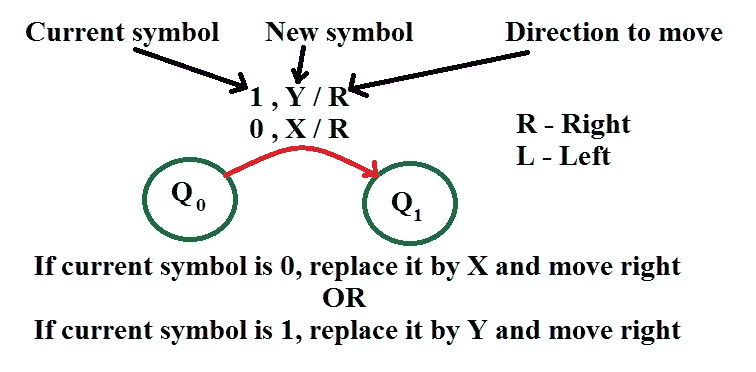
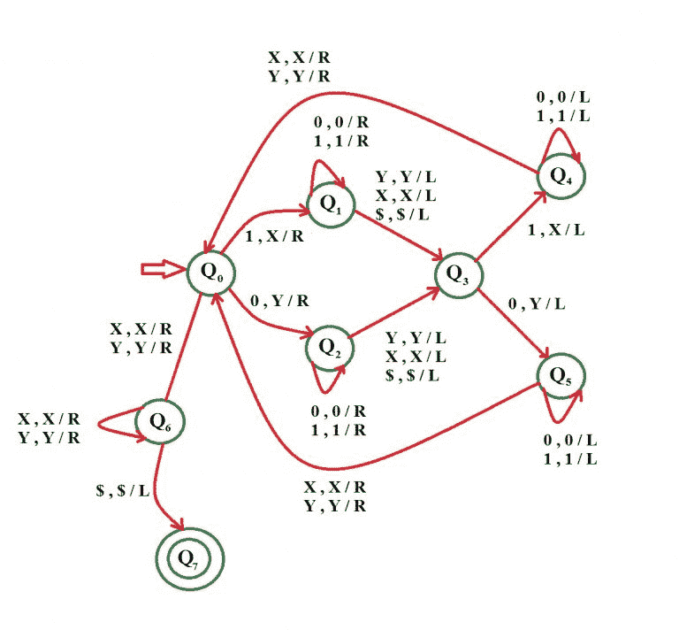

# 为语言 L = { wwr | w∑{ 0，1}}

构建图灵机

> 原文:[https://www . geesforgeks . org/construct-turing-machine-language-l-wwr-w-0-1/](https://www.geeksforgeeks.org/construct-turing-machine-language-l-wwr-w-0-1/)

先决条件–[图灵机](https://www.geeksforgeeks.org/turing-machine/)
语言 L = { ww<sup>r</sup>| w∑{ 0，1}}代表一种只使用 2 个字符的语言，即 0 和 1。语言的第一部分可以是 0 和 1 的任意字符串。第二部分与第一部分相反。将这两个部分结合起来就形成了一条线。任何属于这一类别的字符串都将被该语言接受。字符串的开头和结尾用$符号标记。

例如，如果第一部分 w = 1 1 0 0 1，那么第二部分 w <sup>r</sup> = 1 0 0 1 1。很明显 w <sup>r</sup> 是 w 的反义词，所以字符串 11010101011 是给定语言的一部分。

**示例–**

```
Input : 0 0 1 1 1 1 0 0
Output : Accepted
Input : 1 0 1 0 0 1 0 1 
Output : Accepted

```

**基本表示–**



**假设:**我们用 Y 代替 0，用 x 代替 1。

**使用的方法–**
首先检查第一个符号，如果是 0，则用 Y 替换，如果是 1，则用 X 替换。然后到字符串的末尾。所以最后一个符号和第一个一样。我们也根据它用 X 或 Y 来代替它。
现在再次从起点回到符号 replace 旁边的位置，重复上述相同的过程。

需要注意的一点是，由于 w <sup>r</sup> 与 w 相反，因此两者的符号数相等。每次从字符串的开头替换第 n 个符号时，从末尾替换相应的第 n 个符号。

*   **步骤-1:**
    如果符号为 0，用 Y 替换并向右移动，转到 Q2 州
    如果符号为 1，用 X 替换并向右移动，转到 Q1 州
*   **步骤-2:**
    如果符号为 0，将其替换为 0 并向右移动，保持不变状态
    如果符号为 1，将其替换为 1 并向右移动，保持不变状态
    ———如果符号为$则将其替换为 X 并向右移动，进入状态 Q3
    如果符号为 Y，将其替换为 Y 并向右移动，进入状态 Q3
    如果符号为$则将其替换为$并向右移动，
*   **步骤-3:**
    如果符号为 1，用 X 替换并向左移动，转到状态 Q4
    如果符号为 0，用 Y 替换并向左移动，转到状态 Q5
*   **步骤-4:**
    如果符号为 1，将其替换为 1 并向左移动
    如果符号为 0，将其替换为 0 并向左移动
    保持相同状态
*   **第 5 步:**
    如果符号是 X，用 X 代替，向右移动
    如果符号是 Y，用 Y 代替，向右移动
    进入状态 Q0
*   **第 6 步:**
    如果符号是 X，用 X 替换它并向右移动
    如果符号是 Y，用 Y 替换它并向右移动
    转到状态 Q6
    否则
    转到第 1 步
*   **第 7 步:**
    如果符号是 X，用 X 替换它并向右移动，保持在同一状态
    如果符号是 Y，用 Y 替换它并向右移动，保持在同一状态
    如果符号是$用$替换它并向左移动，字符串被接受，进入最终状态 Q7

